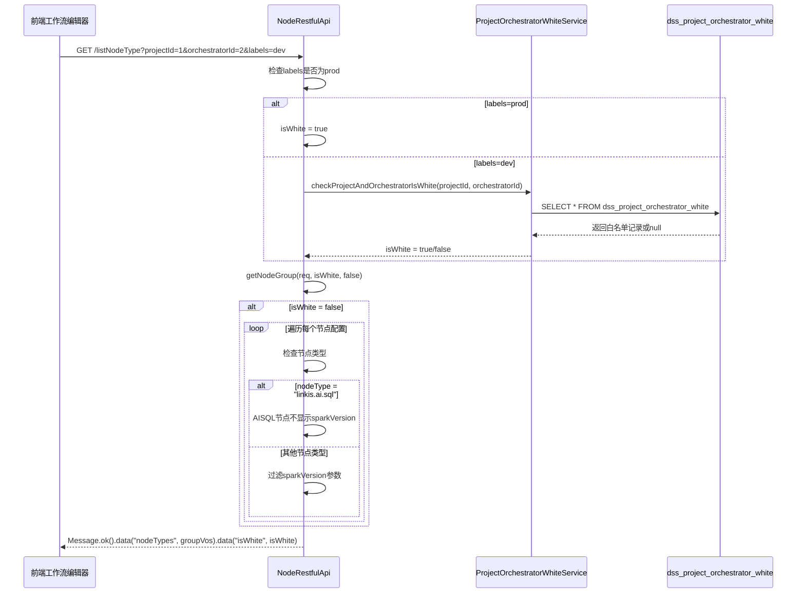
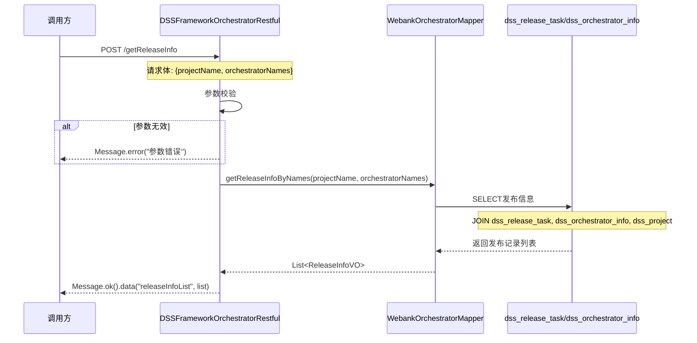
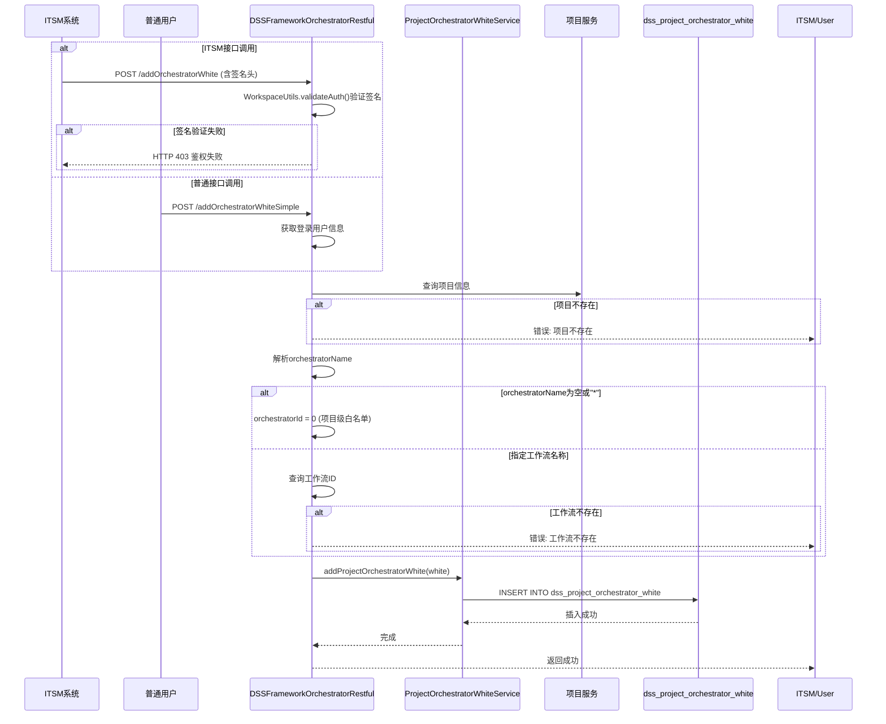

# [工作流模块][节点配置][功能增强] Spark版本白名单与发布信息查询

---

## 执行摘要

### 设计目标

| 目标 | 描述 |
|-----|------|
| **主要目标** | 恢复工作流节点Spark版本的白名单控制机制 |
| **次要目标** | 提供发布信息查询和白名单管理接口 |
| **兼容性目标** | 确保非白名单项目继续正常使用，不影响现有功能 |

### 核心设计决策

| 决策 | 选择 | 理由 |
|-----|------|------|
| 白名单校验方式 | 复用现有ProjectOrchestratorWhiteService | 现有代码已实现完整校验逻辑 |
| AISQL节点处理 | 不显示sparkVersion配置项 | AISQL强制使用Spark3，无需选择 |
| 发布信息查询 | 新增批量查询接口 | 支持多编排同时查询，提升效率 |
| 白名单管理 | 提供ITSM和普通两种接口 | 支持ITSM自动化和人工管理两种场景 |

### 变更影响概览

```
dss-workflow-server
  |-- NodeRestfulApi.java          [修改] 恢复sparkVersion白名单过滤
  |-- DSSFlowServiceImpl.java      [修改] 恢复handleWhiteNodeParams方法
  |-- ProjectOrchestratorWhite.java[已就绪] 已包含reason/type字段

dss-framework-orchestrator-server
  |-- DSSFrameworkOrchestratorRestful.java  [新增] 发布信息查询接口
  |-- DSSFrameworkOrchestratorRestful.java  [新增] 白名单管理接口

dss-orchestrator-db-webank
  |-- WebankOrchestratorMapper.xml [新增] 发布信息查询SQL
```

### 关键风险与缓解

| 风险 | 概率 | 影响 | 缓解措施 |
|-----|:----:|:----:|---------|
| 前端兼容性 | 中 | 中 | 提前通知前端团队，提供适配指南 |
| 数据库字段变更 | 低 | 高 | 新字段允许NULL，无强制迁移 |

### 章节导航

| 章节 | 内容概要 |
|-----|---------|
| Part 1: 核心设计 | 兼容性设计、变更影响分析、核心流程、接口变更 |
| Part 2: 支撑设计 | 数据模型变更、API规范、回滚方案、测试策略 |
| Part 3: 参考资料 | 完整迁移脚本、代码变更示例 |

---

## Part 1: 核心设计

### 1.1 兼容性设计

#### 1.1.1 现有接口影响分析

| 接口 | 影响 | 兼容措施 |
|-----|------|---------|
| GET /dss/workflow/listNodeType | 响应变更 | 新增isWhite字段，非白名单过滤sparkVersion |
| POST /dss/workflow/listNodeType | 响应变更 | 同上，sparkVersion默认值改为3（仅白名单） |

#### 1.1.2 向后兼容保证

**原则**：非白名单项目行为不变

| 场景 | 增强前行为 | 增强后行为 | 兼容性 |
|-----|----------|----------|:------:|
| 白名单项目 | 可选择Spark版本 | 可选择Spark版本 | 兼容 |
| 非白名单项目 | 可选择Spark版本（1.19.6bug） | 不可选择Spark版本 | 修复bug |
| 生产环境 | 可选择Spark版本 | 可选择Spark版本 | 兼容 |
| AISQL节点 | 无特殊处理 | 强制Spark3，不显示配置 | 兼容 |

#### 1.1.3 数据兼容性

| 数据对象 | 变化 | 兼容措施 |
|---------|------|---------|
| dss_project_orchestrator_white | 新增字段 | reason/type字段允许NULL，历史数据无影响 |
| dss_release_task | 无变化 | 只读查询，不修改数据 |

### 1.2 变更影响分析

#### 1.2.1 模块影响范围

| 模块 | 影响类型 | 变更内容 |
|-----|:--------:|---------|
| dss-workflow-server | 修改 | 恢复sparkVersion白名单过滤逻辑 |
| dss-framework-orchestrator-server | 新增 | 发布信息查询、白名单管理接口 |
| dss-orchestrator-db-webank | 新增 | 发布信息查询SQL |
| dss-orchestrator-common | 新增 | VO和Request类 |

#### 1.2.2 接口影响列表

| 接口 | 影响类型 | 变更说明 |
|-----|:--------:|---------|
| GET /dss/workflow/listNodeType | 修改 | 响应增加isWhite字段，非白名单过滤sparkVersion |
| POST /dss/workflow/listNodeType | 修改 | 同上，sparkVersion默认值为3（仅白名单） |
| POST /dss/framework/orchestrator/getReleaseInfo | 新增 | 批量查询发布信息 |
| POST /dss/framework/orchestrator/addOrchestratorWhite | 新增 | ITSM白名单添加接口 |
| POST /dss/framework/orchestrator/addOrchestratorWhiteSimple | 新增 | 普通白名单添加接口 |

### 1.3 核心流程设计

#### 1.3.1 E1: Spark版本白名单限制恢复



**关键节点说明表**

| 节点 | 处理逻辑 | 输入/输出 | 异常处理 |
|-----|---------|----------|---------|
| 1. 请求接收 | 接收projectId、orchestratorId、labels参数 | 输入: HTTP请求参数<br>输出: 参数校验结果 | 参数为空返回isWhite=false |
| 2. 白名单校验 | 调用WhiteService检查项目是否在白名单 | 输入: projectId, orchestratorId<br>输出: isWhite布尔值 | 查询失败返回isWhite=false |
| 3. 节点配置转换 | 遍历节点UI配置，按白名单状态过滤 | 输入: NodeInfo, isWhite<br>输出: NodeInfoVO | 转换异常抛出DSSRuntimeException |
| 4. 响应返回 | 封装响应数据，包含isWhite标识 | 输入: nodeTypes, isWhite<br>输出: Message对象 | 无 |

**技术难点说明表**

| 难点 | 问题描述 | 解决方案 | 决策理由 |
|-----|---------|---------|---------|
| 白名单判断时机 | GET和POST请求的白名单判断逻辑不同 | 统一使用checkProjectAndOrchestratorIsWhite方法，POST请求额外处理批量判断 | 复用现有逻辑，保持一致性 |
| AISQL节点识别 | 如何区分AISQL节点和其他节点 | 通过nodeType字段判断是否为"linkis.ai.sql" | 简单直接，不引入额外复杂度 |
| 默认值设置 | POST请求需要设置sparkVersion默认值 | 仅在isWhite=true且isPostRequest=true时设置defaultValue="3" | 避免非白名单项目产生误导性默认值 |

**边界与约束说明**

- **前置条件**：projectId和orchestratorId参数有效（可查询到对应项目和工作流）
- **后置保证**：响应中isWhite字段准确反映白名单状态，nodeTypes列表符合白名单规则
- **兼容性保证**：生产环境(labels=prod)自动视为白名单，与现有行为一致
- **回滚约束**：回滚后需要前端适配代码同步回滚

#### 1.3.2 E2: AISQL节点特殊处理

AISQL节点（nodeType="linkis.ai.sql"）强制使用Spark3版本，无论项目是否在白名单中，都不显示Spark版本配置选项。

**处理逻辑**：

```
在transfer方法中增加节点类型判断：
IF nodeType == "linkis.ai.sql" THEN
    不显示sparkVersion配置项
ELSE
    按原有白名单逻辑处理
END IF
```

**设计决策**：AISQL节点本身不支持Spark版本选择，强制使用Spark3引擎执行。因此无论白名单状态如何，都不应显示Spark版本配置选项。

#### 1.3.3 E3: 发布信息查询接口



**关键节点说明表**

| 节点 | 处理逻辑 | 输入/输出 | 异常处理 |
|-----|---------|----------|---------|
| 1. 参数校验 | 校验projectName非空，orchestratorNames非空且<=100 | 输入: Request对象<br>输出: 校验结果 | 返回错误码60015 |
| 2. SQL查询 | 联表查询发布信息，按update_time排序取最新 | 输入: projectName, orchestratorNames<br>输出: List<ReleaseInfoVO> | SQL异常记录日志 |
| 3. 响应封装 | 封装查询结果为统一响应格式 | 输入: List<ReleaseInfoVO><br>输出: Message对象 | 无 |

**技术难点说明表**

| 难点 | 问题描述 | 解决方案 | 决策理由 |
|-----|---------|---------|---------|
| 批量查询性能 | orchestratorNames可能多达100个 | 使用IN子句，添加索引优化 | 减少SQL执行次数 |
| 只返回成功记录 | 如何过滤失败的发布记录 | SQL中添加status='Success'条件 | 符合业务需求 |

**边界与约束说明**

- **前置条件**：projectName必填，orchestratorNames非空且大小<=100
- **后置保证**：返回的发布记录均为status='Success'的最新记录
- **兼容性保证**：新增接口，不影响现有功能
- **回滚约束**：删除新增的接口和Mapper方法即可

#### 1.3.4 E4: 白名单管理接口



**关键节点说明表**

| 节点 | 处理逻辑 | 输入/输出 | 异常处理 |
|-----|---------|----------|---------|
| 1. 鉴权验证 | ITSM接口验证签名，普通接口获取登录用户 | 输入: HTTP请求头/Session<br>输出: 用户身份 | ITSM鉴权失败返回403 |
| 2. 项目查询 | 根据projectName查询项目信息 | 输入: projectName<br>输出: projectId | 项目不存在返回错误60013 |
| 3. 工作流解析 | 解析orchestratorName判断级别 | 输入: orchestratorName<br>输出: orchestratorId | 工作流不存在返回错误 |
| 4. 白名单添加 | 创建白名单记录并保存 | 输入: ProjectOrchestratorWhite<br>输出: 无 | 重复添加更新现有记录 |

**技术难点说明表**

| 难点 | 问题描述 | 解决方案 | 决策理由 |
|-----|---------|---------|---------|
| ITSM签名验证 | 需要验证外部系统的签名 | 使用WorkspaceUtils.validateAuth()方法 | 复用现有鉴权机制 |
| 项目级vs工作流级白名单 | orchestratorName为空时表示项目级 | 设置orchestratorId=0表示项目级白名单 | 与现有逻辑保持一致 |
| 重复添加处理 | 同一项目/工作流可能多次添加 | 使用INSERT ON DUPLICATE KEY UPDATE或先查询后更新/插入 | 保证幂等性 |

**边界与约束说明**

- **前置条件**：
  - ITSM接口：签名验证通过
  - 普通接口：用户已登录
- **后置保证**：白名单记录正确保存，包含reason和type字段
- **兼容性保证**：新增接口，不影响现有白名单查询逻辑
- **回滚约束**：删除新增的接口即可

### 1.4 接口变更定义

#### 1.4.1 GET /dss/workflow/listNodeType

```java
// ===== BEFORE（现有代码）=====
@RequestMapping(value = "/listNodeType", method = RequestMethod.GET)
public Message listNodeType(HttpServletRequest req,
                            @RequestParam(value = "labels", required = false) String labels,
                            @RequestParam(value = "projectId", required = false) Long projectId,
                            @RequestParam(value = "orchestratorId",required = false) Long orchestratorId){

    boolean isWhite = false;
    if(DSSCommonUtils.ENV_LABEL_VALUE_PROD.equalsIgnoreCase(labels)){
        isWhite = true;
    }else{
        // 开发中心做白名单判断
        isWhite = projectOrchestratorWhiteService.checkProjectAndOrchestratorIsWhite(projectId, orchestratorId);
    }

    logger.info("projectId is {}, orchestratorId is {} ,isWhite is {}", projectId,orchestratorId,isWhite);

    // GET请求，不设置sparkVersion默认值
    List<NodeGroupVO> groupVos = getNodeGroup(req,isWhite,false);
    return Message.ok().data("nodeTypes", groupVos).data("isWhite",isWhite);
}

// ===== AFTER（增强后）=====
// 无需修改，现有代码已实现白名单逻辑
// 需要在transfer方法中增加AISQL节点特殊处理
private NodeInfoVO transfer(NodeInfo nodeInfo, HttpServletRequest req, boolean isWhite, boolean isPostRequest) throws IOException {
    // ... 现有代码 ...

    // [新增] AISQL节点特殊处理：不显示sparkVersion
    if ("linkis.ai.sql".equalsIgnoreCase(nodeInfo.getNodeType())) {
        // AISQL节点强制使用Spark3，不显示版本配置
        nodeUiVOS = nodeUiVOS.stream()
            .filter(nodeUi -> !"sparkVersion".equalsIgnoreCase(nodeUi.getKey()))
            .collect(Collectors.toList());
    }

    // [新增] 非白名单项目过滤sparkVersion
    if (!isWhite) {
        nodeUiVOS = nodeUiVOS.stream()
            .filter(nodeUi -> !"sparkVersion".equalsIgnoreCase(nodeUi.getKey()))
            .collect(Collectors.toList());
    }

    // ... 现有代码 ...
}
```

#### 1.4.2 POST /dss/framework/orchestrator/getReleaseInfo（新增）

```java
// ===== 新增接口 =====
/**
 * 批量查询发布信息
 *
 * @param request 包含projectName和orchestratorNames列表
 * @return 发布信息列表
 */
@RequestMapping(value = "getReleaseInfo", method = RequestMethod.POST)
public Message getReleaseInfo(@RequestBody ReleaseInfoRequest request) {
    String username = SecurityFilter.getLoginUsername(httpServletRequest);
    Workspace workspace = SSOHelper.getWorkspace(httpServletRequest);

    // 参数校验
    if (StringUtils.isBlank(request.getProjectName())) {
        return Message.error("项目名称不能为空");
    }
    if (CollectionUtils.isEmpty(request.getOrchestratorNames())
        || request.getOrchestratorNames().size() > 100) {
        return Message.error("编排名称列表不能为空且不能超过100个");
    }

    try {
        List<ReleaseInfoVO> releaseInfoList = orchestratorMapper
            .getReleaseInfoByNames(request.getProjectName(), request.getOrchestratorNames());
        return Message.ok().data("releaseInfoList", releaseInfoList);
    } catch (Exception e) {
        LOGGER.error("查询发布信息失败", e);
        return Message.error("查询发布信息失败: " + e.getMessage());
    }
}
```

#### 1.4.3 POST /dss/framework/orchestrator/addOrchestratorWhite（新增）

```java
// ===== 新增接口 - ITSM鉴权 =====
/**
 * ITSM白名单添加接口（支持批量）
 * 需要验证ITSM签名
 */
@RequestMapping(value = "addOrchestratorWhite", method = RequestMethod.POST)
public Message addOrchestratorWhite(HttpServletRequest request,
                                    @RequestBody ItsmRequest itsmRequest) {
    // 验证ITSM签名
    boolean authResult = WorkspaceUtils.validateAuth(request);
    if (!authResult) {
        return Message.error("鉴权失败").code(403);
    }

    // 解析请求参数
    // ... 处理逻辑 ...

    return Message.ok();
}
```

#### 1.4.4 POST /dss/framework/orchestrator/addOrchestratorWhiteSimple（新增）

```java
// ===== 新增接口 - 普通用户 =====
/**
 * 普通白名单添加接口（单条）
 * 使用登录用户身份
 */
@RequestMapping(value = "addOrchestratorWhiteSimple", method = RequestMethod.POST)
public Message addOrchestratorWhiteSimple(@RequestBody AddOrchestratorWhiteRequest request) {
    String username = SecurityFilter.getLoginUsername(httpServletRequest);
    Workspace workspace = SSOHelper.getWorkspace(httpServletRequest);

    // 参数校验
    if (StringUtils.isBlank(request.getProjectName())) {
        return Message.error("项目名称不能为空");
    }

    // ... 处理逻辑 ...

    return Message.ok("添加白名单成功");
}
```

---

## Part 2: 支撑设计

### 2.1 数据模型变更

#### 2.1.1 数据库表变更

| 表名 | 变更类型 | 变更字段 | 说明 |
|-----|:--------:|---------|------|
| dss_project_orchestrator_white | 新增字段 | reason VARCHAR(255) | 白名单添加原因 |
| dss_project_orchestrator_white | 新增字段 | type VARCHAR(50) | 白名单类型（schedulis等） |

**注意**：ProjectOrchestratorWhite.java实体类已包含reason和type字段，无需修改。

#### 2.1.2 新增数据对象

| 对象名 | 类型 | 用途 |
|-------|:----:|------|
| ReleaseInfoVO | 新增 | 发布信息响应VO |
| ReleaseInfoRequest | 新增 | 发布信息查询请求 |
| AddOrchestratorWhiteRequest | 新增 | 白名单添加请求 |

### 2.2 API规范变更

#### 2.2.1 端点变更列表

| 端点 | 方法 | 变更类型 | 描述 |
|-----|:----:|:--------:|------|
| /dss/workflow/listNodeType | GET | 修改 | 响应增加isWhite字段 |
| /dss/workflow/listNodeType | POST | 修改 | 响应增加isWhite字段 |
| /dss/framework/orchestrator/getReleaseInfo | POST | 新增 | 批量查询发布信息 |
| /dss/framework/orchestrator/addOrchestratorWhite | POST | 新增 | ITSM白名单添加 |
| /dss/framework/orchestrator/addOrchestratorWhiteSimple | POST | 新增 | 普通白名单添加 |

### 2.3 回滚方案

#### 2.3.1 回滚触发条件

- 增强导致核心工作流编辑功能不可用
- 白名单校验错误导致所有项目无法选择Spark版本
- 性能下降超过50%

#### 2.3.2 回滚步骤

1. 回滚应用服务到前一版本
2. 验证回滚后系统正常运行
3. 如需完全回滚，执行数据库字段删除脚本

#### 2.3.3 数据库回滚（可选）

```sql
-- 如需完全回滚，删除新增字段
ALTER TABLE dss_project_orchestrator_white DROP COLUMN reason;
ALTER TABLE dss_project_orchestrator_white DROP COLUMN type;
```

**注意**：建议保留字段，新字段允许NULL不影响现有功能。

### 2.4 测试策略

#### 2.4.1 功能测试场景

| 场景ID | 测试场景 | 预期结果 |
|--------|---------|---------|
| TC1.1 | 白名单项目请求listNodeType | 返回完整配置，含sparkVersion |
| TC1.2 | 非白名单项目请求listNodeType | 返回配置不含sparkVersion |
| TC1.3 | 生产环境请求listNodeType | 返回完整配置，isWhite=true |
| TC1.4 | AISQL节点配置查询 | 不含sparkVersion配置项 |
| TC2.1 | 发布信息查询-有效编排 | 返回最新发布成功记录 |
| TC2.2 | 发布信息查询-无效编排 | 不在结果列表中 |
| TC3.1 | ITSM白名单添加-签名有效 | 添加成功 |
| TC3.2 | ITSM白名单添加-签名无效 | 返回403 |
| TC3.3 | 普通白名单添加 | 添加成功，包含reason字段 |

#### 2.4.2 回归测试范围

| 模块 | 测试范围 | 关注点 |
|-----|---------|--------|
| 工作流编辑器 | 节点配置加载 | sparkVersion显示正确性 |
| 批量编辑 | 参数校验 | 白名单校验正确性 |
| 工作流发布 | 发布流程 | 不受影响 |

---

## Part 3: 参考资料

### 3.1 数据迁移脚本

<details>
<summary>数据库字段变更脚本</summary>

```sql
-- =====================================================
-- 功能增强：Spark版本白名单与发布信息查询
-- 数据库变更脚本
-- 执行环境：MySQL 5.7+
-- 执行时间：预计 < 1秒
-- =====================================================

-- 1. 新增reason字段（白名单添加原因）
ALTER TABLE dss_project_orchestrator_white
ADD COLUMN reason VARCHAR(255) COMMENT '白名单添加原因' AFTER orchestrator_name;

-- 2. 新增type字段（白名单类型）
ALTER TABLE dss_project_orchestrator_white
ADD COLUMN type VARCHAR(50) COMMENT '白名单类型（schedulis等）' AFTER reason;

-- 3. 验证字段添加成功
SELECT COLUMN_NAME, COLUMN_TYPE, IS_NULLABLE, COLUMN_COMMENT
FROM INFORMATION_SCHEMA.COLUMNS
WHERE TABLE_NAME = 'dss_project_orchestrator_white'
AND COLUMN_NAME IN ('reason', 'type');
```

</details>

### 3.2 代码变更示例

<details>
<summary>NodeRestfulApi.java - transfer方法变更</summary>

```java
private NodeInfoVO transfer(NodeInfo nodeInfo, HttpServletRequest req, boolean isWhite, boolean isPostRequest) throws IOException {
    NodeInfoVO nodeInfoVO = new NodeInfoVO();
    BeanUtils.copyProperties(nodeInfo, nodeInfoVO);
    nodeInfoVO.setTitle(nodeInfo.getName());
    nodeInfoVO.setType(nodeInfo.getNodeType());
    nodeInfoVO.setImage("");
    Function<NodeUi, String> descriptionSupplier = internationalization(req, NodeUi::getDescriptionEn, NodeUi::getDescription);
    Function<NodeUi, String> labelNameSupplier = internationalization(req, NodeUi::getLableNameEn, NodeUi::getLableName);
    ArrayList<NodeUiVO> nodeUiVOS = new ArrayList<>();
    Set<String> keySet = new HashSet<>(nodeInfo.getNodeUis().size());

    for (NodeUi nodeUi : nodeInfo.getNodeUis()) {
        // 避免重复的ui key
        if (keySet.contains(nodeUi.getKey())) {
            continue;
        }

        NodeUiVO nodeUiVO = new NodeUiVO();
        BeanUtils.copyProperties(nodeUi, nodeUiVO);
        nodeUiVO.setDesc(descriptionSupplier.apply(nodeUi));
        nodeUiVO.setLableName(labelNameSupplier.apply(nodeUi));
        nodeUiVO.setNodeUiValidateVOS(nodeUi.getNodeUiValidates().stream()
            .map(v -> transfer(v, req))
            .sorted(NodeUiValidateVO::compareTo)
            .collect(Collectors.toList()));

        // 只有POST请求且白名单项目才为sparkVersion参数设置默认值为3
        if (isPostRequest && isWhite && "sparkVersion".equalsIgnoreCase(nodeUi.getKey())) {
            nodeUiVO.setDefaultValue("3");
        }

        nodeUiVOS.add(nodeUiVO);
        keySet.add(nodeUi.getKey());
    }

    // [新增] AISQL节点特殊处理：不显示sparkVersion
    // AISQL节点强制使用Spark3，无需选择版本
    if ("linkis.ai.sql".equalsIgnoreCase(nodeInfo.getNodeType())) {
        nodeUiVOS = nodeUiVOS.stream()
            .filter(nodeUi -> !"sparkVersion".equalsIgnoreCase(nodeUi.getKey()))
            .collect(Collectors.toCollection(ArrayList::new));
    }
    // [新增] 非白名单项目过滤sparkVersion
    else if (!isWhite) {
        nodeUiVOS = nodeUiVOS.stream()
            .filter(nodeUi -> !"sparkVersion".equalsIgnoreCase(nodeUi.getKey()))
            .collect(Collectors.toCollection(ArrayList::new));
    }

    nodeUiVOS.sort(NodeUiVO::compareTo);
    nodeInfoVO.setNodeUiVOS(nodeUiVOS);
    return nodeInfoVO;
}
```

</details>

<details>
<summary>ReleaseInfoVO.java - 新增VO类</summary>

```java
package com.webank.wedatasphere.dss.orchestrator.common.entity;

/**
 * 发布信息响应VO
 */
public class ReleaseInfoVO {
    /** 编排ID */
    private Long orchestratorId;

    /** 编排名称 */
    private String orchestratorName;

    /** 发布状态 */
    private String status;

    /** 发布人 */
    private String releaseUser;

    /** 发布时间 */
    private String releaseTime;

    /** 项目ID */
    private Long projectId;

    /** 项目名称 */
    private String projectName;

    // Getter/Setter方法省略
}
```

</details>

<details>
<summary>ReleaseInfoRequest.java - 新增请求类</summary>

```java
package com.webank.wedatasphere.dss.orchestrator.server.entity.request;

import java.util.List;

/**
 * 发布信息查询请求
 */
public class ReleaseInfoRequest {
    /** 项目名称（必填） */
    private String projectName;

    /** 编排名称列表（必填，建议<=100） */
    private List<String> orchestratorNames;

    // Getter/Setter方法省略
}
```

</details>

<details>
<summary>AddOrchestratorWhiteRequest.java - 新增请求类</summary>

```java
package com.webank.wedatasphere.dss.orchestrator.server.entity.request;

/**
 * 白名单添加请求（普通接口）
 */
public class AddOrchestratorWhiteRequest {
    /** 项目名称（必填） */
    private String projectName;

    /** 编排名称（可选，为空或"*"表示项目级白名单） */
    private String orchestratorName;

    /** 添加原因（可选） */
    private String reason;

    // Getter/Setter方法省略
}
```

</details>

<details>
<summary>WebankOrchestratorMapper.xml - 新增SQL</summary>

```xml
<!-- 发布信息查询结果映射 -->
<resultMap id="release_info_map" type="com.webank.wedatasphere.dss.orchestrator.common.entity.ReleaseInfoVO">
    <result column="orchestrator_id" property="orchestratorId" jdbcType="BIGINT"/>
    <result column="orchestrator_name" property="orchestratorName" jdbcType="VARCHAR"/>
    <result column="status" property="status" jdbcType="VARCHAR"/>
    <result column="release_user" property="releaseUser" jdbcType="VARCHAR"/>
    <result column="release_time" property="releaseTime" jdbcType="VARCHAR"/>
    <result column="project_id" property="projectId" jdbcType="BIGINT"/>
    <result column="project_name" property="projectName" jdbcType="VARCHAR"/>
</resultMap>

<!-- 批量查询发布信息 -->
<select id="getReleaseInfoByNames" resultMap="release_info_map">
    SELECT
        o.id AS orchestrator_id,
        o.name AS orchestrator_name,
        rt.status,
        rt.updater AS release_user,
        rt.update_time AS release_time,
        o.project_id,
        p.name AS project_name
    FROM dss_release_task rt
    INNER JOIN dss_orchestrator_info o ON rt.orchestrator_id = o.id
    INNER JOIN dss_project p ON o.project_id = p.id
    WHERE p.name = #{projectName}
    AND o.name IN
    <foreach collection="orchestratorNames" item="name" open="(" separator="," close=")">
        #{name}
    </foreach>
    AND rt.status = 'Success'
    AND rt.id IN (
        SELECT MAX(id) FROM dss_release_task
        WHERE status = 'Success'
        GROUP BY orchestrator_id
    )
</select>
```

</details>

### 3.3 回滚脚本

<details>
<summary>数据库回滚脚本（可选执行）</summary>

```sql
-- =====================================================
-- 功能回滚：删除新增的数据库字段
-- 注意：仅当需要完全回滚时执行
-- 新字段允许NULL，通常无需删除
-- =====================================================

-- 1. 删除reason字段
ALTER TABLE dss_project_orchestrator_white DROP COLUMN IF EXISTS reason;

-- 2. 删除type字段
ALTER TABLE dss_project_orchestrator_white DROP COLUMN IF EXISTS type;

-- 3. 验证字段删除成功
SELECT COLUMN_NAME
FROM INFORMATION_SCHEMA.COLUMNS
WHERE TABLE_NAME = 'dss_project_orchestrator_white'
AND COLUMN_NAME IN ('reason', 'type');
-- 预期结果：无记录返回
```

</details>

---

## 附录

### A. 涉及文件清单

| 类型 | 文件路径 | 修改内容 |
|------|----------|----------|
| 修改 | dss-workflow-server/.../NodeRestfulApi.java | 增加AISQL节点特殊处理，恢复白名单过滤 |
| 已就绪 | dss-workflow-server/.../ProjectOrchestratorWhite.java | 已包含reason/type字段 |
| 已就绪 | dss-workflow-server/.../ProjectOrchestratorWhiteMapper.xml | 已支持reason/type字段 |
| 新增 | dss-orchestrator-common/.../ReleaseInfoVO.java | 发布信息响应VO |
| 新增 | dss-orchestrator-common/.../ReleaseInfoRequest.java | 发布信息查询请求 |
| 新增 | dss-framework-orchestrator-server/.../AddOrchestratorWhiteRequest.java | 白名单添加请求 |
| 修改 | dss-framework-orchestrator-server/.../DSSFrameworkOrchestratorRestful.java | 添加新接口 |
| 修改 | dss-orchestrator-db-webank/.../WebankOrchestratorMapper.xml | 添加发布信息查询SQL |

### B. 设计决策记录（ADR）

| 决策ID | 决策内容 | 理由 | 替代方案 |
|--------|---------|------|---------|
| ADR-001 | 复用现有ProjectOrchestratorWhiteService | 现有代码已实现完整校验逻辑，无需重复开发 | 新建WhiteListValidator类 |
| ADR-002 | AISQL节点不显示sparkVersion | AISQL强制Spark3，用户无需选择 | 显示但禁用 |
| ADR-003 | 发布信息只返回成功记录 | 业务只需关注发布成功的记录 | 返回所有记录让前端过滤 |
| ADR-004 | ITSM和普通接口分开 | ITSM需要签名验证，普通接口用登录态 | 统一接口，参数区分 |

### C. 更新日志

| 版本 | 日期 | 作者 | 变更说明 |
|------|------|------|---------|
| v1.0 | 2026-03-17 | Claude Code | 初始设计文档创建 |

---

**文档状态**: 待评审
**需求文档**: `docs/工作流Spark版本与发布信息查询需求.md`
**预计完成时间**: 3人天