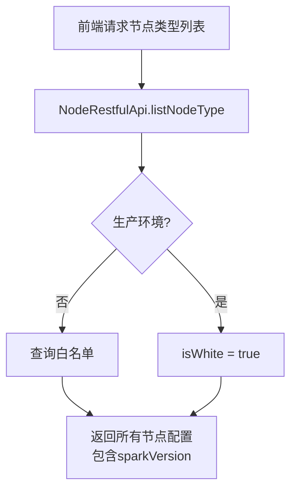
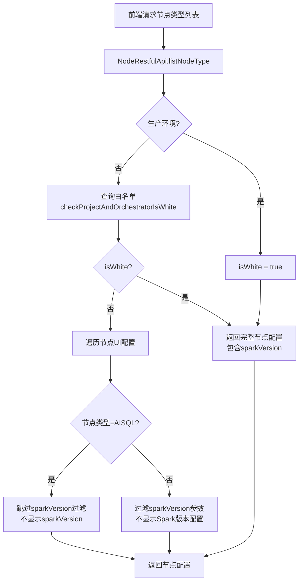
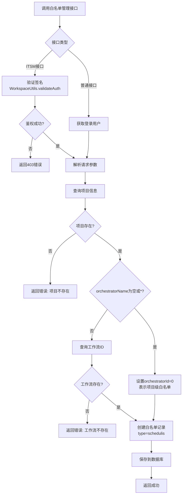

# [工作流模块][节点配置][功能增强] Spark版本白名单与发布信息查询

---

## 📋 需求速览

| 维度 | 内容 |
|-----|------|
| **一句话描述** | 恢复工作流节点Spark版本的白名单控制机制，并提供发布信息查询和白名单管理接口 |
| **基础模块** | dss-workflow-server（工作流服务） |
| **增强目的** | 精细化控制Spark版本配置权限，支持Spark3升级项目管控 |
| **功能范围** | P0: 2个 · P1: 2个 · P2: 0个 |
| **兼容性要求** | 需向后兼容，非白名单项目继续使用Spark2版本 |
| **人力投入预估** | 3 人天 |
| **涉及模块** | dss-workflow-server, dss-framework-orchestrator-server, dss-orchestrator-db |

### 功能属性标签

> 💡 以下属性标签由AAEC机制自动检测，帮助识别增强功能的技术关注点

| 属性类型 | 检测到的属性 |
|:--------:|-------------|
| **前端属性** | `表单交互` `数据展示` |
| **后端属性** | `业务逻辑` `接口扩展` `向后兼容` `权限控制` |
| **数据属性** | `数据校验` |

> 💡 **阅读指引**：速览全貌看本卡片 → 现有功能看第二章 → 增强详情看第四章 → 技术实现看设计文档

---

**需求类型**: ENHANCE（功能增强）
**基础模块**: dss-workflow-server
**文档版本**: v2.0
**创建日期**: 2026-03-17
**作者**: Claude Code
**文档状态**: 评审中

---

## 一、需求背景 【核心】

### 1.1 业务背景

**场景**：DataSphere Studio（DSS）作为一站式数据应用开发管理门户，支持多种Spark版本（Spark2和Spark3）的工作流调度。企业需要精细化控制哪些项目可以使用Spark3版本，以确保生产环境的稳定性和兼容性。

**痛点**：在1.19.6版本中，为了支持Spark3升级，取消了Spark版本配置的白名单限制，导致所有项目都可以选择Spark版本。这与预期的管控策略不符，需要恢复白名单控制机制。

**价值**：
- 恢复Spark版本配置的白名单控制，实现精细化权限管理
- 提供便捷的白名单管理和发布信息查询接口，提升运维效率
- 确保Spark3升级过程可控，降低生产环境风险

### 1.2 系统背景

现有白名单机制依赖数据库表 `dss_project_orchestrator_white`，通过 `ProjectOrchestratorWhiteService.checkProjectAndOrchestratorIsWhite()` 方法校验。1.19.6版本修改了 `NodeRestfulApi.java` 和 `DSSFlowServiceImpl.java`，移除了白名单过滤逻辑。

本次增强在组件边界内进行，恢复原有白名单控制能力，并扩展管理接口。

### 1.3 需求范围

| 属性 | 值 |
|-----|-----|
| 一级模块 | dss-orchestrator |
| 二级模块 | dss-workflow |
| 涉及终端 | 前后端 |
| 涉及模块 | dss-workflow-server, dss-framework-orchestrator-server, dss-orchestrator-db, dss-orchestrator-common |
| 涉及其他组件 | Linkis（Spark执行引擎） |

### 1.4 边界定义

| ✅ 包含（In Scope） | ❌ 不包含（Out of Scope） |
|-------------------|------------------------|
| Spark版本配置白名单恢复 | Spark引擎版本升级 |
| AISQL节点特殊处理（强制Spark3） | 其他节点类型的版本强制 |
| 发布信息查询接口 | 发布流程修改 |
| 白名单管理接口（ITSM/普通） | 白名单删除接口 |
| 白名单表字段扩展（reason/type） | 历史数据迁移 |

### 1.5 术语定义

> 💡 以下术语在本文档中具有特定含义，建议在阅读正文前先了解

| 术语 | 定义 | 所属领域 |
|-----|------|:--------:|
| 白名单 | 允许配置Spark版本的项目/工作流列表 | 业务 |
| 编排（Orchestrator） | DSS中的工作流编排实体 | 技术 |
| AISQL节点 | nodeType为"linkis.ai.sql"的AI SQL节点 | 技术 |
| ITSM | IT服务管理系统，用于流程审批 | 业务 |

---

## 二、现有功能分析 【核心】

### 2.1 现有功能描述

当前工作流节点配置通过 `NodeRestfulApi.listNodeType()` 接口获取节点UI配置列表。节点配置中包含 `sparkVersion` 参数，用于选择Spark版本。

**白名单校验流程**：
1. 调用 `ProjectOrchestratorWhiteService.checkProjectAndOrchestratorIsWhite(projectId, orchestratorId)`
2. 查询 `dss_project_orchestrator_white` 表，匹配 `project_id` 和 `orchestrator_id`
3. `orchestrator_id=0` 表示整个项目在白名单中

**当前问题**：1.19.6版本移除了对非白名单项目 `sparkVersion` 参数的过滤，导致所有项目都显示Spark版本配置。

### 2.2 当前痛点

| 痛点ID | 痛点描述 | 影响范围 | 影响程度 |
|--------|---------|---------|:--------:|
| P1 | 所有项目都能选择Spark版本，无法精细化控制 | 所有非白名单项目 | 高 |
| P2 | 缺乏便捷的白名单管理接口，需数据库操作 | 运维人员 | 中 |
| P3 | 无法快速查询工作流发布状态 | 开发人员 | 中 |

### 2.3 现有功能依赖

| 调用方 | 被调用模块 | 调用方式 |
|-------|----------|---------|
| 前端工作流编辑器 | NodeRestfulApi | REST API |
| 批量编辑功能 | DSSFlowServiceImpl | Spring注入 |
| 白名单服务 | ProjectOrchestratorWhiteMapper | MyBatis |

---

## 三、核心流程 【核心】

### 3.1 增强前流程



**问题**：无论是否在白名单，都返回包含 `sparkVersion` 的配置。

### 3.2 增强后流程



### 3.3 白名单管理流程



---

## 四、增强需求详情 【核心】

### 4.1 功能总览

| ID | 增强点 | 优先级 | 状态 | 一句话描述 |
|----|-------|:------:|:----:|----------|
| E1 | Spark版本白名单限制恢复 | P0 | ✅ 已确认 | 非白名单项目不显示Spark版本配置选项 |
| E2 | AISQL节点特殊处理 | P0 | ✅ 已确认 | AISQL节点强制使用Spark3，不显示版本配置 |
| E3 | 发布信息查询接口 | P1 | ✅ 已确认 | 根据项目和编排名称批量查询发布信息 |
| E4 | 白名单管理接口 | P1 | ✅ 已确认 | 提供ITSM和普通两种白名单添加接口 |

---

### 4.2 增强详述

#### E1: Spark版本白名单限制恢复 `P0` `已确认`

**增强描述**
恢复工作流节点Spark版本的白名单控制机制，只有白名单项目中的节点才显示Spark版本配置选项，非白名单项目默认使用Spark2版本。

**输入变化**
| 输入项 | 变化类型 | 说明 | 约束 |
|-------|:--------:|------|------|
| projectId | 无变化 | 项目ID | 必填 |
| orchestratorId | 无变化 | 编排ID | 必填 |
| labels | 无变化 | 环境标签 | 可选 |

**输出变化**
| 输出项 | 变化类型 | 说明 |
|-------|:--------:|------|
| nodeTypes | 修改 | 节点配置列表，非白名单项目过滤sparkVersion |
| isWhite | 新增 | 返回白名单状态标识 |

**业务规则**
| 规则ID | 规则描述 |
|--------|---------|
| R1.1 | 生产环境（labels=prod）自动视为白名单 |
| R1.2 | 非白名单项目的节点不显示sparkVersion配置项 |
| R1.3 | 批量编辑时，非白名单工作流禁止修改sparkVersion参数 |
| R1.4 | POST请求时，sparkVersion默认值设为3（仅白名单项目） |

**验收标准（三段式）**

| 验证阶段 | 验收条件 |
|:--------:|---------|
| 【输入验证】 | AC1.1: projectId和orchestratorId参数正确传递，类型为Long |
| 【处理验证】 | AC1.2: 白名单项目返回完整配置（含sparkVersion），非白名单项目过滤sparkVersion |
| 【输出验证】 | AC1.3: 响应中isWhite字段正确反映白名单状态，nodeTypes列表不含sparkVersion（非白名单） |

---

#### E2: AISQL节点特殊处理 `P0` `已确认`

**增强描述**
AISQL节点（nodeType="linkis.ai.sql"）强制使用Spark3版本执行，无论项目是否在白名单中，都不显示Spark版本配置选项。

**输入变化**
| 输入项 | 变化类型 | 说明 | 约束 |
|-------|:--------:|------|------|
| nodeType | 无变化 | 节点类型 | 识别AISQL节点 |

**输出变化**
| 输出项 | 变化类型 | 说明 |
|-------|:--------:|------|
| nodeTypes | 修改 | AISQL节点不包含sparkVersion配置 |

**业务规则**
| 规则ID | 规则描述 |
|--------|---------|
| R2.1 | AISQL节点（nodeType="linkis.ai.sql"）始终不显示sparkVersion |
| R2.2 | AISQL节点执行时强制使用Spark3引擎 |
| R2.3 | 删除1.19.6版本添加的AISQL白名单限制代码 |

**验收标准（三段式）**

| 验证阶段 | 验收条件 |
|:--------:|---------|
| 【输入验证】 | AC2.1: 正确识别nodeType="linkis.ai.sql"的AISQL节点 |
| 【处理验证】 | AC2.2: 无论isWhite状态如何，AISQL节点都不包含sparkVersion配置 |
| 【输出验证】 | AC2.3: 响应中AISQL节点无sparkVersion参数，其他节点类型正常按白名单规则处理 |

---

#### E3: 发布信息查询接口 `P1` `已确认`

**增强描述**
新增API接口，根据项目名称和编排名称批量查询工作流发布信息，返回每个编排最新发布成功的记录。

**输入变化**
| 输入项 | 变化类型 | 说明 | 约束 |
|-------|:--------:|------|------|
| projectName | 新增 | 项目名称 | 必填，String |
| orchestratorNames | 新增 | 编排名称列表 | 必填，List<String>，建议≤100 |

**输出变化**
| 输出项 | 变化类型 | 说明 |
|-------|:--------:|------|
| releaseInfoList | 新增 | 发布信息列表，包含orchestratorId、orchestratorName、status、releaseUser、releaseTime、projectId、projectName |

**业务规则**
| 规则ID | 规则描述 |
|--------|---------|
| R3.1 | 只返回发布成功（status='Success'）的记录 |
| R3.2 | 每个编排只返回最新的一条发布成功记录 |
| R3.3 | 编排必须属于指定的项目（通过SQL join自动校验） |
| R3.4 | 未发布的编排不返回记录（不在结果列表中） |

**验收标准（三段式）**

| 验证阶段 | 验收条件 |
|:--------:|---------|
| 【输入验证】 | AC3.1: projectName必填，orchestratorNames非空列表，大小≤100 |
| 【处理验证】 | AC3.2: 正确查询dss_release_task表，按update_time取最新发布成功记录 |
| 【输出验证】 | AC3.3: 返回7个指定字段，格式正确，无多余字段 |

---

#### E4: 白名单管理接口 `P1` `已确认`

**增强描述**
提供两个白名单管理接口：ITSM鉴权接口（支持批量）和普通接口（单条），用于添加工作流白名单。

**输入变化**
| 输入项 | 变化类型 | 说明 | 约束 |
|-------|:--------:|------|------|
| ITSM接口请求头 | 新增 | timeStamp、sign | 必填，签名验证 |
| ITSM接口请求体 | 新增 | createDate、createUser、data、externalId | 必填 |
| 普通接口请求体 | 新增 | projectName、orchestratorName、reason | projectName必填 |

**输出变化**
| 输出项 | 变化类型 | 说明 |
|-------|:--------:|------|
| retCode/retDetail | 新增 | ITSM接口响应格式 |
| Message响应 | 新增 | 普通接口响应格式 |

**业务规则**
| 规则ID | 规则描述 |
|--------|---------|
| R4.1 | ITSM接口需验证签名，失败返回403 |
| R4.2 | orchestratorName为空或"*"时，设置orchestratorId=0（项目级白名单） |
| R4.3 | type字段固定设置为"schedulis" |
| R4.4 | reason字段保存用户填写的原因 |
| R4.5 | 普通接口使用登录用户身份作为createUser |
| R4.6 | 重复添加不报错，更新现有记录 |

**验收标准（三段式）**

| 验证阶段 | 验收条件 |
|:--------:|---------|
| 【输入验证】 | AC4.1: ITSM接口验证签名成功；普通接口验证projectName非空 |
| 【处理验证】 | AC4.2: 正确查询项目和工作流信息，创建白名单记录（含reason、type字段） |
| 【输出验证】 | AC4.3: 数据库记录正确插入，字段值符合预期 |

---

### 4.3 异常场景处理

| 场景ID | 异常场景 | 处理方式 |
|--------|---------|---------|
| E1 | projectId或orchestratorId为null | 返回isWhite=false，按非白名单处理 |
| E2 | 白名单查询失败 | 记录日志，返回isWhite=false |
| E3 | 项目不存在 | 返回错误码60013，提示"项目不存在" |
| E4 | 工作流不存在 | 返回错误，提示"工作流不存在" |
| E5 | ITSM签名验证失败 | 返回HTTP 403，提示"鉴权失败" |
| E6 | 参数校验失败 | 返回错误码60015，提示"参数错误" |

---

## 五、兼容性分析 【核心】

### 5.1 必须保持不变的功能

| 功能 | 说明 | 验证方式 |
|-----|------|---------|
| 生产环境白名单 | labels=prod时自动视为白名单 | 单元测试 |
| 现有白名单查询逻辑 | selectByProjectId查询逻辑不变 | 集成测试 |
| 节点UI配置结构 | NodeUiVO结构不变 | API测试 |
| 批量编辑功能 | 现有批量编辑流程不变 | 端到端测试 |

### 5.2 现有数据处理

| 数据类型 | 处理方式 | 说明 |
|---------|---------|------|
| dss_project_orchestrator_white表 | 新增字段 | 添加reason和type字段，历史数据为NULL |
| dss_release_task表 | 只读查询 | 新增查询接口，不修改数据 |

### 5.3 接口兼容性

| 接口 | 兼容性 | 说明 |
|-----|:------:|------|
| GET /dss/workflow/listNodeType | ⚠️ 变更 | 响应增加isWhite字段，非白名单过滤sparkVersion |
| POST /dss/workflow/listNodeType | ⚠️ 变更 | 同上，sparkVersion默认值改为3（仅白名单） |
| POST /dss/framework/orchestrator/getReleaseInfo | 🆕 新增 | 新接口 |
| POST /dss/framework/orchestrator/addOrchestratorWhite | 🆕 新增 | 新接口 |
| POST /dss/framework/orchestrator/addOrchestratorWhiteSimple | 🆕 新增 | 新接口 |

---

## 六、非功能需求 【重要】

| 类型 | 需求描述 | 目标值 |
|-----|---------|:------:|
| 性能 | 发布信息查询响应时间 | ≤ **1秒**（100条内） |
| 性能 | 白名单查询响应时间 | ≤ **100ms** |
| 性能 | 并发用户支持 | **100** 用户 |
| 兼容性 | 向后兼容 | **100%** |
| 安全 | ITSM接口签名验证 | **必须** |
| 审计 | 白名单操作日志 | **必须** |

---

## 七、数据实体概述 【重要】

### 7.1 数据实体变化

| 实体名称 | 变化类型 | 变化说明 | 与现有实体关系 |
|---------|:--------:|---------|---------------|
| ProjectOrchestratorWhite | 修改 | 新增reason和type字段 | 独立实体 |
| ReleaseInfoVO | 新增 | 发布信息响应VO | 关联dss_release_task |
| ReleaseInfoRequest | 新增 | 发布信息查询请求 | 无持久化 |
| AddOrchestratorWhiteRequest | 新增 | 白名单添加请求 | 无持久化 |

### 7.2 数据规模预估

| 指标 | 增强前 | 增强后 |
|-----|:------:|:------:|
| 白名单记录数 | ~100 条 | ~500 条 |
| 日增量 | ~1 条 | ~5 条 |

### 7.3 数据库变更

```sql
-- 新增reason字段
ALTER TABLE dss_project_orchestrator_white
ADD COLUMN reason VARCHAR(255) COMMENT '原因' AFTER orchestrator_name;

-- 新增type字段
ALTER TABLE dss_project_orchestrator_white
ADD COLUMN type VARCHAR(50) COMMENT '类型' AFTER reason;
```

---

## 八、关联影响分析 【参考】

<details>
<summary>📎 点击展开关联影响分析</summary>

| 影响对象 | 影响类型 | 影响描述 | 应对措施 |
|---------|---------|---------|---------|
| 前端工作流编辑器 | 接口变更 | 需适配isWhite字段和sparkVersion过滤 | 前端适配改造 |
| ITSM系统 | 新增依赖 | 调用白名单添加接口 | 联调测试 |
| Linkis引擎 | 无影响 | AISQL强制Spark3 | 配置确认 |

</details>

---

## 九、风险识别 【参考】

<details>
<summary>⚠️ 点击展开风险分析</summary>

| 风险ID | 风险描述 | 概率 | 影响 | 应对措施 |
|--------|---------|:----:|:----:|---------|
| RISK1 | 数据库字段变更风险 | 中 | 高 | 准备回滚脚本，灰度发布 |
| RISK2 | 前端兼容性风险 | 中 | 中 | 提前通知前端团队，提供适配指南 |
| RISK3 | ITSM集成风险 | 低 | 中 | 提前与ITSM团队联调 |
| RISK4 | 历史数据兼容风险 | 低 | 低 | 新字段允许NULL，无强制迁移 |

</details>

---

## 十、回滚方案 【重要】

### 10.1 回滚触发条件

- 增强导致核心工作流编辑功能不可用
- 白名单校验错误导致所有项目无法选择Spark版本
- 性能下降超过50%

### 10.2 回滚步骤

1. 回滚应用服务到1.19.7版本
2. 执行数据库字段回滚脚本（如需要）
3. 验证回滚后系统正常运行

### 10.3 数据回滚

```sql
-- 可选：删除新增字段（如需完全回滚）
ALTER TABLE dss_project_orchestrator_white DROP COLUMN reason;
ALTER TABLE dss_project_orchestrator_white DROP COLUMN type;
```

**注意**：建议保留字段，新字段允许NULL不影响现有功能。

---

## 十一、测试关注点

1. **白名单功能测试**：验证白名单项目和非白名单项目的sparkVersion显示差异
2. **AISQL节点测试**：验证AISQL节点在任何情况下都不显示sparkVersion
3. **接口兼容性测试**：验证现有接口调用方不受影响
4. **性能测试**：验证批量查询（100条）响应时间≤1秒
5. **安全测试**：验证ITSM接口签名校验逻辑
6. **回归测试**：验证工作流创建、编辑、发布流程正常

---

## 十二、附录

### 澄清质量指标（LCF）

> 📊 以下指标由LCF机制自动计算，反映需求澄清的完整度

| 指标 | 值 | 说明 |
|-----|:---:|------|
| **必填项覆盖度** | 100% | 必填字段的填写完成率 |
| **检查点覆盖度** | 95% | 关键检查点的确认率 |
| **综合完成度** | 98% | 整体需求澄清完成度 |

<details>
<summary>📋 点击查看详细检查点状态</summary>

| 检查点 | 状态 | 说明 |
|-------|:----:|------|
| 增强边界明确 | ✅ | In/Out of Scope已明确定义 |
| 兼容性要求明确 | ✅ | 向后兼容要求已说明 |
| 验收标准完整 | ✅ | 三段式验收标准已定义 |
| 回归范围明确 | ✅ | 测试关注点已列出 |
| 风险识别完整 | ✅ | 4项风险已识别 |
| 回滚方案完整 | ✅ | 触发条件和步骤已明确 |

</details>

### 相关文档

| 文档类型 | 链接 | 说明 |
|---------|------|------|
| 📐 设计文档 | [待生成] | API设计、数据库变更详情 |
| 🧪 Feature文件 | [待生成] | BDD测试用例 |
| 📋 1.19.6版本说明 | ai_prompt/1.19.6/工作流节点的spark版本属性取消白名单限制.md | 原始变更说明 |

### 涉及文件清单

| 类型 | 文件路径 | 修改内容 |
|------|----------|----------|
| 修改 | `dss-workflow-server/.../NodeRestfulApi.java` | 恢复sparkVersion白名单过滤 |
| 修改 | `dss-workflow-server/.../DSSFlowServiceImpl.java` | 恢复handleWhiteNodeParams方法 |
| 修改 | `dss-workflow-server/.../ProjectOrchestratorWhite.java` | 已包含reason和type字段 |
| 新增 | `dss-orchestrator-common/.../ReleaseInfoRequest.java` | 发布信息查询请求类 |
| 新增 | `dss-orchestrator-common/.../ReleaseInfoVO.java` | 发布信息响应VO |
| 新增 | `dss-framework-orchestrator-server/.../AddOrchestratorWhiteRequest.java` | 白名单添加请求类 |
| 修改 | `dss-framework-orchestrator-server/.../DSSFrameworkOrchestratorRestful.java` | 添加白名单管理接口 |
| 修改 | `dss-orchestrator-db/.../WebankOrchestratorMapper.xml` | 添加发布信息查询SQL |

### 术语表

| 术语 | 定义 |
|-----|------|
| 白名单 | 允许配置Spark版本的项目/工作流列表，存储在dss_project_orchestrator_white表 |
| 编排（Orchestrator） | DSS中的工作流编排实体，对应dss_orchestrator_info表 |
| AISQL节点 | nodeType为"linkis.ai.sql"的AI SQL节点，强制使用Spark3 |
| ITSM | IT服务管理系统，用于流程审批和自动化 |

### 更新日志

| 版本 | 日期 | 作者 | 变更说明 |
|------|------|------|---------|
| v1.0 | 2026-03-10 | - | 初始文档创建 |
| v2.0 | 2026-03-17 | Claude Code | 按Agent模板格式重构，添加流程图、三段式验收标准等 |