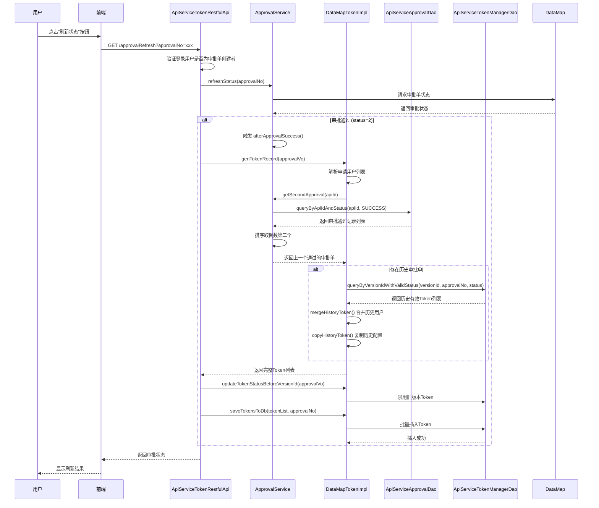

# 数据服务审批与增量授权功能设计文档

## 文档信息

| 项目 | 内容 |
|-----|------|
| 文档版本 | v2.0 |
| 创建日期 | 2026-03-25 |
| 需求类型 | ENHANCE（功能增强） |
| 需求文档 | `docs/1.20.0/数据服务审批与增量授权功能需求.md` |
| 需求编号 | REQ-2026-DSS-015 |
| 涉及模块 | dss-apiservice-server, dss-apiservice-server-webank |

---

## 执行摘要

### 设计目标

| 目标 | 描述 |
|-----|------|
| E1 | 支持批量提单 - 用户可同时选择多个API进行审批提单 |
| E2 | 审批刷新与Token生成 - 审批通过后自动生成Token |
| E3 | 增量授权核心功能 - 自动合并历史授权用户，用户只需填写新增用户 |
| E4 | 历史配置保留 - 保留IP白名单、访问限制等历史配置 |

### 核心设计决策

| 决策项 | 决策内容 | 兼容性策略 |
|-------|---------|-----------|
| 增量授权实现 | 自动合并模式，无需用户指定增量参数 | 保持现有接口签名不变，后端自动处理 |
| Token生成时机 | 审批刷新时手动触发 | 新增`approvalRefresh`接口，不影响现有流程 |
| 历史用户合并 | 在Token生成阶段查询并合并 | 不修改审批表结构，使用现有字段 |
| 旧版本Token处理 | 批量禁用旧版本Token | 新增SQL方法，不修改现有禁用逻辑 |

### 变更影响概览

```
影响范围
├── 接口层
│   ├── ApiServiceTokenRestfulApi.java  [新增方法调用]
│   └── ApiServiceCoreRestfulApi.java   [无变更]
├── 服务层
│   ├── ApprovalServiceImpl.java        [新增方法]
│   └── DataMapTokenImpl.java           [新增方法]
├── DAO层
│   ├── ApiServiceApprovalDao.java      [新增方法]
│   └── ApiServiceTokenManagerDao.java  [新增方法]
└── 数据库
    ├── dss_apiservice_approval         [新增查询]
    └── dss_apiservice_token_manager    [新增查询+更新]
```

### 关键风险与缓解措施

| 风险 | 影响 | 缓解措施 |
|-----|------|---------|
| Token重复生成 | 数据冗余 | 增加审批单号+版本ID去重检查 |
| 历史审批单缺失 | 合并失败 | 空值判断，直接返回申请用户列表 |
| 批量操作性能 | 响应慢 | 使用批量插入，单次SQL更新 |

### 章节导航

| 章节 | 内容 | 层级 |
|-----|------|------|
| Part 1 核心设计 | 兼容性设计、变更影响、核心流程、接口变更 | L1 |
| Part 2 支撑设计 | 数据模型变更、API规范、回滚方案、测试策略 | L2 |
| Part 3 参考资料 | 完整迁移脚本、代码变更、配置文件 | L3 |

---

# Part 1: 核心设计

## 1. 兼容性设计

### 1.1 变更策略总览

| 变更类型 | 涉及模块 | 兼容性保证 |
|---------|---------|-----------|
| 新增方法 | ApprovalService | 接口扩展，不影响现有调用方 |
| 新增方法 | TokenAuth | 接口扩展，不影响现有调用方 |
| 新增方法 | DAO层 | 纯新增查询，不影响现有SQL |
| 现有方法增强 | genTokenRecord | 内部逻辑增强，签名不变 |
| 现有方法增强 | refresh | 内部逻辑增强，签名不变 |

### 1.2 向后兼容保证措施

#### 1.2.1 接口层兼容性

| 接口 | 变更 | 兼容措施 |
|-----|------|---------|
| POST /dss/apiservice/submit | 无变更 | 保持现有请求参数，无需前端修改 |
| GET /dss/apiservice/approvalRefresh | 功能增强 | 保持现有参数，内部增加增量授权逻辑 |
| GET /dss/apiservice/availableSubmitApi | 无变更 | 无影响 |

#### 1.2.2 数据库兼容性

| 表 | 变更类型 | 兼容措施 |
|---|---------|---------|
| dss_apiservice_approval | 无结构变更 | 使用现有字段，无需迁移 |
| dss_apiservice_token_manager | 无结构变更 | 使用现有字段，无需迁移 |
| dss_apiservice_api_version | 无结构变更 | 使用现有状态枚举 |

### 1.3 版本隔离策略

每个API版本拥有独立的Token集合，通过`api_version_id`实现隔离：

```
API V1 (version_id=100) --> Token Set A
API V2 (version_id=200) --> Token Set B (自动继承Set A的用户)
API V3 (version_id=300) --> Token Set C (自动继承Set B的用户)
```

---

## 2. 变更影响分析

### 2.1 影响的模块列表

| 模块 | 影响程度 | 变更说明 |
|-----|:-------:|---------|
| dss-apiservice-server | 低 | 基础实现，无需变更 |
| dss-apiservice-server-webank | 中 | 增强功能实现 |

### 2.2 影响的文件列表

| 文件 | 变更类型 | 影响评估 |
|-----|:-------:|---------|
| ApprovalService.java | 新增方法 | 低风险 |
| ApprovalServiceImpl.java | 新增方法 | 低风险 |
| TokenAuth.java | 新增方法 | 低风险 |
| DataMapTokenImpl.java | 新增方法 | 低风险 |
| ApiServiceApprovalDao.java | 新增方法 | 低风险 |
| ApiServiceApprovalMapper.xml | 新增SQL | 低风险 |
| ApiServiceTokenManagerDao.java | 新增方法 | 低风险 |
| ApiServiceTokenManagerMapper.xml | 新增SQL | 低风险 |
| ApiServiceTokenRestfulApi.java | 逻辑增强 | 中风险 |

### 2.3 风险评估矩阵

| 风险项 | 概率 | 影响 | 风险等级 | 缓解措施 |
|-------|:----:|:----:|:-------:|---------|
| Token重复插入 | 中 | 高 | 高 | 审批单号+版本ID去重 |
| 历史用户遗漏 | 低 | 中 | 中 | 详细日志+单元测试 |
| 性能下降 | 低 | 低 | 低 | 批量操作优化 |

---

## 3. 核心流程设计

### 3.1 审批刷新与Token生成流程（增量授权核心）



### 3.2 关键节点说明表

| 节点 | 处理逻辑 | 输入/输出 | 异常处理 |
|-----|---------|----------|---------|
| 1. 验证创建者 | 检查登录用户是否为审批单创建者 | 输入: approvalNo, userName<br>输出: 验证结果 | 抛出异常100078，提示用户不匹配 |
| 2. 刷新审批状态 | 调用DataMap获取最新审批状态 | 输入: approvalNo<br>输出: ApprovalVo列表 | 捕获异常，返回错误信息 |
| 3. 获取历史审批单 | 查询上一个通过的审批单 | 输入: apiId<br>输出: ApprovalVo或null | 无历史记录时返回null，不合并 |
| 4. 合并历史用户 | 查询历史Token并合并到当前列表 | 输入: 历史审批单信息<br>输出: 合并后的Token列表 | 记录日志，跳过异常用户 |
| 5. 禁用旧版本Token | 批量更新旧版本Token状态为0 | 输入: apiVersionId, apiId<br>输出: 更新结果 | 无 |
| 6. 保存Token | 批量插入Token记录 | 输入: Token列表<br>输出: 保存结果 | 事务回滚，返回错误码800002 |

### 3.3 技术难点说明表

| 难点 | 问题描述 | 解决方案 | 决策理由 |
|-----|---------|---------|---------|
| 历史用户合并 | 如何准确识别并合并历史授权用户 | 通过getSecondApproval获取上一次通过的审批单，查询其有效Token | 简单可靠，数据一致性好 |
| Token重复生成 | 用户多次点击刷新导致Token重复 | 增加审批单号+版本ID去重检查，已存在则跳过 | 避免数据冗余，保证幂等性 |
| 历史配置保留 | 如何保留IP白名单等配置 | 使用BeanUtils.copyProperties复制历史Token属性 | 简单高效，保留所有配置 |
| 版本隔离 | 如何确保只有最新版本Token有效 | 禁用api_version_id小于当前版本的所有Token | 批量操作，性能好 |

### 3.4 边界与约束说明

**前置条件**：
- 用户已登录系统
- 审批单已提交到DataMap
- 审批单状态为"审批中"或"审批通过"

**后置保证**：
- 审批通过后，所有授权用户（申请+历史）均获得有效Token
- 旧版本Token全部被禁用
- Token状态与API版本状态一致

**兼容性保证**：
- 现有提单接口无需修改请求参数
- 现有Token查询接口不受影响
- 审批流程保持不变

**回滚约束**：
- Token一旦生成无法自动撤销
- 需手动禁用或等待过期

---

## 4. 接口变更定义

### 4.1 ApprovalService 接口变更

#### BEFORE（现有代码）

```java
public interface ApprovalService {
    List<ApprovalVo> query(String approvalNo);
    List<ApprovalVo> refreshStatus(String approvalNo) throws Exception;
    void registerApprovalStatusListener(ApprovalStatusListener listener);
}
```

#### AFTER（增强后）

```java
public interface ApprovalService {
    List<ApprovalVo> query(String approvalNo);
    List<ApprovalVo> refreshStatus(String approvalNo) throws Exception;
    void registerApprovalStatusListener(ApprovalStatusListener listener);

    /**
     * [新增] 获取上一个通过的审批单（用于增量授权）
     *
     * 核心逻辑：
     * 1. 查询该API所有审批通过的审批单
     * 2. 按创建时间升序排序
     * 3. 返回倒数第二个审批单（最新的前一个）
     *
     * @param apiId API ID
     * @return 上一个通过的审批单，如果不存在返回 null
     */
    ApprovalVo getSecondApproval(long apiId);

    /**
     * [新增] 根据API ID和状态查询审批记录
     *
     * @param apiId API ID
     * @param status 审批状态
     * @return 审批记录列表
     */
    List<ApprovalVo> queryByApiIdAndStatus(long apiId, int status);
}
```

### 4.2 TokenAuth 接口变更

#### BEFORE（现有代码）

```java
public interface TokenAuth {
    SaveTokenEnum saveTokensToDb(List<TokenManagerVo> tokenManagerVos, String approvalNo)
        throws ApiServiceTokenException;
    List<TokenManagerVo> genTokenRecord(ApprovalVo approvalVo);
}
```

#### AFTER（增强后）

```java
public interface TokenAuth {
    SaveTokenEnum saveTokensToDb(List<TokenManagerVo> tokenManagerVos, String approvalNo)
        throws ApiServiceTokenException;
    List<TokenManagerVo> genTokenRecord(ApprovalVo approvalVo);

    /**
     * [新增] 禁用指定版本之前的所有Token
     *
     * 核心逻辑：
     * 1. 查询该API的所有Token
     * 2. 找出api_version_id小于当前版本的Token
     * 3. 将这些Token状态设置为禁用(status=0)
     *
     * @param approvalVo 当前审批信息（包含apiId和apiVersionId）
     */
    void updateTokenStatusBeforeVersionId(ApprovalVo approvalVo);
}
```

### 4.3 接口变更汇总

| 接口 | 变更类型 | 变更内容 | 兼容性影响 |
|-----|:-------:|---------|-----------|
| ApprovalService.getSecondApproval() | 新增 | 获取上一个通过的审批单 | 无影响 |
| ApprovalService.queryByApiIdAndStatus() | 新增 | 按API ID和状态查询 | 无影响 |
| TokenAuth.updateTokenStatusBeforeVersionId() | 新增 | 禁用旧版本Token | 无影响 |
| TokenAuth.genTokenRecord() | 增强 | 内部增加合并历史用户逻辑 | 无影响 |

---

## 5. 设计决策记录 (ADR)

### ADR-001: 增量授权采用自动合并模式

**状态**: 已采纳

**背景**:
- 用户每次提单都需要填写全部授权用户，体验差
- 需要实现增量授权，用户只需填写新增用户

**决策**:
采用自动合并模式，在Token生成阶段自动查询历史审批单并合并历史用户

**理由**:
1. 无需修改现有提单接口，向后兼容
2. 用户无感知，系统自动处理
3. 实现简单，风险可控

**替代方案**:
- 方案A: 在提单时指定增量模式 - 需要修改接口，兼容性差
- 方案B: 前端预查询历史用户 - 增加前端复杂度

---

### ADR-002: Token生成采用手动刷新模式

**状态**: 已采纳

**背景**:
- 审批通过后需要生成Token
- 需要确定Token生成的触发时机

**决策**:
用户在页面点击"刷新状态"按钮后，调用`approvalRefresh`接口生成Token

**理由**:
1. 用户可控制Token生成时机
2. 避免审批状态同步延迟导致的问题
3. 符合现有用户操作习惯

**替代方案**:
- 方案A: 审批通过后自动生成Token - 需要轮询或回调机制
- 方案B: 定时任务检查并生成 - 实时性差

---

# Part 2: 支撑设计

## 6. 数据模型变更

### 6.1 数据表变更说明

| 表名 | 变更类型 | 变更内容 | 迁移策略 |
|-----|:-------:|---------|---------|
| dss_apiservice_approval | 无变更 | 使用现有字段 | 无需迁移 |
| dss_apiservice_token_manager | 无变更 | 使用现有字段 | 无需迁移 |
| dss_apiservice_api_version | 无变更 | 使用现有状态枚举 | 无需迁移 |

### 6.2 新增查询方法

#### 6.2.1 ApiServiceApprovalDao 新增方法

| 方法名 | 功能 | 参数 | 返回值 |
|-------|------|-----|-------|
| queryByApiIdAndStatus | 根据API ID和状态查询审批记录 | apiId, status | List<ApprovalVo> |

#### 6.2.2 ApiServiceTokenManagerDao 新增方法

| 方法名 | 功能 | 参数 | 返回值 |
|-------|------|-----|-------|
| queryByVersionIdWithValidStatus | 查询某个API版本的所有有效Token | apiVersionId, approvalNo, status | List<TokenManagerVo> |
| updateTokenStatusBeforeVersionId | 禁用指定版本之前的所有Token | apiVersionId, apiId, status | void |

---

## 7. API规范变更

### 7.1 端点变更列表

| 端点 | 方法 | 变更类型 | 说明 |
|-----|:----:|:-------:|------|
| /dss/apiservice/approvalRefresh | GET | 功能增强 | 增加增量授权逻辑 |
| /dss/apiservice/submit | POST | 无变更 | 保持现有接口 |
| /dss/apiservice/availableSubmitApi | GET | 无变更 | 保持现有接口 |

### 7.2 approvalRefresh 接口规范

**请求**:
```
GET /dss/apiservice/approvalRefresh?approvalNo={approvalNo}
```

**响应**:
```json
{
    "method": "/apiservice/approvalRefresh/",
    "status": 0,
    "message": "操作成功",
    "data": {
        "approvalStatus": "审批通过"
    }
}
```

**异常响应**:
```json
{
    "status": 100078,
    "message": "登录用户和审批单的申请用户不匹配，请联系申请用户授权"
}
```

---

## 8. 回滚方案

### 8.1 回滚步骤摘要

| 步骤 | 操作 | 验证点 |
|:---:|------|-------|
| 1 | 代码回滚到上一版本 | 检查接口返回正常 |
| 2 | 无需数据回滚 | 无数据库结构变更 |
| 3 | 验证现有功能正常 | 测试提单、Token查询功能 |

### 8.2 回滚风险评估

| 风险项 | 影响 | 缓解措施 |
|-------|------|---------|
| 已生成的Token | 数据保留 | 无需处理，Token有效期内可用 |
| 审批记录 | 数据保留 | 无需处理，历史审批记录保留 |

---

## 9. 测试策略

### 9.1 单元测试场景

| 测试类 | 测试方法 | 测试场景 |
|-------|---------|---------|
| ApprovalServiceImplTest | testGetSecondApproval | 测试获取上一个通过的审批单 |
| ApprovalServiceImplTest | testGetSecondApprovalWithNoHistory | 测试无历史审批单的情况 |
| DataMapTokenImplTest | testMergeHistoryToken | 测试合并历史用户 |
| DataMapTokenImplTest | testCopyHistoryToken | 测试复制历史Token配置 |
| DataMapTokenImplTest | testSaveTokensToDbDuplicate | 测试重复保存Token |

### 9.2 集成测试场景

| 场景 | 描述 | 预期结果 |
|-----|------|---------|
| 首次提单 | 无历史用户，申请user1,user2 | user1,user2获得Token |
| 增量提单 | 申请user3，历史有user1,user2 | user1,user2,user3获得Token |
| 空用户提单 | 申请用户为空 | 保留所有历史用户 |
| 重复刷新 | 多次调用approvalRefresh | Token不重复插入 |

### 9.3 边界条件测试

| 测试项 | 输入 | 预期结果 |
|-------|-----|---------|
| 无历史审批记录 | API首次提单 | 直接返回申请用户列表 |
| 历史用户全部在申请中 | 申请user1,历史user1 | 不重复添加 |
| 审批单创建者不匹配 | 非创建者调用 | 返回错误100078 |

---

# Part 3: 参考资料

## 10. 完整代码变更

### 10.1 ApprovalServiceImpl.java 新增方法

<details>
<summary>ApprovalServiceImpl.java - getSecondApproval 方法实现</summary>

```java
/**
 * 获取上一个通过的审批单（用于增量授权）
 *
 * 业务场景：
 * 当 API V2 提交审批时，如果需要保留 V1 的授权用户，就需要获取 V1 的审批单信息。
 * 通过查询所有审批通过的记录并排序，返回倒数第二个审批单（最新的前一个）。
 *
 * 使用示例：
 * API V1 审批通过（2026-01-01），授权用户：user1, user2
 * API V2 提交审批（2026-02-01），申请用户：user1, user3
 * 调用此方法获取 V1 的审批单，查询 user1, user2 的 Token 配置
 * 将 user2 的配置复制到 V2，实现增量授权（user1, user2, user3 都有权限）
 *
 * @param apiId API ID
 * @return 上一个通过的审批单，如果不存在返回 null
 */
@Override
public ApprovalVo getSecondApproval(long apiId) {
    // 查询该 API 所有审批通过的审批单（status=3）
    List<ApprovalVo> approvalVoList = queryByApiIdAndStatus(apiId, DataMapStatus.SUCCESS.getIndex());

    // 如果审批通过的记录少于等于 1 条，说明没有上一个审批单（首次提单或只有一次审批）
    if(approvalVoList.size() <= 1){
        return null;
    }

    // 按创建时间升序排序，最新的审批单在列表最后
    approvalVoList.sort(Comparator.comparing(ApprovalVo::getCreateTime));

    // 获取倒数第二个审批单（最新的前一个），即上一次审批通过的记录
    ApprovalVo approvalVo = approvalVoList.get(approvalVoList.size() - 2);
    LOG.info("获取上一个通过的审批单 - API ID: {}, 审批单ID: {}, 审批单号: {}",
             apiId, approvalVo.getId(), approvalVo.getApprovalNo());
    return approvalVoList.get(approvalVoList.size() - 2);
}

@Override
public List<ApprovalVo> queryByApiIdAndStatus(long apiId, int status) {
    return apiServiceApprovalDao.queryByApiIdAndStatus(apiId, status);
}
```

</details>

### 10.2 DataMapTokenImpl.java 新增方法

<details>
<summary>DataMapTokenImpl.java - mergeHistoryToken 方法实现</summary>

```java
/**
 * 合并历史授权用户
 * 将上一版本中已授权但在本次审批申请中未包含的用户，自动合并到当前审批中
 * 增量授权场景：保留历史用户的配置信息（IP 白名单、访问限制等）
 *
 * @param tokenManagerVoList 当前审批申请的用户 token 列表
 * @param approvalVo 当前审批信息
 */
private void mergeHistoryToken(List<TokenManagerVo> tokenManagerVoList, ApprovalVo approvalVo) {

    // 获取上一次审批完成的信息（第二新的审批通过版本）
    ApprovalVo historyApprovalVo = approvalService.getSecondApproval(approvalVo.getApiId());
    if (historyApprovalVo == null) {
        logger.info("api [{},{}] not find history approval",approvalVo.getApiId(),approvalVo.getApprovalName());
        // 没有历史审批记录，无需合并
        return;
    }

    // 提取当前申请的用户列表，用于去重判断
    Set<String> currentUserSet = tokenManagerVoList.stream()
            .map(TokenManagerVo::getUser)
            .collect(Collectors.toSet());

    // 查询上一次审批中所有有效的 token 记录
    List<TokenManagerVo> historyTokenList = apiServiceTokenManagerDao
            .queryByVersionIdWithValidStatus(historyApprovalVo.getApiVersionId(),
                    historyApprovalVo.getApprovalNo(),
                    ApiCommonConstant.API_ENABLE_STATUS);

    logger.info("history token size is {}", historyTokenList.size());
    logger.info("current user is {}",StringUtils.join(currentUserSet,","));
    // 遍历历史 token，找出需要合并的用户（历史中有但本次申请中没有）
    List<TokenManagerVo> tokensToAdd = new ArrayList<>();
    for (TokenManagerVo historyToken : historyTokenList) {
        logger.info("api id is [{},{}], user is {}",historyToken.getApiId(),
                historyToken.getApiVersionId(),historyToken.getUser());
        // 如果该用户已经在当前申请中，跳过
        if (currentUserSet.contains(historyToken.getUser())) {
            continue;
        }

        // 创建新的 token，复制历史 token 的配置信息
        TokenManagerVo newToken = copyHistoryToken(historyToken);
        // 更新为新版本的 API 版本 ID 和审批单号
        newToken.setApiVersionId(approvalVo.getApiVersionId());
        newToken.setApplySource(approvalVo.getApprovalNo());
        newToken.setStatus(1); // 设置为有效状态

        tokensToAdd.add(newToken);
    }

    logger.info("tokensToAdd size is {}", tokensToAdd.size());
    // 将需要合并的 token 添加到列表中（避免在遍历时修改原列表）
    tokenManagerVoList.addAll(tokensToAdd);
}

/**
 * 复制历史 token 的配置信息
 * 保留用户之前设置的 IP 白名单、访问限制等个性化配置
 *
 * @param historyToken 历史 token 配置
 * @return 新的 token 对象，复用历史配置
 */
private TokenManagerVo copyHistoryToken(TokenManagerVo historyToken) {
    TokenManagerVo newToken = new TokenManagerVo();
    // 复制历史 token 的所有属性（除 ID 外）
    BeanUtils.copyProperties(historyToken, newToken);
    newToken.setId(null); // 清空 ID，以便插入新记录
    newToken.setApplyTime(historyToken.getApplyTime() == null ?
            new Date(): historyToken.getApplyTime()); // 如果申请时间空，则更新为当前时间
    return newToken;
}

/**
 * 禁用指定版本之前的所有 Token
 *
 * 业务场景：
 * 当 API V2 审批通过后，需要禁用 V1 的所有 Token，确保只有最新版本的 Token 有效。
 *
 * 执行逻辑：
 * - 查询该 API（apiId）的所有 Token
 * - 找出 api_version_id 小于当前版本的 Token（即旧版本的 Token）
 * - 将这些 Token 的状态设置为禁用（status=0）
 *
 * 示例：
 * API V1（version_id=100）有 Token：user1, user2
 * API V2（version_id=200）审批通过后，禁用 V1 的所有 Token
 * 之后只有 V2 生成的 Token 有效
 *
 * @param approvalVo 当前审批信息（包含 apiId 和 apiVersionId）
 */
@Override
public void updateTokenStatusBeforeVersionId(ApprovalVo approvalVo){
    apiServiceTokenManagerDao.updateTokenStatusBeforeVersionId(
        approvalVo.getApiVersionId(),    // 当前版本 ID
        approvalVo.getApiId(),           // API ID
        ApiCommonConstant.API_DISABLE_STATUS // 禁用状态
    );
    logger.info("已禁用 API {} 版本 {} 之前的所有 Token", approvalVo.getApiId(), approvalVo.getApiVersionId());
}
```

</details>

---

## 11. Mapper XML 变更

### 11.1 ApiServiceApprovalMapper.xml 新增SQL

<details>
<summary>ApiServiceApprovalMapper.xml - queryByApiIdAndStatus</summary>

```xml
<!--
    根据 API ID 和状态查询审批记录列表

    业务场景（获取上一个通过的审批单）：
    1. API 有多个版本，每个版本对应一个审批单
    2. 当需要实现增量授权时，需要获取上一个通过的审批单
    3. 调用此查询: SELECT * FROM approval WHERE api_id=1 AND status=3 ORDER BY create_time DESC
    4. 返回结果按创建时间降序排列，最新的审批单在第一位
    5. 取第二个元素（索引 1），即上一个通过的审批单
-->
<select id="queryByApiIdAndStatus" resultMap="approvalMap">
    SELECT id, api_id, api_version_id, approval_name, apply_user,
           creator, status, approval_no, create_time, update_time
    FROM dss_apiservice_approval
    WHERE api_id = #{apiId}
      AND status = #{status}
    ORDER BY create_time DESC
</select>
```

</details>

### 11.2 ApiServiceTokenManagerMapper.xml 新增SQL

<details>
<summary>ApiServiceTokenManagerMapper.xml - 新增查询和更新</summary>

```xml
<!--
    查询某个 API 版本的所有有效 Token（用于增量授权）

    业务场景（增量授权）：
    1. API V1 审批通过，审批单号 "uuid-v1"，生成 Token: user1, user2
    2. API V2 提交审批，审批单号 "uuid-v2"
    3. 调用此查询获取 V1 的 Token: WHERE api_version_id=100 AND apply_source='uuid-v1' AND status=1
    4. 对比 V2 申请用户列表，发现 user2 不在 V2 申请中
    5. 将 user2 的配置复制到 V2，实现增量授权
-->
<select id="queryByVersionIdWithValidStatus" resultMap="tokenManagerMap">
    SELECT
        id, api_version_id, api_id, publisher, user, apply_time,
        duration, reason, ip_whitelist, status, caller, access_limit,
        token, apply_source
    FROM dss_apiservice_token_manager
    WHERE api_version_id = #{apiVersionId}
      AND apply_source = #{approvalNo}
      AND status = #{status}
    ORDER BY apply_time DESC
</select>

<!--
    禁用指定 API 之前版本的所有 Token
    用途：当 API 新版本审批通过后，禁用旧版本的所有 Token，确保只有最新版本的 Token 有效

    业务场景：
    API V1 (version_id=100) 有 Token: user1, user2
    API V2 (version_id=200) 审批通过后，执行此 SQL
    将所有 api_version_id < 200 的 Token 状态设置为 0（禁用）
    之后只有 V2 生成的 Token 有效
-->
<update id="updateTokenStatusBeforeVersionId">
    UPDATE dss_apiservice_token_manager
    SET status = #{status}
    WHERE api_id = #{apiId}
      AND api_version_id < #{apiVersionId}
</update>
```

</details>

---

## 12. 状态枚举说明

### 12.1 API版本状态枚举

| 状态值 | 名称 | 说明 |
|:-----:|------|------|
| 0 | DISABLE | 禁用 - 历史版本被新版本替代 |
| 1 | ENABLE | 运行中 - 当前生效的版本 |
| 2 | NOT_SUBMITTED | 未提单 - 新创建的版本，等待提单 |
| 3 | SUBMITTED | 已提单 - 已提交审批，等待DM审批结果 |

### 12.2 审批单状态枚举

| 状态值 | 名称 | 说明 |
|:-----:|------|------|
| 0 | INITED | 待审批 |
| 1 | APPROVING | 审批中 |
| 2 | SUCCESS | 审批通过 |
| 3 | FAILED | 审批失败 |

### 12.3 Token状态枚举

| 状态值 | 名称 | 说明 |
|:-----:|------|------|
| 0 | EXPIRED | 过期/禁用 |
| 1 | VALID | 有效期内 |

---

## 附录

### A. 相关文件列表

| 文件路径 | 说明 |
|---------|------|
| dss-apiservice-server-webank/.../ApiServiceTokenRestfulApi.java | 审批刷新接口 |
| dss-apiservice-server-webank/.../ApiServiceCoreRestfulApi.java | 批量提单接口 |
| dss-apiservice-server-webank/.../ApprovalServiceImpl.java | 审批服务实现 |
| dss-apiservice-server-webank/.../DataMapTokenImpl.java | Token生成与增量授权核心 |
| dss-apiservice-server-webank/.../ApiServiceApprovalDao.java | 审批DAO接口 |
| dss-apiservice-server-webank/.../ApiServiceTokenManagerDao.java | Token管理DAO接口 |
| dss-apiservice-server-webank/.../ApiServiceApprovalMapper.xml | 审批SQL映射 |
| dss-apiservice-server-webank/.../ApiServiceTokenManagerMapper.xml | Token管理SQL映射 |

### B. 常量定义

```java
// ApiCommonConstant
public static final String DEFAULT_APPROVAL_NO = "0001";  // 默认审批单号
public static final Integer API_DISABLE_STATUS = 0;       // Token禁用状态
public static final Integer API_ENABLE_STATUS = 1;        // Token有效状态
```

---

## 变更记录

| 版本 | 日期 | 变更内容 | 变更人 |
|------|------|---------|--------|
| v1.0 | 2026-03-18 | 初始版本 | Claude Code |
| v2.0 | 2026-03-25 | 按照标准结构重新生成 | Claude Code |

---

**文档版本**: v2.0
**创建日期**: 2026-03-25
**最后更新**: 2026-03-25
**文档状态**: 已完成
