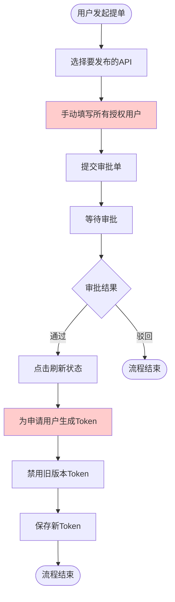
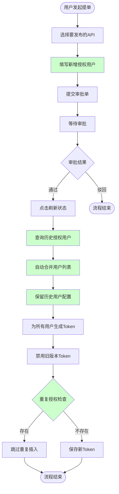
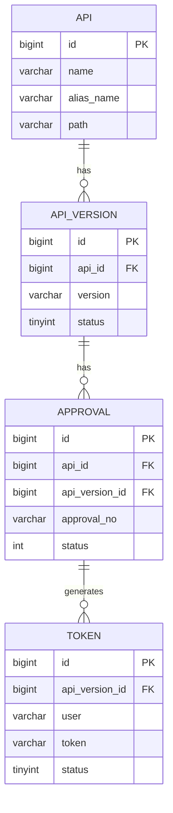

# 数据服务审批与增量授权功能需求文档

**需求类型**: ENHANCE（功能增强）
**基础模块**: dss-apiservice-server（数据服务模块）
**文档版本**: v1.0
**创建日期**: 2026-03-18

---

## 需求速览

| 维度 | 内容 |
|-----|------|
| **一句话描述** | 实现数据服务增量授权功能，支持审批通过后自动合并历史授权用户并生成Token |
| **基础模块** | dss-apiservice-server、dss-apiservice-server-webank |
| **增强目的** | 简化授权流程，避免重复填写历史用户，提升用户体验 |
| **功能范围** | P0: 3个 - P1: 2个 |
| **兼容性要求** | 向后兼容，现有Token管理功能不受影响 |
| **涉及模块** | dss-apiservice-server、dss-apiservice-server-webank |

**功能属性标签**

| 属性维度 | 标签值 |
|---------|-------|
| 前端属性 | workflow（工作流审批） |
| 后端属性 | moderate_rules（中等规则复杂度） |
| 数据属性 | simple_relationship（简单关联关系） |

> **阅读指引**：速览全貌看本卡片 -> 现有功能分析看第三章 -> 增强详情看第五章 -> 技术实现看设计文档

---

## 1. 需求背景

### 1.1 业务背景

数据服务（DataService）是DataSphere Studio的核心功能之一，用于将SQL脚本发布为可调用的REST API。在实际业务场景中，API发布者需要为不同的调用方申请访问Token，涉及审批流程。

**当前痛点**：

1. **重复授权繁琐**：每次API版本更新后重新提单时，发布者需要重新填写所有授权用户（包括历史已授权用户），无法复用历史授权信息。

2. **信息遗漏风险**：由于需要手动填写所有用户，容易出现遗漏历史授权用户的情况，导致部分用户无法访问新版本API。

3. **配置丢失**：历史用户的IP白名单、访问限制等个性化配置在新版本中丢失，需要重新配置。

### 1.2 系统背景

**现有审批流程**：

1. API发布者在Scriptis中创建数据服务
2. 选择API并提交审批单，填写授权用户列表
3. 审批单进入DataMap审批系统
4. 审批通过后，发布者点击"刷新状态"按钮
5. 系统为申请用户生成Token

**问题**：现有流程不支持增量授权，每次提单都需要填写完整的用户列表。

### 1.3 需求范围

| 范围项 | 是否包含 |
|-------|:--------:|
| 批量提单功能 | 是 |
| 审批刷新与Token生成 | 是 |
| 增量授权核心功能 | 是 |
| 历史配置保留 | 是 |
| 重复授权防护 | 是 |
| 前端页面改造 | 否（后续迭代） |
| 审批流程变更 | 否 |

### 1.4 边界定义

**包含内容**：
- 后端增量授权逻辑实现
- 历史Token自动合并
- 历史配置（IP白名单、访问限制）保留
- 重复授权防护机制

**不包含内容**：
- 前端页面UI改造
- 审批流程本身变更
- 新的数据表创建
- 第三方系统对接

### 1.5 术语定义

| 术语 | 定义 |
|-----|------|
| **增量授权** | 在已有授权用户基础上，只需填写新增用户，系统自动合并历史用户 |
| **Token** | API访问令牌，用于身份验证和权限控制 |
| **审批单** | 用户提交的授权申请记录，包含申请用户、授权期限等信息 |
| **API版本** | 数据服务的版本记录，每次发布产生新版本 |
| **DataMap** | 外部审批系统，负责审批流程管理 |

---

## 2. 现有功能分析

### 2.1 现有功能描述

**当前数据服务模块提供的核心功能**：

| 功能 | 接口 | 说明 |
|-----|------|------|
| API创建 | POST /dss/apiservice/api | 创建新的数据服务 |
| API更新 | PUT /dss/apiservice/api/{versionId} | 更新API配置 |
| 批量提单 | POST /dss/apiservice/submit | 提交审批申请 |
| 审批刷新 | GET /dss/apiservice/approvalRefresh | 刷新审批状态并生成Token |
| Token查询 | GET /dss/apiservice/tokenQuery | 查询Token列表 |

**现有Token生成流程**：
1. 用户提交审批单（填写applyUser字段）
2. 审批通过后调用approvalRefresh接口
3. 系统解析applyUser字段，为每个用户生成Token
4. 禁用旧版本Token，保存新版本Token

### 2.2 当前痛点

| 痛点ID | 描述 | 影响范围 |
|--------|------|---------|
| P1 | 版本更新时需重新填写所有授权用户 | 发布者体验差 |
| P2 | 历史授权用户信息可能遗漏 | 业务风险 |
| P3 | 历史IP白名单、访问限制配置丢失 | 用户需重新配置 |
| P4 | 无重复授权防护机制 | 可能产生重复Token |

### 2.3 现有功能依赖

**内部依赖**：
- ApiServiceTokenManagerDao：Token数据库操作
- ApprovalService：审批服务
- JwtManager：Token生成工具

**外部依赖**：
- DataMap审批系统：审批状态查询
- Linkis安全模块：用户身份验证

---

## 3. 核心流程

### 3.1 增强前流程图



**增强前痛点**：填写所有授权用户环节（红色标注）需要手动维护历史用户列表。

### 3.2 增强后流程图



**增强后改进**：绿色标注为新增/优化的环节，实现增量授权自动化。

### 3.3 使用场景详解

**场景一：首次提单**
- 输入：applyUser = "user1,user2"
- 历史用户：无
- 输出：为user1、user2生成Token

**场景二：增量提单**
- 输入：applyUser = "user3,user4"
- 历史用户：user1、user2（来自上次审批）
- 输出：为user1、user2、user3、user4生成Token（自动合并）

**场景三：只保留历史用户**
- 输入：applyUser = ""（空）
- 历史用户：user1、user2
- 输出：为user1、user2生成Token（自动保留历史用户）

---

## 4. 功能总览

### 4.1 功能总览表

| ID | 增强点 | 优先级 | 状态 | 一句话描述 |
|----|-------|:------:|:----:|----------|
| E1 | 批量提单功能 | P0 | 已确认 | 支持一次提交多个API版本 |
| E2 | 审批刷新与Token生成 | P0 | 已确认 | 审批通过后自动生成Token |
| E3 | 增量授权核心功能 | P0 | 已确认 | 自动合并历史授权用户 |
| E4 | 历史配置保留 | P1 | 已确认 | 保留IP白名单、访问限制等配置 |
| E5 | 重复授权防护 | P1 | 已确认 | 防止重复调用导致重复Token |

---

## 5. 增强需求详情

### 5.1 E1：批量提单功能 `P0` `已确认`

**增强描述**

**原有功能**：用户可以选择单个API版本提交审批。

**本次增强**：支持批量选择多个API版本，一次提交多个API的审批申请。

**输入变化**

| 输入项 | 变化类型 | 说明 | 约束 |
|-------|:--------:|------|------|
| submitApiInfos | 新增 | API版本ID列表 | 必填，至少选择1个 |
| approvalName | 修改 | 审批单名称 | 最长200字符 |
| applyUser | 无变化 | 授权用户列表 | 逗号分隔 |
| duration | 无变化 | 授权期限 | 天数或*（永久） |
| backgroundDesc | 无变化 | 背景描述 | 必填 |

**输出变化**

| 输出项 | 变化类型 | 说明 |
|-------|:--------:|------|
| 审批单号 | 无变化 | 返回审批单号 |
| 处理结果 | 新增 | 返回批量处理结果 |

**业务规则**

| 规则ID | 规则描述 |
|--------|---------|
| R1.1 | 审批单名称不能超过200字符 |
| R1.2 | 授权用户字段不能为空 |
| R1.3 | 背景描述为必填项 |
| R1.4 | 工作空间ID为必填项 |
| R1.5 | 涉及JDBC类型API时，需填写开发负责人和产品信息 |

**验收标准（三段式）**

| 验证阶段 | 验收条件 |
|:--------:|---------|
| 【输入验证】 | AC1.1: 提交参数校验通过，必填字段完整 |
| 【处理验证】 | AC1.2: 批量提交的每个API版本都创建审批记录 |
| 【输出验证】 | AC1.3: 返回审批单号，状态为"待审批" |

---

### 5.2 E2：审批刷新与Token生成 `P0` `已确认`

**增强描述**

**原有功能**：审批通过后，用户手动点击刷新，系统为申请用户生成Token。

**本次增强**：刷新时自动合并历史授权用户，为所有用户生成Token。

**输入变化**

| 输入项 | 变化类型 | 说明 | 约束 |
|-------|:--------:|------|------|
| approvalNo | 无变化 | 审批单号 | 必填 |

**输出变化**

| 输出项 | 变化类型 | 说明 |
|-------|:--------:|------|
| approvalStatus | 无变化 | 审批状态描述 |
| Token列表 | 增强 | 包含合并后的所有用户Token |

**业务规则**

| 规则ID | 规则描述 |
|--------|---------|
| R2.1 | 只有审批单创建者可以执行刷新操作 |
| R2.2 | 审批状态为"成功"时才生成Token |
| R2.3 | 生成Token前先禁用旧版本Token |
| R2.4 | Token生成失败时返回错误信息 |

**验收标准（三段式）**

| 验证阶段 | 验收条件 |
|:--------:|---------|
| 【输入验证】 | AC2.1: 审批单号有效，登录用户为创建者 |
| 【处理验证】 | AC2.2: 审批通过时自动调用Token生成逻辑 |
| 【输出验证】 | AC2.3: 返回审批状态，Token已保存到数据库 |

---

### 5.3 E3：增量授权核心功能 `P0` `已确认`

**增强描述**

**原有功能**：仅处理当前审批单中的申请用户。

**本次增强**：自动查询历史审批单，合并历史用户与申请用户，实现增量授权。

**输入变化**

| 输入项 | 变化类型 | 说明 | 约束 |
|-------|:--------:|------|------|
| applyUser | 语义变化 | 新增授权用户（非全部用户） | 可为空 |

**输出变化**

| 输出项 | 变化类型 | 说明 |
|-------|:--------:|------|
| Token列表 | 增强 | 包含历史用户+新增用户 |

**业务规则**

| 规则ID | 规则描述 |
|--------|---------|
| R3.1 | 查询上一次审批通过的审批单（倒数第二个） |
| R3.2 | 提取历史审批单中的有效Token记录 |
| R3.3 | 对用户列表进行去重合并 |
| R3.4 | 申请用户为空时，仅保留历史用户 |
| R3.5 | 首次提单（无历史审批单）时，不执行合并 |

**验收标准（三段式）**

| 验证阶段 | 验收条件 |
|:--------:|---------|
| 【输入验证】 | AC3.1: 正确识别申请用户和历史用户 |
| 【处理验证】 | AC3.2: 用户列表合并正确，无重复用户 |
| 【输出验证】 | AC3.3: Token列表包含所有应授权用户 |

**处理流程说明**

```
1. 获取上一次审批通过的审批单（getSecondApproval）
2. 如果不存在历史审批单，跳过合并
3. 查询历史审批单的有效Token记录
4. 遍历历史Token，找出不在当前申请用户列表中的用户
5. 为这些用户创建新Token，复制历史配置
6. 将新Token添加到Token列表
```

---

### 5.4 E4：历史配置保留 `P1` `已确认`

**增强描述**

**原有功能**：历史用户的个性化配置（IP白名单、访问限制等）在新版本中丢失。

**本次增强**：自动保留历史用户的配置信息。

**输入变化**

| 输入项 | 变化类型 | 说明 | 约束 |
|-------|:--------:|------|------|
| 无新增 | - | - | - |

**输出变化**

| 输出项 | 变化类型 | 说明 |
|-------|:--------:|------|
| ipWhitelist | 增强 | 保留历史用户的IP白名单 |
| accessLimit | 增强 | 保留历史用户的访问限制 |
| caller | 增强 | 保留历史用户的调用方标识 |

**业务规则**

| 规则ID | 规则描述 |
|--------|---------|
| R4.1 | 复制历史Token的所有属性（除ID外） |
| R4.2 | 更新API版本ID为当前版本 |
| R4.3 | 更新审批单号为当前审批单号 |
| R4.4 | 申请时间使用历史Token的申请时间 |

**验收标准（三段式）**

| 验证阶段 | 验收条件 |
|:--------:|---------|
| 【输入验证】 | AC4.1: 正确获取历史Token配置 |
| 【处理验证】 | AC4.2: 配置属性完整复制到新Token |
| 【输出验证】 | AC4.3: 历史用户的IP白名单、访问限制保持不变 |

---

### 5.5 E5：重复授权防护 `P1` `已确认`

**增强描述**

**原有功能**：多次调用刷新接口可能导致重复插入Token记录。

**本次增强**：增加重复授权检查，避免重复Token。

**输入变化**

| 输入项 | 变化类型 | 说明 | 约束 |
|-------|:--------:|------|------|
| 无新增 | - | - | - |

**输出变化**

| 输出项 | 变化类型 | 说明 |
|-------|:--------:|------|
| 处理结果 | 增强 | 重复时跳过插入，返回成功 |

**业务规则**

| 规则ID | 规则描述 |
|--------|---------|
| R5.1 | 检查同一API版本+审批单号是否已存在Token |
| R5.2 | 存在Token时跳过插入，直接返回成功 |
| R5.3 | 默认审批单号（0001）允许重复（用于创建者自授权） |

**验收标准（三段式）**

| 验证阶段 | 验收条件 |
|:--------:|---------|
| 【输入验证】 | AC5.1: 正确检查是否已存在Token记录 |
| 【处理验证】 | AC5.2: 存在Token时跳过插入，不报错 |
| 【输出验证】 | AC5.3: 返回成功状态，无重复Token记录 |

---

## 6. 兼容性分析

### 6.1 接口兼容性

| 接口 | 影响程度 | 兼容性方案 |
|------|:--------:|-----------|
| POST /dss/apiservice/submit | 无影响 | 输入参数无变化，向后兼容 |
| GET /dss/apiservice/approvalRefresh | 无影响 | 输入参数无变化，向后兼容 |
| GET /dss/apiservice/tokenQuery | 无影响 | 返回格式无变化，向后兼容 |

**结论**：所有现有接口保持向后兼容，无需版本升级。

### 6.2 数据兼容性

| 数据项 | 影响程度 | 兼容性方案 |
|--------|:--------:|-----------|
| dss_apiservice_token_manager | 无变化 | 使用现有表结构 |
| dss_apiservice_approval | 无变化 | 使用现有表结构 |
| Token记录 | 语义增强 | 历史Token可正常查询 |

**结论**：无需数据库迁移，现有数据完全兼容。

### 6.3 行为兼容性

| 行为项 | 影响程度 | 兼容性方案 |
|--------|:--------:|-----------|
| Token生成 | 增强 | 增量授权逻辑为新增功能 |
| 审批刷新 | 增强 | 不影响现有刷新逻辑 |
| Token状态更新 | 无变化 | 保持原有逻辑 |

**结论**：新增功能不影响现有业务流程。

---

## 7. 非功能需求

### 7.1 性能需求

| 指标 | 要求 | 说明 |
|------|------|------|
| Token生成响应时间 | <3秒 | 单次刷新生成100个Token以内 |
| 历史查询响应时间 | <1秒 | 查询历史审批单和Token |
| 并发处理 | 支持10个并发刷新 | 同一API的并发刷新需防重 |

### 7.2 安全需求

| 安全项 | 要求 |
|--------|------|
| 权限验证 | 只有审批单创建者可执行刷新操作 |
| 用户验证 | Token中的用户信息必须与申请用户一致 |
| 敏感信息保护 | Token内容需加密存储 |

### 7.3 可用性需求

| 可用性项 | 要求 |
|---------|------|
| 错误提示 | Token生成失败时返回明确错误信息 |
| 日志记录 | 记录Token合并、生成的详细日志 |
| 状态反馈 | 前端展示Token生成结果 |

---

## 8. 数据实体概述

### 8.1 涉及数据表

| 表名 | 用途 | 本次变更 |
|-----|------|---------|
| dss_apiservice_api | API配置表 | 无变更 |
| dss_apiservice_api_version | API版本表 | 无变更 |
| dss_apiservice_approval | 审批单表 | 无变更 |
| dss_apiservice_token_manager | Token管理表 | 无变更（逻辑增强） |

### 8.2 核心字段说明

**dss_apiservice_approval（审批单表）**

| 字段名 | 类型 | 说明 | 取值范围 |
|-------|------|------|---------|
| status | int | 审批状态 | 0:待审批, 1:审批中, 2:成功, 3:失败 |
| apply_user | varchar(1024) | 申请用户 | 逗号分隔的用户名列表 |
| approval_no | varchar(500) | 审批单号 | UUID格式 |

**dss_apiservice_token_manager（Token管理表）**

| 字段名 | 类型 | 说明 | 取值范围 |
|-------|------|------|---------|
| status | tinyint | Token状态 | 0:过期, 1:有效 |
| ip_whitelist | varchar(200) | IP白名单 | IP地址列表 |
| access_limit | varchar(50) | 访问限制 | 限流配置 |
| apply_source | varchar(200) | 申请来源 | 审批单号 |

### 8.3 数据关联关系



---

## 9. 关联影响分析

### 9.1 功能模块影响

| 模块 | 影响等级 | 影响说明 |
|------|:--------:|---------|
| ApiServiceCoreRestfulApi | 轻微 | 接口逻辑无变化 |
| ApiServiceTokenRestfulApi | 轻微 | 接口逻辑无变化 |
| DataMapTokenImpl | 重要 | 新增增量授权逻辑 |
| ApprovalServiceImpl | 轻微 | 新增getSecondApproval方法 |

### 9.2 数据模型影响

| 影响 | 等级 | 说明 |
|-----|:----:|------|
| 表结构变更 | 轻微 | 无需变更 |
| 数据迁移 | 轻微 | 无需迁移 |
| 数据一致性 | 轻微 | 增量逻辑保证一致性 |

### 9.3 安全与权限影响

| 影响 | 等级 | 说明 |
|-----|:----:|------|
| 权限点 | 轻微 | 无新增权限点 |
| 数据访问控制 | 轻微 | 保持原有访问控制 |

### 9.4 用户体验影响

| 影响 | 等级 | 说明 |
|-----|:----:|------|
| 操作流程 | 轻微 | 无变化，后端自动处理 |
| 文案提示 | 轻微 | 无变化 |

### 9.5 上下游影响

| 系统 | 影响等级 | 影响说明 |
|-----|:--------:|---------|
| DataMap审批系统 | 轻微 | 无变化 |
| Linkis安全模块 | 轻微 | 无变化 |

---

## 10. 风险识别

### 10.1 技术风险

| 风险ID | 风险描述 | 可能性 | 影响 | 应对措施 |
|--------|---------|:------:|:----:|---------|
| T1 | 大量历史Token导致合并性能问题 | 低 | 中 | 增加查询索引，限制历史查询数量 |
| T2 | 并发刷新导致Token重复 | 中 | 高 | 增加分布式锁或数据库唯一约束 |
| T3 | JWT生成失败 | 低 | 高 | 增加重试机制和错误日志 |

### 10.2 业务风险

| 风险ID | 风险描述 | 可能性 | 影响 | 应对措施 |
|--------|---------|:------:|:----:|---------|
| B1 | 历史用户误授权 | 低 | 高 | 增加审计日志，支持手动撤销 |
| B2 | 敏感数据访问范围扩大 | 中 | 高 | 审批流程增加敏感数据检查 |

### 10.3 兼容性风险

| 风险ID | 风险描述 | 可能性 | 影响 | 应对措施 |
|--------|---------|:------:|:----:|---------|
| C1 | 历史Token格式不兼容 | 低 | 中 | 保留Token格式不变 |

---

## 11. 回滚方案

### 11.1 回滚触发条件

- 增量授权逻辑导致Token生成失败率超过5%
- 用户反馈授权范围异常
- 系统性能下降超过20%

### 11.2 回滚步骤

| 步骤 | 操作 | 预计时间 |
|------|------|---------|
| 1 | 回滚代码到上一版本 | 5分钟 |
| 2 | 重启apiservice服务 | 5分钟 |
| 3 | 验证现有Token功能正常 | 10分钟 |
| 4 | 通知相关人员 | 5分钟 |

### 11.3 数据恢复

- **无需数据恢复**：本次增强未修改表结构，回滚不影响已有数据。
- **Token状态**：已生成的Token保持有效，不影响用户使用。

---

## 12. 测试关注点

### 12.1 功能测试

| 测试场景 | 测试要点 | 优先级 |
|---------|---------|:------:|
| 首次提单 | 无历史用户时正常生成Token | P0 |
| 增量提单 | 正确合并历史用户和申请用户 | P0 |
| 空申请用户 | 申请用户为空时保留历史用户 | P0 |
| 重复刷新 | 多次刷新不产生重复Token | P1 |
| 配置保留 | IP白名单、访问限制正确保留 | P1 |
| 并发刷新 | 并发场景下Token不重复 | P1 |

### 12.2 性能测试

| 测试场景 | 测试指标 | 预期结果 |
|---------|---------|---------|
| 大量Token生成 | 响应时间 | 100个Token < 3秒 |
| 历史查询 | 响应时间 | < 1秒 |
| 并发刷新 | 成功率 | 10并发成功率100% |

### 12.3 兼容性测试

| 测试场景 | 测试要点 |
|---------|---------|
| 历史Token查询 | 旧版本Token可正常查询 |
| 审批状态查询 | 历史审批单可正常查询 |
| 接口兼容 | 现有接口调用正常 |

### 12.4 安全测试

| 测试场景 | 测试要点 |
|---------|---------|
| 权限验证 | 非创建者无法刷新Token |
| Token有效性 | 生成的Token可正常使用 |
| 敏感信息 | Token信息加密存储 |

---

## 13. 附录

### 13.1 LCF澄清质量指标

| 指标 | 值 |
|-----|---|
| 澄清轮次 | 1轮（基于现有代码分析） |
| 核心发现完整度 | 100% |
| 目标拆解覆盖度 | 100% |
| 关键约束识别率 | 100% |

### 13.2 相关文档

| 文档类型 | 文档路径 |
|---------|---------|
| 源码位置 | dss-apps/dss-apiservice-server-webank/src/main/java/ |
| 数据库DDL | db/apps/dss_apiservice_ddl.sql |
| API文档 | 本需求文档 |

### 13.3 术语表

| 术语 | 英文 | 定义 |
|-----|------|------|
| 数据服务 | DataService | 将SQL脚本发布为REST API的功能 |
| 增量授权 | Incremental Authorization | 在现有授权基础上添加新用户 |
| Token | Token | API访问令牌 |
| 审批单 | Approval | 授权申请记录 |
| DataMap | DataMap | 外部审批系统 |

---

## 变更记录

| 版本 | 日期 | 变更内容 | 变更人 |
|------|------|---------|--------|
| v1.0 | 2026-03-18 | 初始版本 | Claude Code |