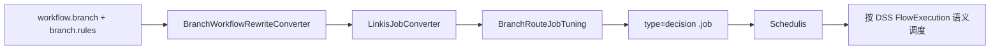
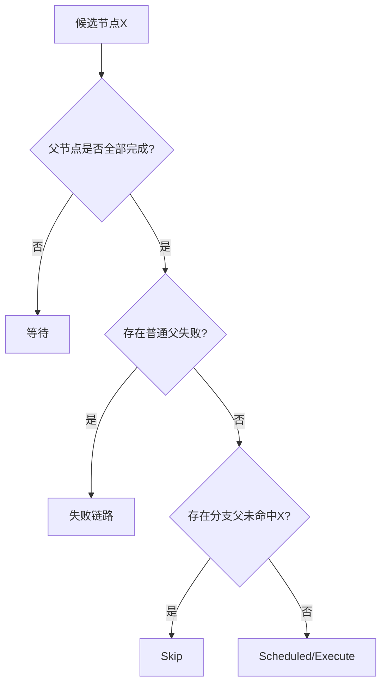

# 工作流分支节点设计文档

## 1. 文档信息
- 版本：1.21.0
- 状态：已更新
- 设计范围：DSS 发布层分支适配 + 语义对齐要求

## 2. 设计结论
本版本采用“DSS 规则配置 + 发布为 decision + 语义对齐 DSS FlowExecution”的方案：
- DSS 节点类型保持 `workflow.branch`。
- 规则配置保持 `branch.rules`。
- 发布到 Schedulis 时分支节点 `.job` 转换为 `type=decision`。
- Schedulis 运行期必须按 DSS FlowExecution 语义判定分支下游。

## 3. 总体架构

### 3.1 关键模块
- `BranchWorkflowRewriteConverter`
  - 提取分支规则并补充 route 元数据。
- `BranchRouteJobTuning`
  - 将分支节点类型调优为 `decision`。
- `LinkisJobConverter`
  - 生成 decision 节点属性：`condition.N/on.success.N/on.failure.N`。
- `AzkabanDssJobType`
  - 仅保留动态变量提取与 props 输出，不承担 guard/route 分支裁剪。

### 3.2 架构示意图


## 4. 核心设计

### 4.1 决策节点发布设计
分支节点发布规则：
1. 读取 `wds.branch.route.rule.text`。
2. 按 `;` 切分规则。
3. 每条规则按最后一个 `=` 切分条件与目标。
4. 输出：
   - `condition.N`
   - `on.success.N`
   - `on.failure.N=`
5. `default=xxx` 转换为 `condition.N=true`。

### 4.2 字段过滤设计
当 `type=decision` 时，不输出 linkis 专属字段：
- `linkis.version`
- `linkistype`
- `command`

### 4.3 分支语义对齐设计（重点）
对齐依据：DSS `FlowDependencyResolverImpl`。

关键语义：
1. 父节点未全部完成 -> 等待。
2. 存在分支父节点未命中当前节点 -> `skip`。
3. 所有分支父节点命中且普通父节点完成无失败 -> 可执行。
4. 普通父节点失败 -> 失败链路。

特别说明：
- 混合上游场景（分支未命中 + 普通父成功）必须 `skip`。
- 该语义优先于“任一父成功即可执行”。

### 4.4 状态判定流程图


## 5. 关键场景补充

### 5.1 编号10场景（混合父节点）
- 条件：节点 X 有普通父 A（成功）和分支父 B（未命中 X）。
- 结果：X 必须 `skip`。
- 原因：分支未命中判定优先，严格对齐 DSS FlowExecution。

### 5.2 示例
输入：
```text
branch.rules = b==200=sql_1345;b<50=sql_9000
```

输出：
```properties
type=decision
condition.1=b==200
on.success.1=sql_1345
on.failure.1=
condition.2=b<50
on.success.2=sql_9000
on.failure.2=
```

## 6. 实现约束
1. 不再依赖 DSS `guard` 运行时裁剪语义来决定下游执行。
2. 不允许 Schedulis 语义偏离 DSS 矩阵规则。
3. jobtype 仅负责动态变量进入 props，供 decision 条件使用。

## 7. 验证要点
1. 分支节点发布后是 `type=decision`。
2. decision 属性展开正确。
3. 混合上游编号10场景验证为 `skip`。
4. 与 DSS FlowExecution 语义逐条对齐通过。

## 8. 非目标
- 不引入新的分支 DSL。
- 不新增分支数据库模型。
- 不改动分支节点前端配置入口。