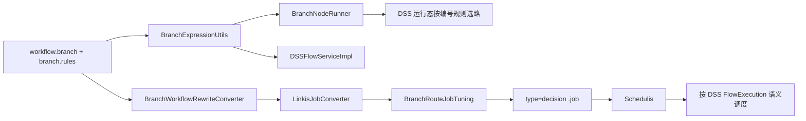
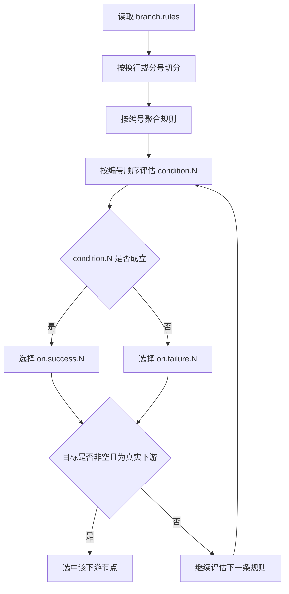
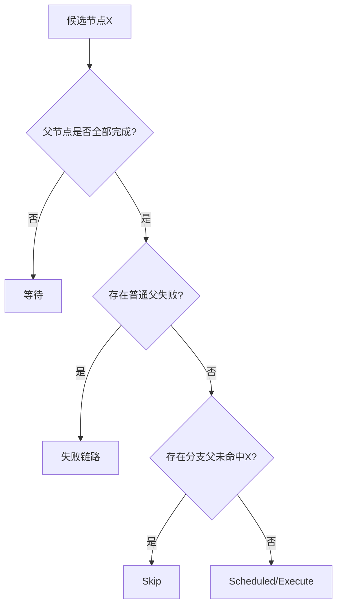

# 工作流分支节点设计文档

## 1. 文档信息
- 版本：1.21.0
- 状态：已更新
- 设计范围：DSS 分支节点运行态、发布层分支适配与语义对齐

## 2. 设计结论
本版本采用“DSS 规则配置统一为编号属性 + DSS 运行态直接选路 + 发布为 decision + 语义对齐 DSS FlowExecution”的方案：
- DSS 节点类型保持 `workflow.branch`。
- 规则配置保持 `branch.rules`。
- `branch.rules` 格式统一为 `condition.N / on.success.N / on.failure.N`。
- DSS 运行态直接解析该格式并完成分支选路。
- 发布到 Schedulis 时分支节点 `.job` 转换为 `type=decision`，沿用相同编号属性。
- Schedulis 运行期必须按 DSS FlowExecution 语义判定分支下游。

## 3. 总体架构

### 3.1 关键模块
- `BranchExpressionUtils`
  - DSS 运行态解析 `branch.rules`。
  - 按编号聚合 `condition.N / on.success.N / on.failure.N`。
  - 提供条件表达式求值能力。
- `BranchNodeRunner`
  - DSS 运行态分支节点执行器。
  - 按编号顺序评估规则。
  - 条件为真时选择 `on.success.N`，条件为假时选择 `on.failure.N`。
- `DSSFlowServiceImpl`
  - 保存/校验阶段解析分支规则。
  - 校验 success/failure 目标是否属于当前分支节点的真实下游。
- `BranchWorkflowRewriteConverter`
  - 提取分支规则并补充 route 元数据。
- `LinkisJobConverter`
  - 将统一后的 `branch.rules` 转换为 `decision` 节点属性：`condition.N/on.success.N/on.failure.N`。
- `BranchRouteJobTuning`
  - 将分支节点类型调优为 `decision`。
- `AzkabanDssJobType`
  - 仅保留动态变量提取与 props 输出，不承担 guard/route 分支裁剪。

### 3.2 架构示意图


## 4. 核心设计

### 4.1 规则格式统一设计
统一后的 `branch.rules` 使用如下形式：
```properties
condition.1=amount == 101
on.success.1=sql_2762
on.failure.1=sql_1358
condition.2=amount > 200
on.success.2=sql_8277
on.failure.2=sql_7655
```

约束：
1. 支持多个 `condition.N`，规则数量不限制。
2. 规则之间支持换行或 `;` 分隔。
3. 同一编号下，`condition.N` 必填。
4. 同一编号下，`on.success.N` 和 `on.failure.N` 至少一个非空。
5. 不支持 `default`、`else`、`*` 默认分支关键字。

### 4.2 DSS 运行态解析与选路设计
DSS 运行态读取 `branch.rules` 后，处理流程如下：
1. 按换行或 `;` 切分原始文本。
2. 按 key 前缀识别 `condition.`、`on.success.`、`on.failure.`。
3. 依据编号 `N` 聚合同一组规则。
4. 按编号升序逐条求值：
   - 条件成立，取 `on.success.N`
   - 条件不成立，取 `on.failure.N`
5. 若当前选出的目标为空，或目标不是当前分支节点真实下游，则继续评估下一条规则。
6. 若全部规则均未选中有效下游，则分支节点执行失败。

### 4.3 DSS 运行态流程图


### 4.4 决策节点发布设计
分支节点发布规则：
1. 读取统一后的 `branch.rules`。
2. 按换行或 `;` 切分规则条目。
3. 识别 `condition.N`、`on.success.N`、`on.failure.N`。
4. 按编号聚合并输出：
   - `condition.N`
   - `on.success.N`
   - `on.failure.N`
5. 发布后的 `.job` 使用：
   - `type=decision`
   - 连续编号 decision 属性

### 4.5 字段过滤设计
当 `type=decision` 时，不输出 linkis 专属字段：
- `linkis.version`
- `linkistype`
- `command`

### 4.6 分支语义对齐设计（重点）
对齐依据：DSS FlowExecution 语义。

关键语义：
1. 父节点未全部完成 -> 等待。
2. 存在分支父节点未命中当前节点 -> `skip`。
3. 所有分支父节点命中且普通父节点完成无失败 -> 可执行。
4. 普通父节点失败 -> 失败链路。

特别说明：
- 混合上游场景（分支未命中 + 普通父成功）必须 `skip`。
- 该语义优先于“任一父成功即可执行”。
- DSS 运行态的 `on.failure.N` 仅决定分支节点本身选中的下游目标，不改变下游节点的依赖判定矩阵。

### 4.7 状态判定流程图


## 5. 关键场景补充

### 5.1 编号10场景（混合父节点）
- 条件：节点 X 有普通父 A（成功）和分支父 B（未命中 X）。
- 结果：X 必须 `skip`。
- 原因：分支未命中判定优先，严格对齐 DSS FlowExecution。

### 5.2 编号规则示例
输入：
```properties
condition.1=amount == 101
on.success.1=sql_2762
on.failure.1=sql_1358
condition.2=amount > 200
on.success.2=sql_8277
on.failure.2=sql_7655
```

DSS 运行态语义：
- 若 `amount == 101`，优先选择 `sql_2762`
- 若 `amount != 101`，优先选择 `sql_1358`
- 若第一组规则未落到真实下游，再继续评估第 2 组规则

发布输出：
```properties
type=decision
condition.1=amount == 101
on.success.1=sql_2762
on.failure.1=sql_1358
condition.2=amount > 200
on.success.2=sql_8277
on.failure.2=sql_7655
```

## 6. 实现约束
1. DSS 与 Schedulis 使用统一的编号规则格式。
2. 不再使用旧的 `条件=目标节点名` 分支规则格式。
3. 不再依赖 DSS `guard` 运行时裁剪语义来决定下游执行。
4. 不允许 Schedulis 语义偏离 DSS 矩阵规则。
5. jobtype 仅负责动态变量进入 props，供 decision 条件使用。

## 7. 验证要点
1. DSS 运行态能够正确解析多个 `condition.N`。
2. DSS 运行态能够在条件不成立时走 `on.failure.N`。
3. 分支节点发布后是 `type=decision`。
4. decision 属性展开正确。
5. 混合上游编号10场景验证为 `skip`。
6. 与 DSS FlowExecution 语义逐条对齐通过。

## 8. 非目标
- 不引入新的分支 DSL。
- 不新增分支数据库模型。
- 不改动分支节点前端配置入口。
