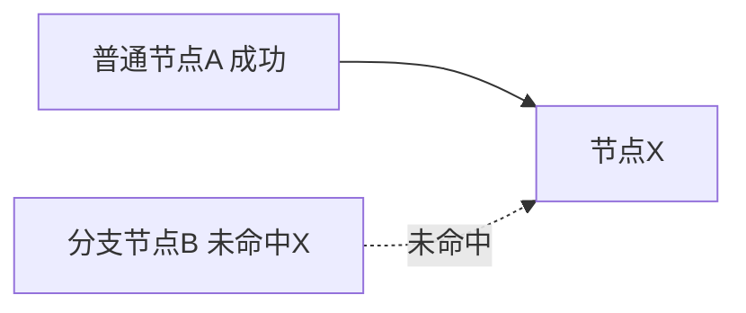
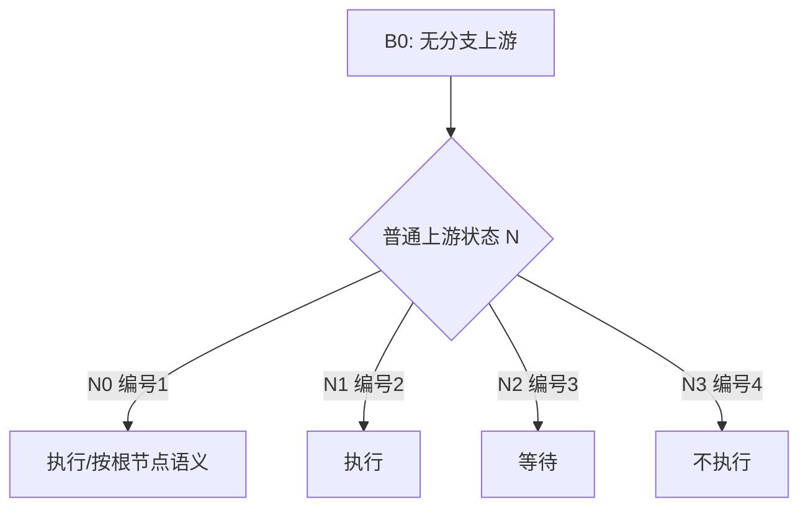
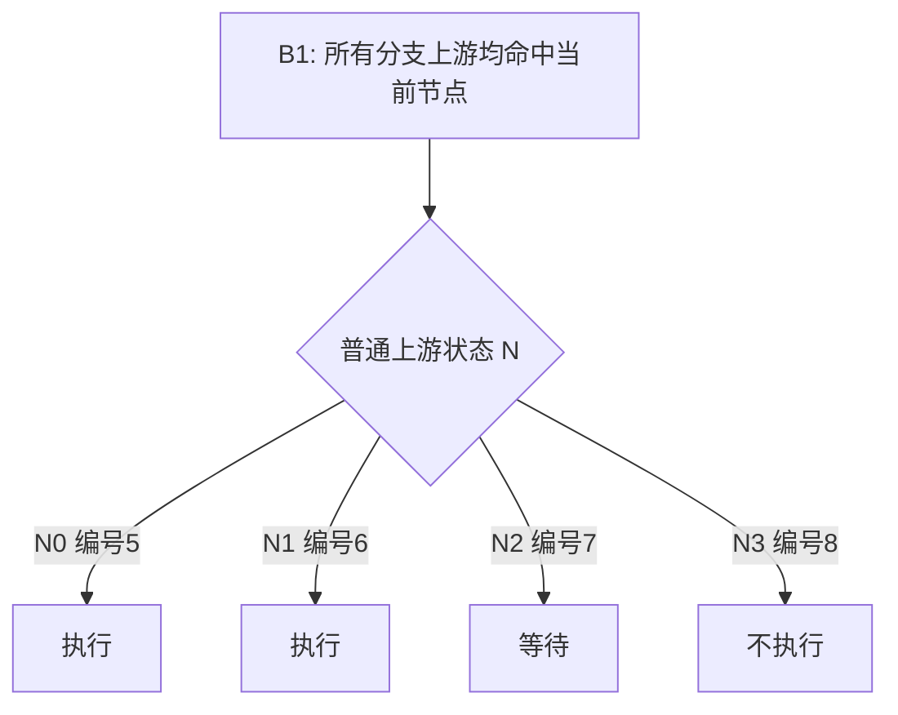
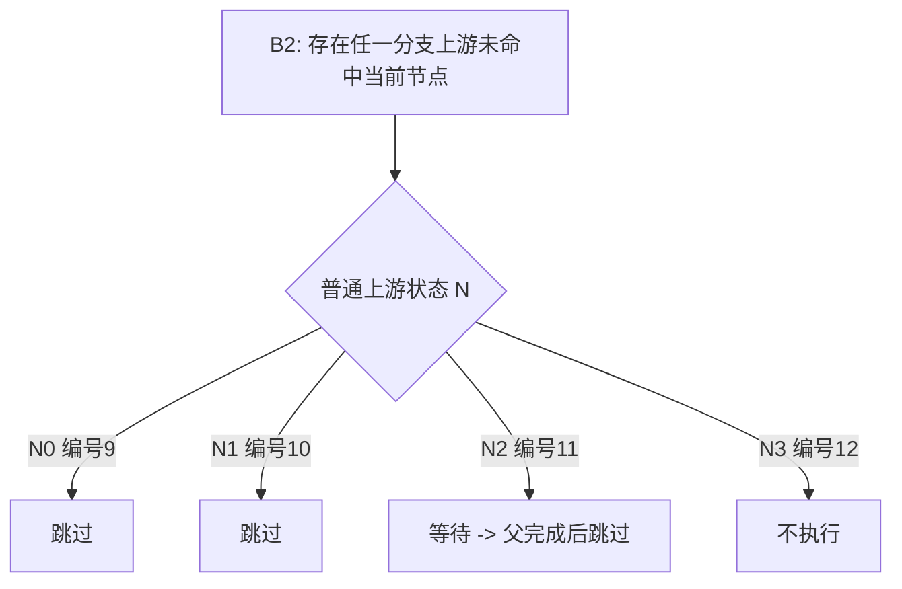
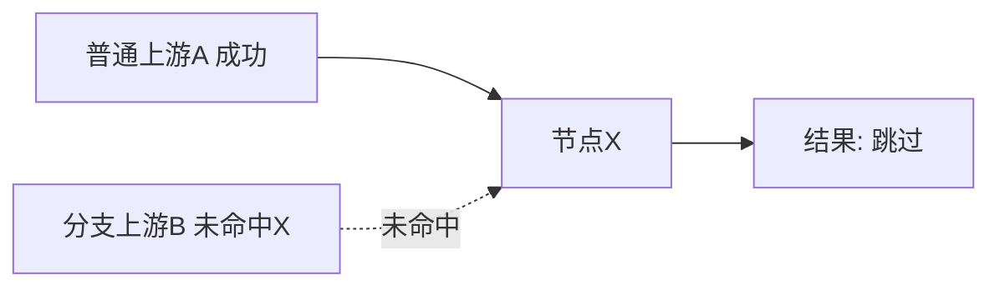

# 工作流分支节点需求文档

## 1. 文档信息
- 版本：1.21.0
- 状态：已更新
- 适用范围：DSS 工作流 `workflow.branch` 节点（发布到 Schedulis）

## 2. 需求背景
DSS 已支持分支节点规则配置（`branch.rules`），发布到调度侧后需保持与 DSS FlowExecution 一致的分支语义。

本次需求重点：
- DSS 侧继续使用 `branch.rules` 作为规则来源。
- 发布到 Schedulis 时将分支节点转换为 `type=decision`。
- 调度执行语义严格对齐 DSS FlowExecution（尤其是混合上游场景）。

## 3. 目标
1. 分支节点在 DSS 侧配置不变，仍由 `branch.rules` 驱动。
2. 发布到 Schedulis 的分支节点 `.job` 结构符合约定。
3. 分支下游执行判定严格遵循 DSS FlowExecution 语义。

## 4. 核心需求

### 4.1 节点类型与规则来源
- 节点类型：`workflow.branch`
- 规则来源：节点参数 `branch.rules`
- 规则语法：`条件=目标节点名`，多条规则用 `;` 分隔

示例：
```text
b==200=sql_1345;b<50=sql_9000
```

### 4.2 发布后 `.job` 必备属性（分支节点）
分支节点发布后应满足：
```properties
type=decision
condition.1=b==200
on.success.1=sql_1345
on.failure.1=
condition.2=b<50
on.success.2=sql_9000
on.failure.2=
```

### 4.3 规则映射要求
- 规则按顺序展开为 `N=1..k`。
- 使用最后一个 `=` 切分“条件”和“目标节点名”。
- `default=节点X` 在发布时转换为 `condition.N=true`。
- 无法解析的规则条目跳过，不生成对应 `N`。

### 4.4 语义对齐约束（强制）
- Schedulis 侧分支判定必须对齐 DSS FlowExecution：
  - 若节点存在分支父节点且该分支未命中当前节点，则节点应判定为 `skip`。
  - 该规则优先于“存在其他普通父节点成功即可执行”的策略。
- 不允许出现“分支未命中但因普通父节点成功而执行”的语义偏差。

## 5. 关联下游节点执行判定（严格 DSS FlowExecution）
### 5.1 判定维度
- 分支上游状态（B）：
  - `B0`：无分支上游
  - `B1`：所有分支上游均命中当前节点
  - `B2`：存在任一分支上游未命中当前节点
- 普通上游状态（N）：
  - `N0`：无普通上游
  - `N1`：普通上游全部完成且无失败
  - `N2`：普通上游未全部完成
  - `N3`：存在普通上游失败

### 5.2 判定规则
1. 若 `N3`，流程进入失败链路，节点不执行。
2. 若父节点未全部完成（`N2` 或分支父未完成），节点等待。
3. 若存在 `B2`，节点 `skip`。
4. 若 `B1` 且普通父节点完成无失败（`N1` 或 `N0`），节点执行。
5. 若 `B0` 且普通父节点完成无失败（`N1`），节点执行。

### 5.3 全量判定矩阵（12种）
| 编号 | 分支上游状态B | 普通上游状态N | 结果 | 说明 |
|---|---|---|---|---|
| 1 | B0 | N0 | 执行/根节点语义 | 无依赖场景按流程起点处理 |
| 2 | B0 | N1 | 执行 | 纯普通链路完成 |
| 3 | B0 | N2 | 等待 | 普通父节点未完成 |
| 4 | B0 | N3 | 不执行 | 失败链路 |
| 5 | B1 | N0 | 执行 | 纯分支链路且命中 |
| 6 | B1 | N1 | 执行 | 分支命中且普通链路完成 |
| 7 | B1 | N2 | 等待 | 父节点未完成 |
| 8 | B1 | N3 | 不执行 | 失败链路 |
| 9 | B2 | N0 | 跳过 | 分支未命中 |
| 10 | B2 | N1 | 跳过 | **分支未命中优先，严格 DSS 语义** |
| 11 | B2 | N2 | 等待/后续跳过 | 先等待父完成，完成后按未命中跳过 |
| 12 | B2 | N3 | 不执行 | 失败链路 |

### 5.4 混合上游场景示意图（编号10）


预期：`X` 跳过（严格 DSS FlowExecution 语义）。

### 5.5 关联下游节点执行判定图示（覆盖全部场景）
为便于和 5.3 判定矩阵逐条对应，按 `B0/B1/B2` 分组画图如下。

#### 5.5.1 B0（无分支上游）场景：编号 1/2/3/4


#### 5.5.2 B1（分支均命中）场景：编号 5/6/7/8


#### 5.5.3 B2（存在分支未命中）场景：编号 9/10/11/12


#### 5.5.4 混合上游关键场景（编号10）


说明：即使存在成功的普通上游，只要命中 `B2`，仍按 DSS FlowExecution 严格语义判定为跳过。

#### 5.5.5 统一判定总流程（便于实现时对齐）
```mermaid
flowchart TD
    Start[开始判定节点X] --> F{是否存在失败父节点 N3?}
    F -->|是| End1[不执行]
    F -->|否| C{父节点是否全部完成?}
    C -->|否| End2[等待]
    C -->|是| B2{是否命中 B2?}
    B2 -->|是| End3[跳过]
    B2 -->|否| R{是否满足可执行条件?}
    R -->|是: B1&(N0/N1) 或 B0&N1 或 B0&N0| End4[执行]
    R -->|否| End5[等待/不执行]
```

## 6. 发布与映射流程示意图


## 7. 验收标准
1. `workflow.branch` 节点发布后 `type=decision`。
2. `branch.rules` 正确展开为连续编号的 `condition.N/on.success.N/on.failure.N`。
3. 混合上游场景按第5章矩阵执行，编号10必须为“跳过”。
4. Schedulis 侧回归验证与 DSS FlowExecution 语义一致。

## 8. 非目标
- 不引入新的分支规则 DSL。
- 不新增分支专用数据库表或独立 CRUD API。
