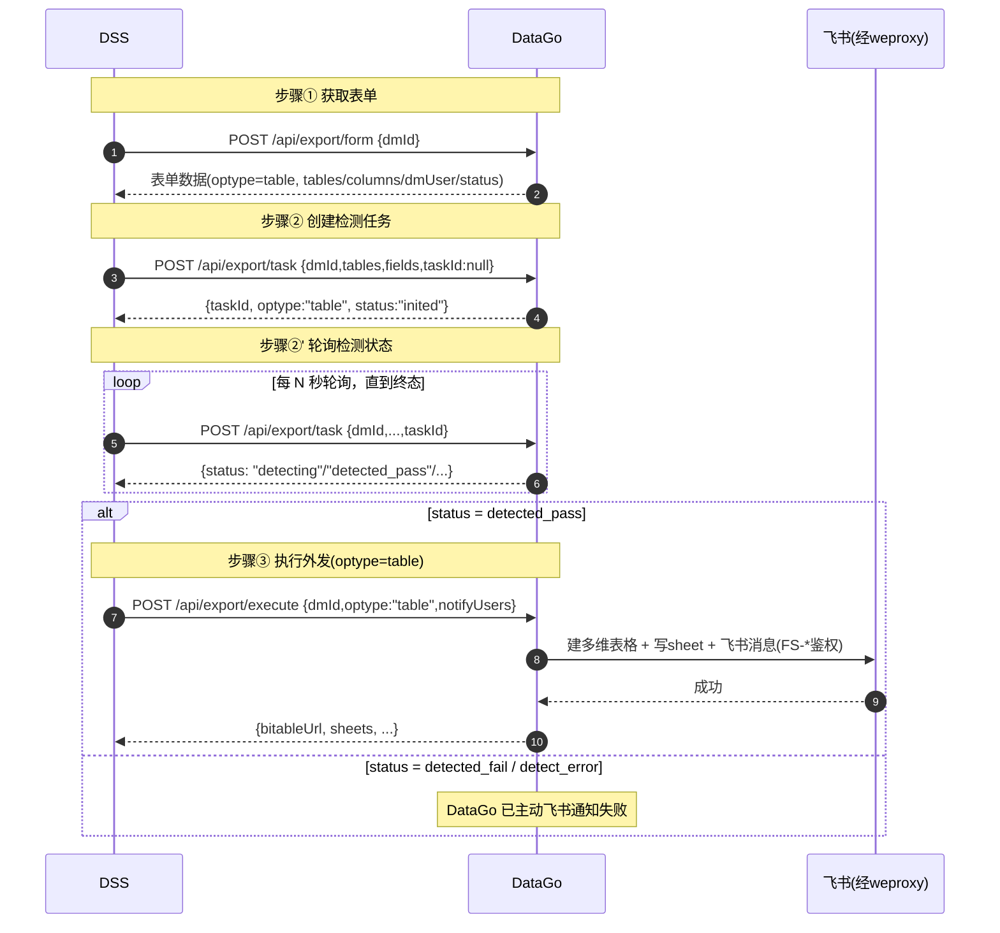

# 数据外发 接口文档（供 DSS 对接）

## 文档信息

| 项 | 值 |
|----|----|
| 文档版本 | v1.9 |
| 创建日期 | 2026-07-15 |
| 最近更新 | 2026-07-18 |
| 所属分支 | 1.5.0-alexyang-feishu |
| 接口提供方 | DataGo（datago） |
| 接口消费方 | DSS 调度服务 |
| 关联设计 | [数据外发飞书多维表格_设计.md](./数据外发飞书多维表格_设计.md) |
| 关联需求 | [数据外发飞书多维表格_需求.md](../requirements/数据外发飞书多维表格_需求.md) |

> **重要说明**：本组接口为 **DataGo 通用数据外发接口**，按 **`optype`** 区分外发对象：
> - `optype=table`（本期实现）→ **飞书多维表格**外发（库表原始数据 → 检测 → 写多维表格）
> - `optype=datago`（报告）→ 沿用现有报告外发（企微渠道），**本期本组接口不处理**，DSS 对报告外发仍走现有 `/api/report/*`
>
> 本文档详细契约针对 **`optype=table`**；`optype=datago` 仅说明路由策略，不展开。

---

## 1. 概述

DataGo 提供通用数据外发接口，支撑「DM 审批单驱动 → 脱敏检测 → 批量外发」全流程：

| 编号 | 接口 | 方法 & 路径 | 用途 |
|:----:|------|------------|------|
| ① | 外发表单获取 | `POST /api/export/form` | 按 dm 单号查询外发表单数据 |
| ② | 外发任务生成/状态查询 | `POST /api/export/task` | 创建检测任务（taskId 空）或查询状态（taskId 非空） |
| ③ | 执行外发 | `POST /api/export/execute` | 检测全通过后批量外发 |
| ④ | 飞书消息发送 | `POST /api/export/message` | 向指定用户发文本消息（仅文本，通用通知，不依赖 dm 单） |

**Base URL**：`http://{DataGoHost}:{DataGoPort}`（默认端口 `3003`，按部署环境填写）  
**Content-Type**：`application/json; charset=utf-8`  
**字符集**：UTF-8

## 2. 鉴权与通用约定

### 2.1 请求头

| Header | 必填 | 说明 |
|--------|:----:|------|
| `Content-Type` | 是 | `application/json; charset=utf-8` |
| `X-Request-Id` | 否 | 请求追踪 ID（强烈建议传入，便于全链路排查；不传则服务端生成） |

> **鉴权方式**：本组接口为**内网服务间调用**，当前版本依赖**网络层隔离**（DSS 与 DataGo 同处 SF 内网安全区）。如需服务级鉴权（如固定 Token / IP 白名单），由双方约定后在本文档补充。**DSS 无需关心飞书侧鉴权**（`optype=table` 时 FS-* 鉴权由 DataGo 内部处理）。

### 2.2 optype 判别

外发对象类型由 dm 单的 **`optype`** 字段决定（贯穿 ①②③）：

| optype | 外发对象 | 外发渠道 | 本期支持 |
|--------|---------|---------|:--------:|
| `table` | 库表原始数据 | 飞书多维表格（+ 飞书消息） | ✅ |
| `datago` | 报告 | 企业微信（现有报告外发） | ❌（走 `/api/report/*`） |

> dm 单的 `optype` 在 DM 审批/DGSA 推送时确定。③ 接口按 optype 路由外发逻辑。
>
> **取值归一化**：dm 单 `optype` 与 ③ 入参 `optype` 均兼容 `_type` 后缀写法——`table`/`table_type`、`datago`/`datago_type` 等价（大小写无关），服务端统一归一化为短形式 `table`/`datago`。dm 单未声明 `optype` 时默认 `datago`（报告外发）。

### 2.3 统一响应结构

```json
{
  "success": true,
  "code": 200,
  "message": "描述信息",
  "data": { ... }
}
```

| 字段 | 类型 | 说明 |
|------|------|------|
| `success` | boolean | 业务是否成功 |
| `code` | number | HTTP 状态码（与 HTTP status 一致） |
| `message` | string | 结果描述/错误信息 |
| `data` | object \| null | 业务数据，失败时为 `null` |

### 2.4 任务状态枚举（optype=table）

② 接口返回的 `status` 字段取值：

| status 值 | 含义 | 是否终态 | DSS 后续动作 |
|-----------|------|:--------:|-------------|
| `inited` | 已创建，待检测 | 否 | 等待检测，继续轮询 |
| `detecting` | 检测中 | 否 | 继续轮询 |
| `detected_pass` | 检测通过 | 否 | 可调 ③ 外发 |
| `detected_fail` | 检测不通过（命中敏感） | 是 | 流程终止，已飞书通知 |
| `detect_error` | 检测异常（已自动重试 2 次仍失败） | 是 | 流程终止，已飞书通知 |
| `exported` | 已外发 | 是 | 流程完成 |

### 2.5 通用错误码

| code | 含义 | 触发场景 |
|:----:|------|---------|
| 200 | 成功 | 正常响应 |
| 400 | 参数错误 | 必填缺失、optype 非法、notifyUsers 为空等 |
| 403 | 权限/校验失败 | dm 单无效、notifyUsers 非 dm 单用户子集 |
| 404 | 不存在 | dm 单/任务不存在 |
| 409 | 状态冲突 | 存在未检测通过的任务、optype 不支持 |
| 413 | （已移除） | 原「单 sheet 超 50MB」不再拒绝；50MB 改为写入时按请求体分批 |
| 500 | 服务内部错误 | DataGo 内部异常 |
| 502 / 504 | 上游不可达 | weproxy-nginx / 飞书不可达（③ 外发时） |

---

## 3. 接口详情

### 3.1 ① 外发表单获取 — `POST /api/export/form`

**用途**：按 dm 单号查询外发表单数据（库表、字段、分区、用户、optype、检测/外发状态）。

#### 请求体

| 字段 | 类型 | 必填 | 说明 |
|------|------|:----:|------|
| `dmId` | string | 否 | DM 审批单号。**不传或不存在时返回空数据** |

```json
{ "dmId": "DM202607150001" }
```

#### 响应（dm 单存在，optype=table）

```json
{
  "success": true,
  "code": 200,
  "message": "获取成功",
  "data": {
    "dmId": "DM202607150001",
    "dmTitle": "2026年7月审计数据外发申请",
    "dmUser": "alexyang",
    "optype": "table",
    "tables": [
      {
        "dbName": "db_audit",
        "tableName": "t_event_log",
        "partition": "ds=2026-07-14",
        "columns": ["user_id", "event", "ts"],
        "usernames": ["ryanchen", "alexyang"]
      }
    ],
    "status": "detected_pass"
  }
}
```

| 字段 | 类型 | 说明 |
|------|------|------|
| `data.dmId` | string | dm 单号 |
| `data.dmTitle` | string | dm 单标题 |
| `data.dmUser` | string | 提单人（dm 单检测用户；③ 的 notifyUsers 须为其子集） |
| `data.optype` | string | 外发对象类型（`table` / `datago`） |
| `data.tables` | array | 库表列表（optype=table 时） |
| `data.tables[].dbName` | string | 库名 |
| `data.tables[].tableName` | string | 表名 |
| `data.tables[].partition` | string | 分区（如 `ds=2026-07-14`） |
| `data.tables[].columns` | string[] | 授权列（来自 dm 单 `column`，**必填**；为空的表视为无效，① 自动剔除） |
| `data.tables[].bittableId` | string | 要更新的多维表格文档 appToken（dm 表单 `bittableId`，**必选**） |
| `data.tables[].bittablesheetName` | string | 指定写入的数据表名（dm 表单 `bittablesheetName`，可选；空=③ 新建名为 `db.table` 的数据表） |
| `data.tables[].usernames` | string[] | 该表关联的检测用户（dm_json 记录的 `real_user_name` 集合） |
| `data.status` | string | 当前状态（见 2.4） |

#### 响应（dm 单号为空 / 不存在）

```json
{ "success": true, "code": 200, "message": "无数据", "data": null }
```

---

### 3.2 ② 外发任务生成 / 状态查询 — `POST /api/export/task`

**用途**：**同一接口，两种语义**，由 `taskId` 是否为空区分：
- `taskId` 为空 → **创建**检测任务（optype 继承自 dm 单），返回 `taskId`
- `taskId` 非空 → **查询**该任务当前状态

#### 请求体

| 字段 | 类型 | 必填 | 说明 |
|------|------|:----:|------|
| `dmId` | string | 是 | DM 审批单号（须在 ① 中有效） |
| `tables` | array | 是 | 外发库表列表（**每表自带 fields/partitions/notifyUsers**） |
| `tables[].dbName` | string | 是 | 库名 |
| `tables[].tableName` | string | 是 | 表名 |
| `tables[].fields` | string[] | 是 | 该表的外发字段（列名）；**须⊆dm表单该表 `columns`**，否则检测/事后审计阶段该表"库表范围检测"直接失败 |
| `tables[].partitions` | string[] | 否 | 该表的分区列表（按分区逐批读取/检测，写入同一 sheet） |
| `tables[].notifyUsers` | string[] | 是 | 该表的外发通知用户；**非空**，且**须⊆dm表单该表用户名单**（① 返回的 `tables[].usernames`），否则拒绝 |
| `taskId` | number \| null | 否 | **空/null=创建；非空=查询** |

> `fields` / `partitions` / `notifyUsers` 都在**每个 `tables[]` 元素内**，**外层不再有**这些参数。创建时校验：每表 `notifyUsers` 非空、且是 dm 表单该表用户名单子集。

**创建请求示例**：
```json
{
  "dmId": "10166597",
  "tables": [
    { "dbName": "hduser05_ind", "tableName": "asdf_zxcv", "fields": ["num", "value1"], "partitions": ["1=1"], "notifyUsers": ["ryanchen"] }
  ],
  "taskId": null
}
```

**创建响应**：
```json
{
  "success": true,
  "code": 200,
  "message": "任务已创建",
  "data": { "taskId": 1024, "optype": "table", "status": "inited" }
}
```

**查询请求示例**（传 `taskId`）：
```json
{
  "dmId": "DM202607150001",
  "tables": [{ "dbName": "db_audit", "tableName": "t_event_log" }],
  "fields": ["user_id", "event", "ts"],
  "taskId": 1024
}
```

**查询响应**：
```json
{
  "success": true,
  "code": 200,
  "message": "查询成功",
  "data": {
    "taskId": 1024,
    "optype": "table",
    "status": "detecting",
    "resultSummary": "检测中，已检测 2/3 表"
  }
}
```

| 字段 | 类型 | 说明 |
|------|------|------|
| `data.taskId` | number | 任务 ID（= DataGo 外发任务主键，后续 ③/查询均用它） |
| `data.optype` | string | 外发对象类型（继承自 dm 单） |
| `data.status` | string | 任务状态（见 2.4） |
| `data.resultSummary` | string | 状态/结果摘要（进度、命中敏感表、失败原因等） |

#### 错误响应

| code | message 示例 | 触发 |
|:----:|-------------|------|
| 400 | `dmId 参数为必填项` / `tables 不能为空` | dmId 缺失 / tables 空 |
| 400 | `notifyUsers 不能为空: 表 X.Y` | 某表 notifyUsers 为空 |
| 403 | `dm 单无效或非 table 类型` | dm 单不在权限表 / optype≠table / 已过期 |
| 403 | `notifyUsers 必须是 dm 表单该表用户名单的子集，越权: 表 X.Y 用户 [xxx]` | 某表 notifyUsers 含 dm 表单该表用户之外账号 |
| 404 | `任务不存在: taskId=9999` | 查询模式下 taskId 不存在 |

> **本期 ② 仅支持 optype=table**。dm 单 optype=datago 时返回 403（报告外发走现有 `/api/report/*`）。

---

### 3.3 ③ 执行外发 — `POST /api/export/execute`

**用途**：按 `optype` 路由外发逻辑。**异步接口**——首次调用触发后台外发并立即返回 `status=exporting`；外发完成后任务置 `exported` 并写入多维表格 URL，再次调用（或用 ② taskId 查询）即返回 `status=exported` 与 `bitableUrl`。

| optype | 外发行为 | 本期支持 |
|--------|---------|:--------:|
| `table` | 创建飞书多维表格 + 写 sheet（详见下）；**不代发通知**（调用方用 ④） | ✅ |
| `datago` | 报告外发（企微），**本期本接口不处理**，返回 409 提示走 `/api/report/*` | ❌ |

**optype=table 外发结果**（v2.0：更新指定文档）：
- **每表 → 更新 dm 表单 `bittableId` 指定的多维表格文档**的数据表（不再新建文档；`department`/`folderToken` 失效）
- 写入前 `checkBitableAccess(bittableId)` 权限检查，**无权限该表 `failed`**
- 数据表确定：`bittablesheetName` 空 → 新建名为 `db.table` 的数据表；非空 → 查该文档现有数据表，**不存在则建，存在则校验列数（=结果集列数）一致后追加**，列数不一致该表 `failed`
- 外发数据 = 检测时的结果集（复用 `resultLocation`，不重扫 Hive）
- **单表 >50000 行（飞书 1254103）直接 `failed`**（不再 success+备注兼容）；任务整体仍 `exported`（部分失败不回滚）
- **③ 不代发飞书通知**——`notifyUsers` 仅在响应中返回，供调用方调 ④ 自行通知

#### 请求体

| 字段 | 类型 | 必填 | 说明 |
|------|------|:----:|------|
| `dmId` | string | 是 | DM 审批单号 |
| `optype` | string | 是 | 外发对象类型；**本期仅 `table`**（`datago` → 409） |
| `taskIds` | number[] | 否 | 指定导出的任务；**不传则导出该 dm 单下所有 `detected_pass` 任务** |
| `department` | string | 否 | 部门（决定多维表格所在云盘目录 `folderToken` 与命名 `[部门]`，缺省 `common`） |

> ③ **不入参 `notifyUsers`**——通知用户在 ② 创建任务时按表提供并校验；③ 不代发通知，仅在响应里返回 `notifyUsers` 供调用方调 ④ 自行通知。

**请求示例**：
```json
{
  "dmId": "DM202607150001",
  "optype": "table",
  "taskIds": [1024, 1025]
}
```

#### 响应（optype=table）

**进行中（首次触发或仍在后台外发）**：
```json
{
  "success": true,
  "code": 200,
  "message": "外发进行中，请稍后查询",
  "data": {
    "dmId": "DM202607150001",
    "optype": "table",
    "status": "exporting",
    "taskIds": [1024, 1025],
    "notifyUsers": ["alexyang", "ryanchen"]
  }
}
```

**完成（再次调用，或用 ② taskId 查询）**：
```json
{
  "success": true,
  "code": 200,
  "message": "外发完成",
  "data": {
    "dmId": "DM202607150001",
    "optype": "table",
    "status": "exported",
    "taskIds": [1024, 1025],
    "bitableName": "bdap-export-bittable--基础科技产品部--20260716_103000",
    "bitableUrl": "https://feishu.cn/base/bascnXXXX",
    "notifyUsers": ["alexyang", "ryanchen"]
  }
}
```

| 字段 | 类型 | 说明 |
|------|------|------|
| `data.dmId` | string | dm 单号 |
| `data.optype` | string | `table` |
| `data.status` | string | `exporting`（进行中）/ `exported`（完成） |
| `data.taskIds` | number[] | 本次外发涉及的任务 id |
| `data.bitableName` | string | 多维表格名称（status=exported 时返回） |
| `data.bitableUrl` | string | 多维表格访问 URL（status=exported 时返回；也可经 ② taskId 查询获取） |
| `data.notifyUsers` | string[] | 任务 notifyUsers 汇总（供调用方调 ④ 通知，③ 不代发） |

> 各表 sheet 写入明细（`sheets[].status`/行数）写入审计 `export_result`，不随异步响应返回。
> **部分失败**：某表写 sheet 失败时**已写入表不回滚**，各表结果记入 `export_result.sheets`，整体仍置 `exported`；若 `processExport` 整体异常（如建多维表格失败），任务回 `detected_pass` 可重试。

#### 错误响应

| code | message 示例 | 触发 |
|:----:|-------------|------|
| 400 | `optype 参数为必填项` | optype 缺失 |
| 409 | `optype=datago 本期本接口不支持，请走 /api/report/* 报告外发` | optype=datago |
| 409 | `存在未检测通过的任务: [taskId=1025 status=detected_fail]` | 指定任务未全通过 |
| 413 | （已移除） | 原表大小 413 拒绝已下线；大表按请求体 50MB 分批写入 |
| 502 | `飞书服务不可达，请稍后重试` | weproxy / 飞书不可达 |

---

### 3.4 ④ 飞书消息发送 — `POST /api/export/message`

**用途**：向指定用户发送飞书**文本**消息（通用通知能力，**不依赖 dm 单 / optype**，**仅支持文本**）。消息经公司 **fass-core 网关**（`/fass-core/feishu/external/access/sendMessage`）发送。③ 外发结果通知即基于此能力。

#### 请求体

| 字段 | 类型 | 必填 | 说明 |
|------|------|:----:|------|
| `receivers` | string[] | 是 | 接收用户列表（非空）；DataGo 逐个 `receiver` 调用 fass-core |
| `text` | string | 是 | 文本内容（写入卡片模板的 `msg` 变量） |
| `templateCode` | string | 否 | 模板编码，默认 `DATAGO_NOTIFY`（来自 DataGo 配置） |

> 卡片模板（`DATAGO_NOTIFY`）当前**仅 `msg` 变量**，故 ④ **仅支持文本**；图片/富媒体暂不支持（待模板扩展）。

**请求示例**：
```json
{ "receivers": ["alexyang", "ryanchen"], "text": "DataGo 通知：外发完成" }
```

#### 底层映射（fass-core sendMessage）

DataGo 内部逐 `receiver` 调用：
```
POST {feishu.baseUrl}/fass-core/feishu/external/access/sendMessage
Headers: FS-AppId / Token / FS-Nonce / FS-Timestamp / FS-Signature / FS-Source
Body:    { "receiver": "<user>", "templateCode": "DATAGO_NOTIFY", "appId": "<feishu.appId>", "params": { "msg": "<text>" } }
```

#### 响应（成功）

```json
{
  "success": true,
  "code": 200,
  "message": "发送完成",
  "data": {
    "sentTo": ["alexyang", "ryanchen"],
    "failedTo": []
  }
}
```

| 字段 | 类型 | 说明 |
|------|------|------|
| `data.sentTo` | string[] | 发送成功的用户 |
| `data.failedTo` | string[] | 发送失败的用户（逐用户发送，部分失败不阻断整体响应） |

#### 错误响应

| code | message 示例 | 触发 |
|:----:|-------------|------|
| 400 | `receivers 不能为空` | receivers 空 |
| 400 | `text 不能为空` | text 缺失 |
| 502 | `飞书服务不可达，请稍后重试` | fass-core / 飞书不可达 |

---

## 4. 端到端调用流程（DSS 编排建议，optype=table）



### 4.1 DSS 编排要点

1. **获取表单**（①）：DSS 用 dm 单号调①，拿到 `optype` / `tables` / `columns` / `dmUser`。
2. **创建任务**（②，taskId 空）：传入 tables（每表含 `partitions` 列表）/fields，拿到 `taskId`，状态 `inited`。
3. **轮询状态**（②，taskId 非空）：
   - 建议轮询间隔 **10~30 秒**（检测按表分批，每批 ≤5000 行，耗时与数据量相关）。
   - 终态：`detected_pass` / `detected_fail` / `detect_error`。`detect_error` 为 DataGo 已自动重试 2 次仍失败。
   - 非终态：`inited` / `detecting`，继续轮询。
4. **外发**（③）：仅当 `status=detected_pass` 时调用；`optype=table`；`notifyUsers` 须为①返回的 `dmUser` 及其同单用户的子集。
5. **失败感知**：`detected_fail` / `detect_error` 时，DataGo **已主动**经飞书通知用户，DSS 无需重复通知（可选记录）。

### 4.2 幂等与重试

- **② 创建幂等**：同一 dm 单若已有进行中任务，建议 DSS 先查（taskId 非空）再决定是否创建，避免重复。
- **③ 重试**：502/504（飞书不可达）可重试；409（未通过/不支持）不可重试。（大表自动按请求体 50MB 分批，无超限拒绝）

---

## 5. 附录

### 5.1 字段类型约定

| 类型 | 说明 |
|------|------|
| string | UTF-8 字符串 |
| number | 整数（taskId 为正整数） |
| boolean | true/false |
| array | JSON 数组 |
| dm 单号 | 字符串，DM 审批单唯一标识（如 `DM202607150001`） |
| 分区 | 字符串，Hive 分区表达式（如 `ds=2026-07-14`） |

### 5.2 关键业务约束（DSS 需知）

| 约束 | 说明 |
|------|------|
| optype | 外发对象判别字段（`table`/`datago`），贯穿 ①②③，由 dm 单决定 |
| 本期范围 | 本组接口仅完整支持 `optype=table`；`optype=datago` 报告外发走现有 `/api/report/*` |
| notifyUsers | ③必填非空，且 ⊆ dm 单检测用户（dmUser） |
| 写入分批 | 批量新增记录按**单次请求体 ≤50MB**分批（可配 `feishu.maxRequestBytes`）；非表大小限制，不拒外发 |
| 检测批次 | DataGo 内部按每批 5000 行检测（可配） |
| 多维表格结构 | 一个 dm 单一个多维表格，每表一个 sheet，不拆分 |
| 检测异常重试 | DataGo 内部自动重试 2 次，仍失败置 `detect_error` |
| ④ 消息接口 | 通用飞书消息，**仅文本**，**不依赖 dm 单 / optype**；经 fass-core 网关发送（卡片模板仅 `msg` 变量） |

### 5.3 变更记录

| 版本 | 日期 | 变更 |
|------|------|------|
| v1.0 | 2026-07-15 | 首版，路径 `/api/bitable/*`，判别字段 `type` |
| v1.1 | 2026-07-15 | **路径改为通用外发 `/api/export/*`（form/task/execute）**；判别字段改为 **`optype`**（table/datago）；明确本期仅 optype=table，datago 走现有报告外发 |
| v1.2 | 2026-07-16 | 新增 **④ 飞书消息发送接口** `POST /api/export/message`，支持向指定用户发文本/图片（图片支持 imageKey 或 imageBase64） |
| v1.3 | 2026-07-16 | ④ 改为经 **fass-core 网关** `/fass-core/feishu/external/access/sendMessage`（body: receiver/templateCode/msg_type/content/appId + FS-* 鉴权）；入参 `users`→`receivers`，移除 `imageBase64`/`imageName`（image 仅传 `imageKey`），新增 `templateCode` |
| v1.4 | 2026-07-16 | ④ 按最新 fass-core 契约**精简为纯文本**——body 改为 `{receiver, templateCode, appId, params:{msg}}`（无 msg_type/content）；卡片模板 `DATAGO_NOTIFY` 仅 `msg` 变量，**移除 image 支持**（去 `msgType`/`imageKey`）；入参仅 `receivers`+`text`(+可选 `templateCode`) |
| v1.5 | 2026-07-16 | ③ 新增入参 `department`（决定多维表格云盘目录与命名）；多维表格命名改为 `bdap-export-bittable--[部门]--[time]`，folderToken 按部门从配置映射取（回退 common） |
| v1.6 | 2026-07-16 | **移除 ③ 的 413 表大小拒绝**——50MB 是「单次请求体上限」（批量新增记录按此分批写入），非表大小上限，不再拒外发 |
| v1.7 | 2026-07-16 | ② `/export/task` 入参调整：`partitions` 从外层移入**每个 `tables[]` 元素**（`partitions: string[]`），外层不再有 `partitions` |
| v1.8 | 2026-07-17 | ①②数据模型修正：`fields`/`partitions`/`notifyUsers` 全部为**每表内部字段**；`notifyUsers` 改为 ② 入参（每表，非空且⊆dm表单该表用户名单，空/越权→拒绝）；③ 不再入参 `notifyUsers`（用任务里的 notifyUsers 通知） |
| v1.9 | 2026-07-18 | `optype` 取值兼容 `_type` 后缀：dm 单与 ③ 入参的 `table`/`table_type`、`datago`/`datago_type` 等价（大小写无关），服务端归一化为短形式 `table`/`datago`；dm 单未声明时默认 `datago` |
| v2.0 | 2026-07-20 | 需求调整（column/fields 校验 + bittableId 更新模式 + 5w 行直接失败）：① `tables[]` 新增 `bittableId`(必选)/`bittablesheetName`(可选)，`columns` 必填（为空的表无效，仅该表剔除）；② `fields` 须⊆dm表 `columns`，**检测/事后审计阶段校验，失败则该表"库表范围检测"直接失败**；dm 表单 `bittableId` 必填，②校验；③ 外发从"新建多维表格"改为"**更新指定 `bittableId` 文档的数据表**"（`bittablesheetName` 空=新建 `db.table` 表 / 非空=查现有表不存在则建、存在校验列数后追加），`department`/`folderToken` 失效，`bitableUrl` 取首个成功表 url；**单表 >50000 行(1254103)直接 `failed`**（不再 success+备注） |

---

## 文档元数据

- **文档路径**：`docs/1.5.0/design/数据外发飞书多维表格_接口文档.md`
- **面向消费方**：DSS 调度服务
- **接口提供方**：DataGo（`POST /api/export/*`）
- **下一步**：DSS 据此编排 ①→②(轮询)→③；如有字段/流程疑问，双方协商后更新本文档与设计文档。
