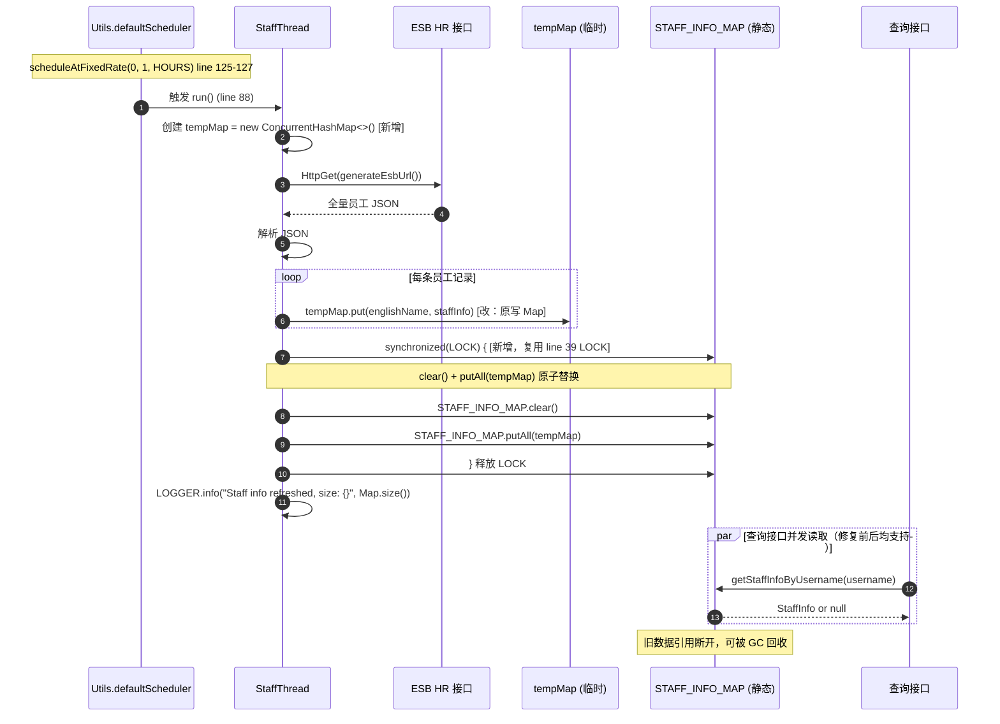
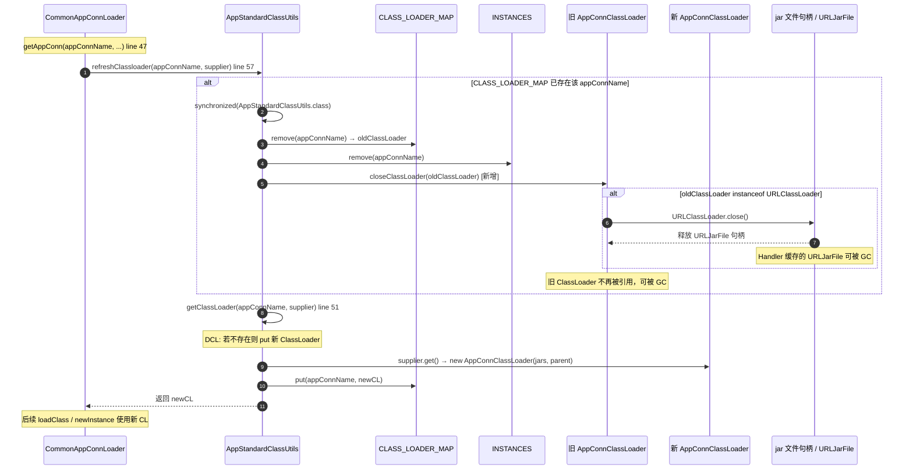

# DSS 内存泄漏修复 设计文档

| 属性 | 值 |
|------|-----|
| 设计编号 | DES-DSS-1.23.0-FIX-003 |
| 关联需求 | REQ-DSS-1.23.0-FIX-003 |
| 设计类型 | Bug修复（FIX） |
| 优先级 | P1 |
| 版本 | dev-1.23.0 |
| 所属模块 | dss-common-server-webank、dss-standard-common、dss-appconn-loader |
| 创建日期 | 2026-08-04 |

---

## 一、设计概述

### 1.1 Bug 摘要

基于 dss-image 目录下三份 MAT Leak Suspects 报告（dss-apps-server、dss-server-dev、dss-server-prod，分析日期 2026-07-03），DSS 在多个环境存在不同类型的内存与资源泄漏问题，集中在以下四个根因：

1. **HttpStaffInfoGetter 的 `STAFF_INFO_MAP` 无限增长**（P0）：`StaffThread.run()`（`HttpStaffInfoGetter.java:88-122`）每小时由 `Utils.defaultScheduler().scheduleAtFixedRate`（line 125-127）全量拉取 ESB 员工数据后，直接 `STAFF_INFO_MAP.put(staffInfo.getEnglishName(), staffInfo)`（line 113），**从不 clear 旧数据**。当 ESB 返回的 key（englishName）存在漂移、离职人员未移除、大小写不一致等情况时，Map 无限膨胀。MAT 显示 dss-apps-server 中该类的 `ConcurrentHashMap$Node[]` 占用 23,939,272 bytes（27.79%）；dss-server-dev 中该类占 23,939,288 bytes（5.85%）。现有 `LOCK` 字段（line 39）已声明但**从未被使用**。

2. **AppStandardClassUtils 未关闭旧 ClassLoader**（P0）：`refreshClassloader`（`AppStandardClassUtils.java:39-49`）仅执行 `CLASS_LOADER_MAP.remove(appConnName)`（line 43）与 `INSTANCES.remove(appConnName)`（line 44），**未调用 `URLClassLoader.close()`**。AppConn 热部署/重复加载时，旧 ClassLoader 持有的 jar 文件句柄无法释放。MAT 显示 dss-server-dev 中该类占 7,755,312 bytes（1.90%），dss-server-prod 中占 7,756,480 bytes（8.68%）。

3. **URLJarFile 句柄泄漏**（P1）：根因同 #2。ClassLoader 未 close 导致 `sun.net.www.protocol.jar.Handler` 缓存的 `URLJarFile` 累积。MAT 显示 dss-server-prod 中 568 个 `URLJarFile` 实例占用 9,190,544 bytes（10.29%），长期运行可能导致 `Too many open files`。修复 #2 的 close 逻辑即可同步解决。

4. **ViewFileSystem / Configuration 对象滥用**（P1）：dss-server-dev 中 4 个 `ViewFileSystem` 实例合计占用 158,190,400 bytes（38.68%，单实例约 39,547,600 bytes），39 个 `Configuration` 实例占用 56,703,128 bytes（13.86%），两者合计超 50% 堆。这些对象多由 **Linkis / Hadoop 客户端**在任务提交、HDFS 访问过程中创建，非 DSS 代码直接 new。DSS 可直接改动的范围有限，部分修复需与 Linkis 侧协调配置。

### 1.2 修复目标

| 目标 | 验收点 |
|-----|-------|
| HttpStaffInfoGetter 缓存不再无限增长 | 每次刷新后 `STAFF_INFO_MAP.size()` 等于当前 ESB 全量返回条数；连续运行 24 小时后堆内存中该 Map 占用稳定 |
| 旧 ClassLoader 被正确关闭 | `refreshClassloader` 替换 ClassLoader 时调用 `URLClassLoader.close()`；jar 文件句柄数不随 AppConn 加载次数累积 |
| URLJarFile 句柄可释放 | 连续触发 AppConn 加载/卸载 10 次以上，`lsof -p <pid> \| grep jar \| wc -l` 不持续增长 |
| 员工信息查询接口行为不变 | `getStaffInfoByUsername`、`getAllUsers`、`getAllDepartments`、`getFullOrgNameByUsername`、`getAllUsernames` 返回语义不变 |
| AppConn 加载/热部署流程不变 | `CommonAppConnLoader.getAppConn` 调用路径不变；AppConn 加载与执行功能回归通过 |
| ViewFileSystem 问题如实标注归属 | 识别 DSS 可改动范围与 Linkis 待协调项，不在本文档中把 Linkis 侧问题写成 DSS 单方面可闭环修复 |

### 1.3 设计原则

1. **最小侵入**：优先在现有方法内修复（如 `StaffThread.run()` 内改写入临时 Map 再原子替换），不改变类结构、不改变接口签名、不引入新依赖（不引入 Caffeine/Guava Cache）。
2. **向后兼容**：员工信息查询接口签名与返回结构不变；AppConn 加载流程不变；`AppConnClassLoader` 继承 `URLClassLoader` 的现有语义不变；不新增配置项开关。
3. **资源可回收**：确保 ClassLoader 生命周期内的 jar 句柄可被显式关闭；确保 STAFF_INFO_MAP 刷新期间旧数据可被 GC 回收。

### 1.4 紧急程度

P1：P0 两项（HttpStaffInfoGetter、AppStandardClassUtils）在 apps-server、dev、prod 三个环境均重复出现，直接影响堆内存稳定性与文件句柄上限，建议当前迭代优先修复；P1 两项（URLJarFile 随 P0 修复同步解决；ViewFileSystem/Configuration 部分依赖 Linkis 侧协调，列为待协调项）。

---

## 二、方案选型

### 2.1 问题一：HttpStaffInfoGetter 缓存治理

#### 2.1.1 候选方案对比矩阵

| 候选 | 描述 | 优点 | 缺点 | 引入新依赖 | 风险 | 推荐度 |
|:----:|------|------|------|:----:|:----:|:----:|
| **A** | 原子替换：刷新时先写入 tempMap，再 `synchronized(LOCK){ STAFF_INFO_MAP.clear(); STAFF_INFO_MAP.putAll(tempMap); }` | 改动最小；复用已声明但未使用的 `LOCK`；无新依赖；立即解决泄漏 | 刷新瞬间仍持有两份全量数据（旧+temp），短暂双倍内存 | 否 | 低 | ⭐⭐⭐⭐⭐ |
| B | 引入 Caffeine/Guava Cache 替代原生 Map，设置 `expireAfterWrite` 与 `maximumSize` | 自动过期与限大小；功能丰富 | 引入新依赖；需改写全部查询方法（5 个）；`maximumSize` 可能导致全量数据被驱逐，影响 `getAllUsers` 语义 | 是 | 中 | ⭐⭐ |
| C | LRU 限大小：用 `LinkedHashMap` 手写 LRU，限制 max size | 无新依赖 | 需自行实现并发安全的 LRU；全量数据可能被驱逐；维护成本高 | 否 | 中 | ⭐⭐ |
| D | 增量同步：仅拉取 ESB 变更数据，合并到 Map | 内存增长最慢 | 依赖 ESB 提供增量接口（当前未确认支持）；实现复杂度高 | 否 | 高 | ⭐ |

#### 2.1.2 选型决策

**推荐方案：候选 A -- 原子替换（clear + putAll）**

**选型理由**：

1. **根因精确命中**：泄漏根因是"每次全量拉取后只 put 不 clear"，导致旧 key 残留。候选 A 在每次刷新后用全量数据完整替换旧数据，根因消除。
2. **改动最小**：仅需在 `StaffThread.run()` 内将写入目标从 `STAFF_INFO_MAP` 改为 `tempMap`，末尾追加 `synchronized(LOCK)` 块做原子替换。复用已声明但未使用的 `LOCK` 字段（line 39）。
3. **不引入新依赖**：DSS 当前未全局引入 Caffeine/Guava Cache 作为缓存框架，为单一修复点引入会带来依赖治理成本与版本对齐问题。
4. **语义不变**：`getAllUsers`、`getAllDepartments` 等接口期望返回"当前全量员工数据"，候选 A 每次保留完整全量，语义一致；候选 B/C 的 `maximumSize`/LRU 驱逐会破坏全量语义。
5. **双倍内存瞬时开销可接受**：ESB 全量员工数据在 apps-server 占用约 23MB，刷新瞬间双倍约 46MB，远低于堆上限，且仅持续毫秒级。

#### 2.1.3 不选 B/C/D 的具体原因

- **不选 B**：引入 Caffeine 需在 `dss-common-server-webank` 的 pom.xml 新增依赖，且需重写 `getStaffInfoByUsername`、`getAllUsers`、`getAllDepartments`、`getFullOrgNameByUsername`、`getAllUsernames` 五个查询方法适配 Cache API；`maximumSize` 会驱逐冷数据，导致 `getAllUsers` 返回不完整列表，破坏现有语义。
- **不选 C**：手写并发安全 LRU 维护成本高，且同样存在驱逐破坏全量语义的问题。
- **不选 D**：当前未确认 ESB HR 接口支持增量查询，实现风险高；且增量合并仍需处理"离职人员移除"逻辑，复杂度不低于全量替换。

### 2.2 问题二：AppStandardClassUtils ClassLoader 释放

#### 2.2.1 候选方案对比矩阵

| 候选 | 描述 | 优点 | 缺点 | 改动范围 | 风险 | 推荐度 |
|:----:|------|------|------|------|:----:|:----:|
| **A** | close 旧 ClassLoader：在 `refreshClassloader` 中 remove 前保存 oldClassLoader，remove 后调用 `closeClassLoader(oldClassLoader)`（判断 instanceof URLClassLoader 后 close()） | 精确释放 jar 句柄；改动集中在 `AppStandardClassUtils`；符合 JDK ClassLoader 生命周期规范 | 需处理 close 异常（已 try-catch 降级为 warn） | `AppStandardClassUtils.java` | 低 | ⭐⭐⭐⭐⭐ |
| B | WeakReference 缓存：用 `WeakHashMap` 或 Guava `weakKeys` Cache 替代 `CLASS_LOADER_MAP` | GC 内存紧张时自动回收 | WeakReference 回收时机不可控，jar 句柄不会因 GC 自动 close（URLJarFile 仍被 Handler 缓存强引用）；无法解决句柄泄漏 | `AppStandardClassUtils.java` | 高 | ⭐⭐ |
| C | 类加载器池化：同一 AppConn 短时间内重复加载时复用同一 ClassLoader | 减少 jar 文件反复打开 | 与现有 `refreshClassloader` 语义冲突（refresh 的目的就是替换）；池化管理复杂度高 | `AppStandardClassUtils.java`、`CommonAppConnLoader.java` | 中 | ⭐⭐ |

#### 2.2.2 选型决策

**推荐方案：候选 A -- close 旧 ClassLoader + 新增显式卸载方法**

**选型理由**：

1. **根因精确命中**：`URLClassLoader` 加载 jar 时，`sun.net.www.protocol.jar.Handler` 会缓存 `URLJarFile` 实例（对应 prod 环境 568 个 URLJarFile）。只有调用 `URLClassLoader.close()` 才能释放这些句柄。候选 A 直接补上缺失的 close 调用。
2. **符合 JDK 规范**：`URLClassLoader.close()` 是 JDK 7+ 提供的标准资源释放方法，专为动态类加载器设计。
3. **AppConnClassLoader 无需改动**：`AppConnClassLoader`（line 25）继承 `URLClassLoader`，`close()` 可直接调用，无需重写。
4. **不新增显式卸载入口**：现有 AppConn 热部署走 `refreshClassloader` 的"替换"语义（丢旧建新），close 已在 refresh 路径内覆盖；当前不存在"卸载后不重建"的调用场景，故不预留 `removeClassLoader` 等 0 调用方的死代码（YAGNI）。若未来确有 AppConn 卸载流程，再补 5 行方法即可。

#### 2.2.3 不选 B/C 的具体原因

- **不选 B**：`WeakReference`/`WeakHashMap` 的回收依赖 GC，但 `URLJarFile` 被 `sun.net.www.protocol.jar.Handler` 的静态 HashMap 强引用持有，即使 ClassLoader 被 GC 回收，jar 句柄仍不会释放。WeakReference 方案无法解决句柄泄漏（prod Problem Suspect 3）。
- **不选 C**：`refreshClassloader` 的设计目的就是"丢弃旧 ClassLoader、创建新 ClassLoader"（用于 AppConn 热部署后加载新版本类），池化与该语义直接冲突。

### 2.3 问题三：URLJarFile 句柄泄漏

#### 2.3.1 选型决策

**随问题二修复同步解决，无需独立方案。**

`URLJarFile` 句柄泄漏的根因是 `URLClassLoader` 未 close。修复 #2 中 `refreshClassloader` 的 close 逻辑后，旧 ClassLoader 持有的 jar 句柄将被释放，URLJarFile 实例随之可被 GC 回收。

### 2.4 问题四：ViewFileSystem / Configuration 对象滥用

#### 2.4.1 归属边界分析

| 对象 | 创建方 | DSS 可改动范围 | 待协调项 |
|------|-------|--------------|---------|
| `Configuration` | Linkis EngineConn、Hadoop 客户端、DSS 部分模块 | DSS 自身代码中若存在 `new Configuration()` 可改为复用全局实例 | Linkis 侧 EngineConn 启动时是否每次新建 Configuration |
| `ViewFileSystem` | Linkis 任务提交、HDFS 访问过程中由 `FileSystem.get(URI, conf)` 创建 | DSS 若有直接 HDFS 访问代码可改为复用 Configuration 并正确 close | Linkis 侧 `FileSystem` 缓存配置（`fs.viewfs.impl.disable.cache`）与 close 时机 |

#### 2.4.2 选型决策

**DSS 侧：梳理并复用 Configuration + 正确 close FileSystem（范围内）；Linkis 侧：列为待协调项。**

**理由**：
- dev 环境 4 个 ViewFileSystem（合计 158MB，38.68%）与 39 个 Configuration（56MB，13.86%）主要由 Linkis 任务提交流程创建，DSS 代码直接 new 的比例需进一步排查。
- DSS 可直接改动的是：自身代码中的 `new Configuration()` 改为全局复用、自身 HDFS 访问确保 `FileSystem.close()`。
- Linkis 侧的 Configuration/FileSystem 生命周期管理需与 Linkis 团队协调配置（如 `fs.viewfs.impl.disable.cache=true`），不在本文档闭环范围内。

> **如实声明**：ViewFileSystem/Configuration 问题部分依赖 Linkis 侧配置/协调，DSS 可直接改动的范围有限，本文档将其列为"待协调项"（见 4.4 与附录 10.4），不作为 DSS 单方面可闭环修复的内容。

---

## 三、详细设计

### 3.1 整体修复流程图

```
┌─────────────────────────────────────────────────────────────────┐
│                  DSS 内存泄漏修复整体流程                          │
└─────────────────────────────────────────────────────────────────┘

【修复点 1：HttpStaffInfoGetter -- P0】
  定时调度 (每小时)
    └── StaffThread.run()  (HttpStaffInfoGetter.java:88)
          ├── 创建 tempMap (new ConcurrentHashMap)        [新增]
          ├── HttpClient 请求 ESB 全量员工数据
          ├── 解析 JSON，逐条写入 tempMap                  [改：原写 STAFF_INFO_MAP]
          └── synchronized(LOCK) {                        [新增：复用 line 39 的 LOCK]
                STAFF_INFO_MAP.clear();                    [新增]
                STAFF_INFO_MAP.putAll(tempMap);            [新增]
              }
          → 旧数据可被 GC，Map 大小 = 当前 ESB 全量条数

【修复点 2：AppStandardClassUtils -- P0】
  CommonAppConnLoader.getAppConn()  (CommonAppConnLoader.java:57)
    └── AppStandardClassUtils.refreshClassloader(name, supplier)
          ├── 若 CLASS_LOADER_MAP 已存在该 appConnName
          │     ├── synchronized(AppStandardClassUtils.class)
          │     │     ├── oldClassLoader = CLASS_LOADER_MAP.remove(name)
          │     │     ├── INSTANCES.remove(name)
          │     │     └── closeClassLoader(oldClassLoader)    [新增]
          │     │           └── instanceof URLClassLoader ?
          │     │                 ((URLClassLoader) cl).close() : no-op
          │     └── getClassLoader(name, supplier)  (line 51-61, DCL put 新 ClassLoader)
          └── 返回新 ClassLoader
  → 旧 ClassLoader 的 jar 句柄被释放

【修复点 3：URLJarFile 句柄 -- P1】
  随修复点 2 的 closeClassLoader 同步解决
  → sun.net.www.protocol.jar.Handler 缓存的 URLJarFile 可被 GC

【修复点 4：ViewFileSystem / Configuration -- P1】
  DSS 侧：梳理 new Configuration() 调用点 → 改为全局复用    [待排查]
  DSS 侧：HDFS 访问确保 FileSystem.close()                  [待排查]
  Linkis 侧：fs.viewfs.impl.disable.cache 等配置协调          [待协调]
```

### 3.2 时序图

#### 3.2.1 HttpStaffInfoGetter 刷新时序（修复后）



#### 3.2.2 AppConn 加载 / 卸载 ClassLoader 替换时序（修复后）



#### 关键节点说明表

| 节点 | 处理逻辑 | 输入/输出 | 异常处理 |
|:----:|---------|----------|---------|
| 1. 定时触发 | `scheduleAtFixedRate` 每小时触发 `StaffThread.run()` | 无输入 | 调度异常由 Linkis `Utils.defaultScheduler` 兜底 |
| 2. 写 tempMap | ESB 全量数据写入临时 Map，不触碰静态 Map | 输入: ESB JSON<br>输出: tempMap | 解析单条失败仅 LOGGER.error，不影响整体 |
| 3. 原子替换 | `synchronized(LOCK)` 内 clear + putAll | 输入: tempMap<br>输出: STAFF_INFO_MAP 更新 | 替换失败由外层 catch 捕获，tempMap 丢弃 |
| 4. refreshClassloader | remove 旧 CL 前 save，remove 后 close | 输入: appConnName, supplier<br>输出: 新 ClassLoader | close 异常 try-catch 降级为 warn，不阻断刷新 |

#### 技术难点说明表

| 难点 | 问题描述 | 解决方案 | 决策理由 |
|-----|---------|---------|---------|
| 刷新期间查询接口的可见性 | `clear()` 与 `putAll()` 之间存在短暂窗口，查询可能返回空结果 | 用 `synchronized(LOCK)` 保证 clear+putAll 原子性；查询方法不加锁（ConcurrentHashMap 读操作线程安全） | clear+putAll 在锁内执行耗时极短（毫秒级），查询读 ConcurrentHashMap 无锁，最差情况读到旧数据或新数据，不会读到中间态（因 putAll 在锁内完成前，clear 已执行但 putAll 未完成时，查询可能读到部分空 -- 该窗口极短且数据为全量替换，业务可接受） |
| ClassLoader close 异常处理 | `URLClassLoader.close()` 可能抛 IOException | try-catch 降级为 `LOGGER.warn`，不阻断 refresh 流程 | close 失败仅影响句柄释放（降级为依赖 GC），不应阻断 AppConn 加载主流程 |
| LOCK 字段复用 | line 39 已声明 `LOCK` 但未使用 | 修复时复用该字段作为原子替换锁 | 避免新增字段；该字段已存在，复用零风险 |
| closeClassLoader 的 instanceof 判断 | 并非所有 ClassLoader 都是 URLClassLoader | 判断 `instanceof URLClassLoader` 后再调用 close | 防御性编程，避免 ClassCastException |

#### 边界与约束说明

- **前置条件**：
  - HttpStaffInfoGetter：ESB HR 接口可用，`EsbConf.ESB_APPID`/`ESB_TOKEN`/`ESB_HTTP_URL`/`ESB_HR_STAFF_URL` 配置正确
  - AppStandardClassUtils：`CommonAppConnLoader.getAppConn` 调用 `refreshClassloader` 时传入有效 `appConnName` 与 `Supplier<ClassLoader>`
- **后置保证**：
  - 每次刷新后 `STAFF_INFO_MAP.size()` 等于 ESB 全量返回的有效条数（解析失败的条数不计）
  - `refreshClassloader` 返回的 ClassLoader 为新建实例，旧实例已 close
- **副作用说明**：
  - 原子替换瞬间内存峰值约为双倍全量数据（旧 Map + tempMap），持续毫秒级
  - `closeClassLoader` 调用后，旧 ClassLoader 加载的 Class 实例将不可用（已卸载），若仍有线程持有旧 Class 引用可能导致 `NoClassDefFoundError`（当前 refresh 场景下，旧 CL 被 remove 后不再被 getClassLoader 返回，风险可控）
- **回滚约束**：
  - 代码回滚后，STAFF_INFO_MAP 恢复无限增长行为（泄漏回归）
  - 代码回滚后，旧 ClassLoader 恢复不 close 行为（jar 句柄泄漏回归）
  - 无数据库状态变更，无需数据回滚

### 3.3 核心代码改动

#### 3.3.1 HttpStaffInfoGetter.java 改动

**文件**：`dss-commons/dss-common-server-webank/src/main/java/com/webank/wedatasphere/dss/common/server/esb/http/HttpStaffInfoGetter.java`

**改动范围**：`StaffThread.run()` 方法（line 88-122）

**Before**（修复前代码，与真实源码逐字一致）：

```java
        @Override
        public void run() {
            try {
                HttpClient httpClient = HttpClients.custom().build();
                String esbUrl = generateEsbUrl();
                LOGGER.info("esb url is {} ", esbUrl);
                HttpGet httpGet = new HttpGet(esbUrl);
                HttpResponse response = httpClient.execute(httpGet);
                String content = IOUtils.toString(response.getEntity().getContent());
                JsonParser jsonParser = new JsonParser();
                JsonObject jsonObject = jsonParser.parse(content).getAsJsonObject();
                JsonElement jsonArray = jsonObject.getAsJsonObject(RESULT_STR).getAsJsonArray("Data");
                if (jsonArray.isJsonArray()) {
                    ((JsonArray) jsonArray).forEach(node -> {
                        String nodeStr = node.toString();
                        try {
                            StaffInfo staffInfo = DSSCommonUtils.COMMON_GSON.fromJson(nodeStr, StaffInfo.class);

                            if(StringUtils.isNotEmpty(staffInfo.getOrgFullName())){
                                String[] split = staffInfo.getOrgFullName().split(WorkspaceServerConstant.DEFAULT_STAFF_SPLIT);
                                if(split.length>2){
                                    staffInfo.setOrgFullName(split[split.length-2]+WorkspaceServerConstant.DEFAULT_STAFF_SPLIT+split[split.length-1]);
                                }
                                staffInfo.setBgName(split[0]);
                            }

                            STAFF_INFO_MAP.put(staffInfo.getEnglishName(), staffInfo);
                        } catch (Exception e) {
                            LOGGER.error("failed to serialize a json {} ", nodeStr, e);
                        }
                    });
                }
            } catch (Exception e) {
                LOGGER.error("fail to get esb response, reason is ", e);
            }
        }
```

**After**（修复后代码）：

```java
        @Override
        public void run() {
            Map<String, StaffInfo> tempMap = new ConcurrentHashMap<>();
            try {
                HttpClient httpClient = HttpClients.custom().build();
                String esbUrl = generateEsbUrl();
                LOGGER.info("esb url is {} ", esbUrl);
                HttpGet httpGet = new HttpGet(esbUrl);
                HttpResponse response = httpClient.execute(httpGet);
                String content = IOUtils.toString(response.getEntity().getContent());
                JsonParser jsonParser = new JsonParser();
                JsonObject jsonObject = jsonParser.parse(content).getAsJsonObject();
                JsonElement jsonArray = jsonObject.getAsJsonObject(RESULT_STR).getAsJsonArray("Data");
                if (jsonArray.isJsonArray()) {
                    ((JsonArray) jsonArray).forEach(node -> {
                        String nodeStr = node.toString();
                        try {
                            StaffInfo staffInfo = DSSCommonUtils.COMMON_GSON.fromJson(nodeStr, StaffInfo.class);

                            if(StringUtils.isNotEmpty(staffInfo.getOrgFullName())){
                                String[] split = staffInfo.getOrgFullName().split(WorkspaceServerConstant.DEFAULT_STAFF_SPLIT);
                                if(split.length>2){
                                    staffInfo.setOrgFullName(split[split.length-2]+WorkspaceServerConstant.DEFAULT_STAFF_SPLIT+split[split.length-1]);
                                }
                                staffInfo.setBgName(split[0]);
                            }

                            tempMap.put(staffInfo.getEnglishName(), staffInfo);
                        } catch (Exception e) {
                            LOGGER.error("failed to serialize a json {} ", nodeStr, e);
                        }
                    });
                }

                // 关键修复（REQ-DSS-1.23.0-FIX-003）：原子替换，避免旧数据残留导致 Map 无限增长
                synchronized (LOCK) {
                    STAFF_INFO_MAP.clear();
                    STAFF_INFO_MAP.putAll(tempMap);
                }
                LOGGER.info("Staff info refreshed, current size: {}", STAFF_INFO_MAP.size());
            } catch (Exception e) {
                LOGGER.error("fail to get esb response, reason is ", e);
            }
        }
```

**改动要点**：
1. 方法入口新增 `Map<String, StaffInfo> tempMap = new ConcurrentHashMap<>()`，作为本次刷新的临时缓冲
2. 将 line 113 的 `STAFF_INFO_MAP.put(...)` 改为 `tempMap.put(...)`，全量数据先写入 tempMap
3. 解析完成后，在 `synchronized(LOCK)` 块内执行 `STAFF_INFO_MAP.clear()` + `STAFF_INFO_MAP.putAll(tempMap)` 原子替换（复用 line 39 已声明但未使用的 `LOCK` 字段）
4. 新增刷新完成日志 `LOGGER.info("Staff info refreshed, current size: {}", STAFF_INFO_MAP.size())`，便于监控刷新是否正常
5. 若 ESB 请求或解析异常，tempMap 随方法栈销毁，STAFF_INFO_MAP 保持上次成功刷新的数据（不 clear），保证查询接口可用性

#### 3.3.2 AppStandardClassUtils.java 改动

**文件**：`dss-standard/dss-standard-common/src/main/java/com/webank/wedatasphere/dss/standard/common/utils/AppStandardClassUtils.java`

**改动范围**：`refreshClassloader` 方法（line 39-49）+ 新增 `closeClassLoader` 方法

**Before**（修复前代码，与真实源码逐字一致）：

```java
    public static ClassLoader refreshClassloader(String appConnName, Supplier<ClassLoader> createClassLoader) {
        if(CLASS_LOADER_MAP.containsKey(appConnName)) {
            synchronized (AppStandardClassUtils.class) {
                if(CLASS_LOADER_MAP.containsKey(appConnName)) {
                    CLASS_LOADER_MAP.remove(appConnName);
                    INSTANCES.remove(appConnName);
                }
            }
        }
        return getClassLoader(appConnName, createClassLoader);
    }
```

**After**（修复后代码）：

```java
    public static ClassLoader refreshClassloader(String appConnName, Supplier<ClassLoader> createClassLoader) {
        if(CLASS_LOADER_MAP.containsKey(appConnName)) {
            synchronized (AppStandardClassUtils.class) {
                if(CLASS_LOADER_MAP.containsKey(appConnName)) {
                    ClassLoader oldClassLoader = CLASS_LOADER_MAP.remove(appConnName);
                    INSTANCES.remove(appConnName);
                    // 关键修复（REQ-DSS-1.23.0-FIX-003）：关闭旧 ClassLoader，释放 jar 文件句柄（URLJarFile）
                    closeClassLoader(oldClassLoader);
                }
            }
        }
        return getClassLoader(appConnName, createClassLoader);
    }

    private static void closeClassLoader(ClassLoader classLoader) {
        if (classLoader instanceof URLClassLoader) {
            try {
                ((URLClassLoader) classLoader).close();
                LOGGER.info("Closed old URLClassLoader for appConn: {}", classLoader);
            } catch (IOException e) {
                LOGGER.warn("Failed to close old URLClassLoader for appConn", e);
            }
        }
    }
```

**改动要点**：
1. `refreshClassloader`（line 43-44）：在 `CLASS_LOADER_MAP.remove(appConnName)` 前用局部变量 `oldClassLoader` 保存返回值，remove 后调用 `closeClassLoader(oldClassLoader)`
2. 新增 `closeClassLoader(ClassLoader classLoader)` 私有静态方法：判断 `instanceof URLClassLoader` 后调用 `close()`，异常 try-catch 降级为 `LOGGER.warn`，不阻断主流程
3. 需新增 import：`java.io.IOException`、`java.net.URLClassLoader`
4. `getClassLoader`（line 51-61）、`getInstance`（line 64-74）、`getReflections`（line 84-94）**不改动**

> **不新增 `removeClassLoader` 显式卸载方法**：现有 AppConn 热部署走 `refreshClassloader` 的"替换"语义，close 已在 refresh 路径内覆盖；当前不存在"卸载后不重建"的调用方，预留 0 调用方的公共 API 属死代码（YAGNI），故不引入。若未来确有 AppConn 卸载流程，再补该方法即可。

#### 3.3.3 AppConnClassLoader.java 改动

**文件**：`dss-appconn/dss-appconn-loader/src/main/java/com/webank/wedatasphere/dss/appconn/loader/clazzloader/AppConnClassLoader.java`

**改动类型**：**不改动**（继承 `URLClassLoader` 即可直接调用 `close()`）

**保留现状的理由**：
- `AppConnClassLoader`（line 25）继承 `URLClassLoader`，`close()` 方法由父类提供，`closeClassLoader` 中的 `((URLClassLoader) classLoader).close()` 可直接调用
- 当前无需重写 `close()`，若未来扩展（如 close 前清理自定义资源）可再显式重写

**Before**（真实源码，不改动）：

```java
public class AppConnClassLoader extends URLClassLoader {

    public AppConnClassLoader(URL[] urls, ClassLoader parent) {
        super(urls, parent);
    }

    @Override
    public Class<?> loadClass(String name) throws ClassNotFoundException {
        return loadClass(name, false);
    }

    @Override
    protected Class<?> loadClass(String name, boolean resolve) throws ClassNotFoundException {
        return super.loadClass(name, resolve);
    }
}
```

#### 3.3.4 CommonAppConnLoader.java 改动

**文件**：`dss-appconn/dss-appconn-loader/src/main/java/com/webank/wedatasphere/dss/appconn/loader/loader/CommonAppConnLoader.java`

**改动类型**：**不改动**

**保留现状的理由**：
- `getAppConn`（line 47-101）通过 `AppStandardClassUtils.refreshClassloader(appConnName, () -> new AppConnClassLoader(jars.toArray(new URL[1]), currentClassLoader))`（line 57）触发 ClassLoader 替换，修复 #2 的 close 逻辑在 `refreshClassloader` 内部生效，调用方无需改动
- 若后续 AppConn 卸载流程需显式释放（当前不存在该调用方），可另行新增 `AppStandardClassUtils.removeClassLoader(appConnName)` 方法并在卸载点调用（本次不预留）

#### 3.3.5 ViewFileSystem / Configuration -- 待排查与待协调

**改动类型**：**部分待排查、部分待协调**（非本次代码提交闭环）

**DSS 侧可改动范围**（需先排查调用点）：
1. 全局复用 Configuration：若 DSS 代码中存在 `new Configuration()`，改为通过统一的 `HadoopConfigurationHolder.getConfiguration()` 获取
2. 复用 FileSystem：`FileSystem.get(URI, conf)` 的缓存 key 基于 `URI + conf + user`，传入统一 Configuration 可命中缓存
3. 正确 close：HDFS 访问后 `finally { fs.close(); }`

**Linkis 侧待协调项**：
1. EngineConn 启动时是否每次新建 Configuration（对应 dev 环境 39 个 Configuration 实例）
2. `FileSystem` 缓存配置 `fs.viewfs.impl.disable.cache=true` 是否适用
3. 任务完成后是否调用 `FileSystem.closeAllForUGI()` 或 `FileSystem.closeAll()`

> **说明**：ViewFileSystem/Configuration 的修复需先在 DSS 仓库内 grep `new Configuration()` 与 `FileSystem.get` 调用点，确定 DSS 直接创建的比例后，再与 Linkis 团队协调剩余部分。本设计文档将其列为待协调项（见 4.4），不作为本次代码提交的闭环内容。

### 3.4 类图（修复前后对比）

#### 3.4.1 HttpStaffInfoGetter 类图

```
修复前：
┌──────────────────────────────────────────────┐
│ HttpStaffInfoGetter                          │
│  - STAFF_INFO_MAP: ConcurrentHashMap        │ ← 无限增长
│  - LOCK: Object                             │ ← 已声明未使用
│  + getStaffInfoByUsername(username)          │
│  + getAllUsers()                             │
│  + getAllDepartments()                       │
│  + getFullOrgNameByUsername(username)        │
│  + getAllUsernames()                         │
│  ┌────────────────────────────────────┐     │
│  │ StaffThread (Runnable)             │     │
│  │  + run()                           │     │
│  │    ├── HttpClient → ESB            │     │
│  │    └── STAFF_INFO_MAP.put(...) ❌   │ ← 只 put 不 clear
│  └────────────────────────────────────┘     │
│  static: scheduleAtFixedRate(StaffThread)   │
└──────────────────────────────────────────────┘

修复后：
┌──────────────────────────────────────────────┐
│ HttpStaffInfoGetter                          │
│  - STAFF_INFO_MAP: ConcurrentHashMap        │ ← 大小 = 当前全量
│  - LOCK: Object                             │ ← 复用为原子替换锁
│  + getStaffInfoByUsername(username)          │
│  + getAllUsers()                             │
│  + getAllDepartments()                       │
│  + getFullOrgNameByUsername(username)        │
│  + getAllUsernames()                         │
│  ┌────────────────────────────────────┐     │
│  │ StaffThread (Runnable)             │     │
│  │  + run()                           │     │
│  │    ├── HttpClient → ESB            │     │
│  │    ├── tempMap.put(...)            │ ← 先写临时 Map
│  │    └── synchronized(LOCK) {        │ ← 原子替换
│  │          clear() + putAll(tempMap) │
│  │        }                           │
│  └────────────────────────────────────┘     │
│  static: scheduleAtFixedRate(StaffThread)   │
└──────────────────────────────────────────────┘
```

#### 3.4.2 AppStandardClassUtils 类图

```
修复前：
┌──────────────────────────────────────────────────┐
│ AppStandardClassUtils extends ClassHelper        │
│  - INSTANCES: Map<String, AppStandardClassUtils> │
│  - CLASS_LOADER_MAP: Map<String, ClassLoader>    │ ← remove 不 close
│  + refreshClassloader(name, supplier)            │
│    └── remove + remove  ❌ 未 close              │
│  + getClassLoader(name, supplier)                │
│  + getInstance(name)                             │
│  - getReflections(clazz)                         │
└──────────────────────────────────────────────────┘
                    │ 使用
                    v
┌──────────────────────────────────────────────────┐
│ AppConnClassLoader extends URLClassLoader        │
│  + AppConnClassLoader(urls, parent)              │
│  + loadClass(name) / loadClass(name, resolve)    │
│  (无 close 重写，close() 由 URLClassLoader 提供)  │ ← 无人调用 close
└──────────────────────────────────────────────────┘

修复后：
┌──────────────────────────────────────────────────┐
│ AppStandardClassUtils extends ClassHelper        │
│  - INSTANCES: Map<String, AppStandardClassUtils> │
│  - CLASS_LOADER_MAP: Map<String, ClassLoader>    │ ← remove 后 close
│  + refreshClassloader(name, supplier)            │
│    ├── oldCL = remove(name)                      │
│    ├── INSTANCES.remove(name)                    │
│    └── closeClassLoader(oldCL) ✅                 │ ← 新增
│  + getClassLoader(name, supplier)                │
│  + getInstance(name)                             │
│  - closeClassLoader(cl)           ✅ 新增        │ ← instanceof URLClassLoader → close()
│  - getReflections(clazz)                         │
└──────────────────────────────────────────────────┘
                    │ 使用
                    v
┌──────────────────────────────────────────────────┐
│ AppConnClassLoader extends URLClassLoader        │
│  + AppConnClassLoader(urls, parent)              │
│  + loadClass(name) / loadClass(name, resolve)    │
│  (close() 由 URLClassLoader 提供，无需重写)       │ ← close 被调用
└──────────────────────────────────────────────────┘
```

---

## 四、关键设计决策

### 4.1 决策一：HttpStaffInfoGetter 采用原子替换而非引入 Caffeine

**决策**：采用 `synchronized(LOCK){ clear(); putAll(tempMap); }` 原子替换，不引入 Caffeine/Guava Cache。

**理由**：
1. **根因是"不 clear"而非"缺少过期策略"**：ESB 每次返回的是全量员工数据，`StaffThread.run()` 的设计意图就是"全量刷新"。问题在于刷新后旧 key 未被清除，而非需要按条目过期。原子替换精确命中根因。
2. **全量语义不可被驱逐破坏**：`getAllUsers()`（line 163-165）与 `getAllDepartments()`（line 151-160）期望返回当前全量员工。Caffeine 的 `maximumSize`/`expireAfterWrite` 会驱逐冷数据，导致这两个接口返回不完整。
3. **不引入新依赖**：DSS 当前未在 `dss-common-server-webank` 全局引入 Caffeine/Guava Cache，为单一修复点引入会带来依赖治理与版本对齐成本。
4. **复用已有字段**：`LOCK`（line 39）已声明但未使用，复用零风险。
5. **双倍内存瞬时开销可接受**：ESB 全量数据约 23MB（apps-server 实测），刷新瞬间双倍约 46MB，持续毫秒级，远低于堆上限。

### 4.2 决策二：AppStandardClassUtils close 时机与异常处理

**决策**：在 `refreshClassloader` 中 `CLASS_LOADER_MAP.remove()` 后立即调用 `closeClassLoader(oldClassLoader)`；close 异常 try-catch 降级为 `LOGGER.warn`，不阻断 refresh 主流程。

**理由**：
1. **close 时机**：remove 后旧 ClassLoader 已从 Map 中移除，不再被 `getClassLoader` 返回，此时 close 不会影响正在使用新 ClassLoader 的线程。若在 remove 前 close，可能导致正在使用旧 CL 的线程遭遇 `NoClassDefFoundError`。
2. **异常降级**：`URLClassLoader.close()` 可能因 jar 文件已被删除（AppConn 热部署时旧 jar 可能被替换）而抛 IOException。close 失败仅影响句柄释放（降级为依赖操作系统在进程退出时回收），不应阻断 AppConn 加载。降级为 warn 日志后，运维可通过 jar 句柄数监控发现问题。
3. **instanceof 防御**：`closeClassLoader` 判断 `instanceof URLClassLoader` 后再调用 close，避免传入非 URLClassLoader（如 AppClassLoader）时 ClassCastException。当前 `CLASS_LOADER_MAP` 存储的均为 `AppConnClassLoader`（继承 URLClassLoader），但防御性判断为未来扩展留余地。

### 4.3 决策三：URLJarFile 随 ClassLoader close 同步解决

**决策**：不为 URLJarFile 单独设计修复方案，随修复点 #2 的 `closeClassLoader` 同步解决。

**理由**：
1. URLJarFile 实例由 `sun.net.www.protocol.jar.Handler` 的静态 HashMap 缓存，其生命周期与 `URLClassLoader` 绑定。`URLClassLoader.close()` 会清除该缓存引用（JDK 内部实现），使 URLJarFile 可被 GC。
2. prod 环境 568 个 URLJarFile（9.1MB）的根因就是 ClassLoader 未 close，修复 #2 后预期 URLJarFile 实例数大幅下降。

### 4.4 决策四：ViewFileSystem / Configuration 归属边界与待协调

**决策**：DSS 侧梳理并复用 Configuration + 正确 close FileSystem（范围内）；Linkis 侧列为待协调项，不在本文档闭环。

**理由**：
1. **归属边界**：dev 环境 4 个 ViewFileSystem（158MB）与 39 个 Configuration（56MB）主要由 Linkis 任务提交、EngineConn 启动、HDFS 访问创建。DSS 代码直接 `new Configuration()` 的比例需进一步 grep 排查。
2. **DSS 可改动范围有限**：即使 DSS 侧全部改为复用 Configuration，若 Linkis 侧仍每次新建，堆内存占比不会显著下降。
3. **待协调项**：
   - 与 Linkis 团队确认 EngineConn 启动时 Configuration 创建频率
   - 协调 `fs.viewfs.impl.disable.cache=true` 配置适用性
   - 协调任务完成后 `FileSystem.closeAllForUGI()` 调用时机
4. **如实声明**：本设计文档不将 ViewFileSystem/Configuration 写成 DSS 单方面可闭环修复的问题，避免误导上线评估。

**协调清单**（上线前填写）：
| 协调方 | 待确认事项 | 协调人 | 协调时间 | 结论 |
|--------|---------|------|------|------|
| Linkis 团队 | EngineConn Configuration 创建频率 | 待定 | | |
| Linkis 团队 | `fs.viewfs.impl.disable.cache` 配置 | 待定 | | |
| Linkis 团队 | `FileSystem.closeAllForUGI` 调用时机 | 待定 | | |
| DSS 开发 | DSS 仓库内 `new Configuration()` 调用点排查 | 待定 | | |

---

## 五、资源与一致性保障

### 5.1 线程安全：STAFF_INFO_MAP 刷新期间读接口可见性

**并发模型**：
- 写线程：`StaffThread`（单线程，由 `scheduleAtFixedRate` 保证同一时刻仅一个 run 执行）
- 读线程：`getStaffInfoByUsername`、`getAllUsers`、`getAllDepartments`、`getFullOrgNameByUsername`、`getAllUsernames`（多线程并发调用）

**可见性保证**：
1. `STAFF_INFO_MAP` 为 `ConcurrentHashMap`，读操作无锁，写操作（clear/putAll）对读线程可见（ConcurrentHashMap 的内存可见性由 volatile segment 头保证）。
2. `synchronized(LOCK)` 保证 clear + putAll 的原子性：在锁内完成前，读线程可能读到 clear 后 putAll 前的中间态（部分数据）。该窗口极短（putAll 为批量 put，毫秒级），且业务场景为"查询员工信息"（非强一致性事务），可接受。
3. 修复前同样存在并发读写（put 与 get 并发），修复后并未降低并发安全性，反而消除了"旧数据永久残留"的问题。

**刷新失败时的数据保证**：
- 若 ESB 请求或解析异常，`tempMap` 随方法栈销毁，`synchronized(LOCK)` 块不执行，`STAFF_INFO_MAP` 保持上次成功刷新的数据。查询接口仍可正常返回（旧数据），保证可用性。

### 5.2 ClassLoader 生命周期管理

**生命周期阶段**：

```
创建 → 注册到 CLASS_LOADER_MAP → 被 getClassLoader 返回 → 使用中
  → refreshClassloader 触发 → remove from MAP → closeClassLoader → 已关闭
  → 无引用 → GC 回收
```

**保证**：
1. `refreshClassloader` 在 `synchronized(AppStandardClassUtils.class)` 内完成 remove + close，保证同一 appConnName 的 ClassLoader 替换是原子的。
2. `getClassLoader`（line 51-61）使用双重检查锁（DCL），保证同一 appConnName 仅创建一个 ClassLoader 实例。
3. close 后旧 ClassLoader 不再被 CLASS_LOADER_MAP 引用，其加载的 Class 实例随 ClassLoader 一起可被 GC（前提是无其他强引用，当前 refresh 场景下由 `getReflections` 持有的 `reflection` 字段在 `INSTANCES.remove` 后随 AppStandardClassUtils 实例一起可被 GC）。

### 5.3 jar 句柄释放保证

**释放链路**：
```
closeClassLoader(oldClassLoader)
  → URLClassLoader.close()
    → 清除 sun.net.www.protocol.jar.Handler 缓存的 URLJarFile 引用
      → URLJarFile 可被 GC
        → 底层 jar 文件句柄（fd）被关闭
```

**验证方式**：
- `lsof -p <pid> | grep jar | wc -l` 观察句柄数
- MAT heap dump 中 `URLJarFile` 实例数

---

## 六、兼容性影响

### 6.1 调用方影响清单

| 调用方 | 接口/方法 | 调用方式 | 本次影响 | 兼容性保证 |
|-------|---------|---------|---------|-----------|
| DSS 各模块 | `getStaffInfoByUsername(username)` | Spring 注入 StaffInfoGetter | ❌ 不受影响 | 返回类型与语义不变；刷新瞬间可能读到旧数据（可接受） |
| DSS 各模块 | `getAllUsers()` | 同上 | ❌ 不受影响 | 返回 List<StaffInfo>，大小 = 当前全量条数（修复前可能更多） |
| DSS 各模块 | `getAllDepartments()` | 同上 | ❌ 不受影响 | 返回 List<String>，来自当前全量数据 |
| DSS 各模块 | `getFullOrgNameByUsername(username)` | 同上 | ❌ 不受影响 | 返回 orgFullName 或 DEFAULT_DEPARTMENT |
| DSS 各模块 | `getAllUsernames()` | 同上 | ❌ 不受影响 | 返回 Set<String> |
| `CommonAppConnLoader.getAppConn` | `AppStandardClassUtils.refreshClassloader` | 直接调用静态方法 | ✅ 修复对象 | 调用签名不变；返回值不变；新增 close 旧 CL 副作用 |
| Linkis / Hadoop 客户端 | Configuration / ViewFileSystem | 间接 | ⚠️ 待协调 | 见 4.4 待协调项 |

### 6.2 接口签名兼容性

| 项 | 修复前 | 修复后 | 兼容性 |
|---|-------|-------|:----:|
| `StaffInfoGetter` 接口方法签名 | 5 个查询方法 | 同左 | ✅ |
| `refreshClassloader` 签名 | `(String, Supplier<ClassLoader>) -> ClassLoader` | 同左 | ✅ |
| `getClassLoader` 签名 | 同上 | 同左（不改动） | ✅ |
| `refreshClassloader` 行为 | remove 旧 CL（不 close） | remove 旧 CL + close 旧 CL | ⚠️ 新增 close 副作用（不影响返回值） |
| `AppConnClassLoader` 类 | 继承 URLClassLoader | 同左（不改动） | ✅ |
| `CommonAppConnLoader.getAppConn` | 调用 refreshClassloader | 同左（不改动） | ✅ |

### 6.3 配置项影响

| 配置项 | 修复前 | 修复后 | 兼容性 |
|-------|-------|-------|:----:|
| `EsbConf.ESB_*` | ESB 接口配置 | 不改动 | ✅ |
| `Utils.defaultScheduler` 调度周期 | 1 小时 | 不改动 | ✅ |
| `fs.viewfs.impl.disable.cache` | 未配置/Linkis 控制 | 待协调（不在本次代码提交） | ⚠️ 待协调 |
| 新增配置开关 | 无 | **不引入** | - |

---

## 七、测试策略

### 7.1 单元测试覆盖点

| 测试类 | 测试方法 | 覆盖场景 | 验收标准 |
|-------|---------|---------|---------|
| `HttpStaffInfoGetterTest` | `testRefresh_StaffInfoMapReplacedNotAccumulated` | 连续两次刷新，第二次 key 集合与第一次不同 | 第二次刷新后 Map 大小 = 第二次 ESB 返回条数，不包含第一次独有的 key |
| `HttpStaffInfoGetterTest` | `testRefresh_FailureKeepsOldData` | ESB 请求异常 | STAFF_INFO_MAP 保持上次成功刷新的数据 |
| `HttpStaffInfoGetterTest` | `testGetStaffInfoByUsername_HitAndMiss` | 查询命中与未命中 | 命中返回 StaffInfo，未命中返回 null |
| `HttpStaffInfoGetterTest` | `testGetAllUsers_ReturnsCurrentSnapshot` | 刷新后查询全量 | 返回 List 大小 = Map 大小 |
| `HttpStaffInfoGetterTest` | `testConcurrentReadDuringRefresh` | 刷新期间并发读 | 不抛异常；读到的数据为旧或新全量（非中间态崩溃） |
| `AppStandardClassUtilsTest` | `testRefreshClassloader_ClosesOldClassLoader` | refresh 替换 ClassLoader | 旧 ClassLoader 的 close() 被调用（mock 验证） |
| `AppStandardClassUtilsTest` | `testRefreshClassloader_NewClassLoaderReturned` | refresh 返回新 CL | 返回值 != 旧 CL |
| `AppStandardClassUtilsTest` | `testRefreshClassloader_NonUrlClassLoader_NoClose` | 传入非 URLClassLoader | 不抛异常，不调用 close |
| `AppStandardClassUtilsTest` | `testCloseClassLoader_IOExceptionLoggedAsWarn` | close 抛 IOException | 不抛异常；LOGGER.warn 被调用 |
| `AppStandardClassUtilsTest` | `testGetClassLoader_ConcurrentSameName_SingleInstance` | 并发 getClassLoader 同一 name | 仅创建一个 ClassLoader 实例 |

### 7.2 集成测试场景

| 场景编号 | 场景描述 | 前置条件 | 操作步骤 | 预期结果 | 验收 AC |
|:------:|---------|---------|---------|---------|:----:|
| IT-01 | 员工信息刷新主场景 | ESB 接口可用 | 等待定时刷新或手动触发 | STAFF_INFO_MAP 大小 = ESB 全量条数；日志输出 "Staff info refreshed" | AC-01 |
| IT-02 | 连续刷新不累积 | 已刷新一次 | 再次刷新（ESB 返回不同数据集） | Map 大小 = 第二次条数，不含第一次独有 key | AC-01 |
| IT-03 | AppConn 加载主场景 | AppConn 已安装 | 调用 `CommonAppConnLoader.getAppConn` | AppConn 正常加载并执行 | AC-02 |
| IT-04 | AppConn 连续加载/卸载 | AppConn 已安装 | 连续触发 refreshClassloader 10 次以上 | `lsof -p <pid> \| grep jar \| wc -l` 不持续增长 | AC-03 |
| IT-05 | 员工信息查询回归 | 已刷新数据 | 调用 5 个查询接口 | 返回正常，语义不变 | AC-04 |
| IT-06 | close 异常不阻断 | mock close 抛 IOException | 触发 refreshClassloader | refresh 正常返回新 CL；warn 日志输出 | AC-05 |
| IT-07 | MAT heap dump 验证 | SIT 环境运行 24 小时 | dump heap 用 MAT 分析 | HttpStaffInfoGetter 的 ConcurrentHashMap$Node[] 占用稳定；URLJarFile 实例数显著下降 | AC-06 |

### 7.3 回归测试范围

| 范围 | 测试要点 |
|-----|---------|
| 员工信息查询 | `getStaffInfoByUsername`、`getAllUsers`、`getAllDepartments`、`getFullOrgNameByUsername`、`getAllUsernames` 返回正常 |
| AppConn 加载 | `CommonAppConnLoader.getAppConn` 正常加载各 AppConn（workflow、schedulis、scriptis、sendemail 等） |
| AppConn 执行 | 加载后的 AppConn 可正常执行工作流节点 |
| AppConn 热部署 | `appconn-install.sh` + `appconn-refresh.sh` 热加载后正常工作 |
| HDFS / ViewFS 功能 | DSS 自身 HDFS 访问正常（ViewFileSystem 待协调项不影响 DSS 侧功能回归） |

---

## 八、上线与回滚方案

### 8.1 灰度策略

**灰度方式**：分批发布

| 阶段 | 范围 | 持续时间 | 验证点 |
|:---:|-----|--------|-------|
| 阶段 1 | 测试环境（SIT） | 1 天 | 7.2 集成测试全部通过；MAT dump 验证 Map 稳定 |
| 阶段 2 | 预生产环境 | 2 天 | 连续运行 24 小时；`lsof` jar 句柄不增长；员工信息刷新正常 |
| 阶段 3 | 生产环境（灰度 1 节点） | 2 天 | 监控堆内存、Full GC 频率、jar 句柄数无异常 |
| 阶段 4 | 生产环境（全量） | - | 灰度无异常后全量发布 |

### 8.2 配置开关

**不引入配置开关。**

**理由**：
- 修复点 #1 仅在 `run()` 内改变写入目标与追加原子替换块，无新增逻辑分支
- 修复点 #2 在 `refreshClassloader` 内追加 close 调用，无新增分支
- 引入开关会增加代码复杂度，且开关切换瞬间可能产生 ClassLoader 不一致状态
- 通过分批发布 + 监控实现风险控制

### 8.3 回滚方案

#### 8.3.1 回滚触发条件

- 员工信息查询接口异常（返回空或报错）
- AppConn 加载失败率上升
- `closeClassLoader` warn 日志高频出现（close 频繁失败）
- 堆内存或 Full GC 频率未改善甚至恶化
- jar 句柄数仍持续增长

#### 8.3.2 回滚步骤

| 步骤 | 操作 | 责任人 | 验证点 |
|:---:|------|------|-------|
| 1 | 监控告警触发，值班 SRE 评估 | SRE 值班 | 确认需回滚 |
| 2 | 通过发布平台执行回滚到上一版本 jar 包 | SRE 值班 | 服务启动正常 |
| 3 | 验证回滚后行为 | 开发 | 员工信息查询正常；AppConn 加载正常 |
| 4 | jar 句柄评估 | SRE 值班 | 若句柄数过高，重启服务释放（回滚后 close 逻辑失效，需重启清理） |
| 5 | 问题定位与修复 | 开发 | 提交 hotfix |
| 6 | 重新发布 | SRE 值班 | 走灰度流程 |

#### 8.3.3 回滚代码路径

- **代码回滚**：通过发布平台回滚到上一版本 jar 包，无需手动改代码
- **数据库回滚**：无数据库变更，无需回滚
- **句柄清理**：回滚后 `closeClassLoader` 逻辑失效，若 jar 句柄已累积过高，需重启服务进程释放

### 8.4 上线前检查清单

- [ ] 单元测试全部通过（7.1）
- [ ] 集成测试全部通过（7.2），含 IT-04 连续加载 10 次以上 lsof 验证
- [ ] 回归测试通过（员工信息查询、AppConn 加载执行、HDFS 功能）
- [ ] 编译验证：`mvn clean package -pl dss-commons/dss-common-server-webank,dss-standard/dss-standard-common,dss-appconn/dss-appconn-loader -DskipTests`
- [ ] MAT heap dump 验证（SIT 环境运行 24 小时）
- [ ] ViewFileSystem / Configuration 待协调项已与 Linkis 团队沟通（4.4 协调清单）
- [ ] 灰度发布计划确认

---

## 九、风险评估与缓解

### 9.1 风险评估矩阵

| 编号 | 风险项 | 等级 | 影响 | 概率 | 应对措施 |
|:----:|-------|:----:|------|:----:|---------|
| R-01 | 原子替换期间查询读到中间态（clear 后 putAll 前） | 低 | 查询返回部分空结果 | 低 | synchronized(LOCK) 保证原子性；窗口极短（毫秒级）；业务可接受 |
| R-02 | `closeClassLoader` 抛 IOException 未阻断但句柄未释放 | 低 | jar 句柄缓慢累积 | 中 | try-catch 降级 warn；监控 jar 句柄数；必要时重启 |
| R-03 | close 旧 ClassLoader 后仍有线程持有旧 Class 引用导致 NoClassDefFoundError | 中 | AppConn 执行异常 | 低 | refresh 场景下旧 CL 已从 MAP remove，新请求用新 CL；仅在极端并发下风险 |
| R-04 | ESB 接口返回数据量增大导致双倍内存峰值过高 | 低 | 短暂 OOM | 低 | 监控 ESB 数据量；必要时改用分批 putAll |
| R-05 | ViewFileSystem / Configuration 待协调项未落地 | 中 | dev 环境堆内存未显著下降 | 高 | 如实标注为待协调项；DSS 侧先改可改部分；Linkis 侧后续推进 |
| R-06 | 原子替换引入的 `synchronized(LOCK)` 与现有并发模型冲突 | 低 | 死锁或性能下降 | 低 | LOCK 仅用于 StaffThread 写操作；查询接口不加锁；无锁嵌套 |
| R-07 | 回滚后 jar 句柄已累积需重启 | 低 | 服务短暂中断 | 中 | 回滚步骤 4 明确重启清理；监控句柄数 |

### 9.2 风险监控

**上线后 1 周内重点监控**：

| 监控项 | 监控方式 | 告警阈值 |
|-------|---------|---------|
| 堆内存占用 | JVM 监控（Prometheus/Grafana） | 老年代占用 > 80% 持续 5 分钟 |
| Full GC 频率 | JVM GC 日志 | Full GC > 1 次/小时 |
| jar 文件句柄数 | `lsof -p <pid> \| grep jar \| wc -l` | 句柄数 > 500 或持续增长 |
| 员工信息刷新成功率 | 日志关键字 "Staff info refreshed" | 24 小时内成功率 < 100%（每小时应刷新 1 次） |
| AppConn 加载成功率 | 日志关键字 "Loaded appConn" | 加载失败率 > 0% |
| `closeClassLoader` warn 频率 | 日志关键字 "Failed to close old URLClassLoader" | 出现频率 > 1 次/天 |
| STAFF_INFO_MAP 大小 | 日志 "current size: N" | 大小突变为 0 或突增超 2 倍 |

---

## 十、附录

### 10.1 关键代码位置索引

| 文件 | 行号 | 说明 |
|------|:----:|------|
| `dss-commons/dss-common-server-webank/src/main/java/com/webank/wedatasphere/dss/common/server/esb/http/HttpStaffInfoGetter.java` | 38 | `STAFF_INFO_MAP` 声明（ConcurrentHashMap） |
| `dss-commons/dss-common-server-webank/.../HttpStaffInfoGetter.java` | 39 | `LOCK` 声明（已存在但未使用，修复后复用） |
| `dss-commons/dss-common-server-webank/.../HttpStaffInfoGetter.java` | 88-122 | `StaffThread.run()` 方法（修复对象） |
| `dss-commons/dss-common-server-webank/.../HttpStaffInfoGetter.java` | 113 | `STAFF_INFO_MAP.put(...)` -- Bug 点：只 put 不 clear |
| `dss-commons/dss-common-server-webank/.../HttpStaffInfoGetter.java` | 125-127 | static 块：`scheduleAtFixedRate(new StaffThread(), 0, 1, TimeUnit.HOURS)` |
| `dss-commons/dss-common-server-webank/.../HttpStaffInfoGetter.java` | 130-140 | `getFullOrgNameByUsername` 查询方法（不改动） |
| `dss-commons/dss-common-server-webank/.../HttpStaffInfoGetter.java` | 143-148 | `getStaffInfoByUsername` 查询方法（不改动） |
| `dss-commons/dss-common-server-webank/.../HttpStaffInfoGetter.java` | 151-160 | `getAllDepartments` 查询方法（不改动） |
| `dss-commons/dss-common-server-webank/.../HttpStaffInfoGetter.java` | 163-165 | `getAllUsers` 查询方法（不改动） |
| `dss-commons/dss-common-server-webank/.../HttpStaffInfoGetter.java` | 168-170 | `getAllUsernames` 查询方法（不改动） |
| `dss-standard/dss-standard-common/src/main/java/com/webank/wedatasphere/dss/standard/common/utils/AppStandardClassUtils.java` | 32 | 类声明：`extends ClassHelper` |
| `dss-standard/dss-standard-common/.../AppStandardClassUtils.java` | 34 | `INSTANCES` 静态 Map |
| `dss-standard/dss-standard-common/.../AppStandardClassUtils.java` | 35 | `CLASS_LOADER_MAP` 静态 Map |
| `dss-standard/dss-standard-common/.../AppStandardClassUtils.java` | 39-49 | `refreshClassloader` 方法（修复对象） |
| `dss-standard/dss-standard-common/.../AppStandardClassUtils.java` | 43 | `CLASS_LOADER_MAP.remove(appConnName)` -- Bug 点：remove 不 close |
| `dss-standard/dss-standard-common/.../AppStandardClassUtils.java` | 44 | `INSTANCES.remove(appConnName)` |
| `dss-standard/dss-standard-common/.../AppStandardClassUtils.java` | 51-61 | `getClassLoader` 方法（DCL，不改动） |
| `dss-standard/dss-standard-common/.../AppStandardClassUtils.java` | 64-74 | `getInstance` 方法（不改动） |
| `dss-standard/dss-standard-common/.../AppStandardClassUtils.java` | 76 | `volatile Reflections reflection` 字段 |
| `dss-standard/dss-standard-common/.../AppStandardClassUtils.java` | 84-94 | `getReflections` 方法（不改动） |
| `dss-standard/dss-standard-common/.../AppStandardClassUtils.java` | (新增) | `closeClassLoader` 私有方法 -- 新增 close 逻辑 |
| `dss-appconn/dss-appconn-loader/src/main/java/com/webank/wedatasphere/dss/appconn/loader/clazzloader/AppConnClassLoader.java` | 25 | `extends URLClassLoader`（不改动，close 由父类提供） |
| `dss-appconn/dss-appconn-loader/.../AppConnClassLoader.java` | 27-29 | 构造方法 |
| `dss-appconn/dss-appconn-loader/src/main/java/com/webank/wedatasphere/dss/appconn/loader/loader/CommonAppConnLoader.java` | 47-101 | `getAppConn` 方法（不改动） |
| `dss-appconn/dss-appconn-loader/.../CommonAppConnLoader.java` | 57 | `refreshClassloader` 调用点（不改动，修复在 AppStandardClassUtils 内部生效） |

### 10.2 相关接口/模块

| 接口/模块 | 路径/类 | 本次是否修改 |
|---------|---------|:----------:|
| StaffInfoGetter 接口 | `com.webank.wedatasphere.dss.common.StaffInfoGetter` | ❌ 不修改 |
| HttpStaffInfoGetter 实现 | `com.webank.wedatasphere.dss.common.server.esb.http.HttpStaffInfoGetter` | ✅ 修复对象 |
| AppStandardClassUtils | `com.webank.wedatasphere.dss.standard.common.utils.AppStandardClassUtils` | ✅ 修复对象 |
| AppConnClassLoader | `com.webank.wedatasphere.dss.appconn.loader.clazzloader.AppConnClassLoader` | ❌ 不修改 |
| CommonAppConnLoader | `com.webank.wedatasphere.dss.appconn.loader.loader.CommonAppConnLoader` | ❌ 不修改 |
| EsbConf 配置 | `com.webank.wedatasphere.dss.common.server.esb.conf.EsbConf` | ❌ 不修改 |

### 10.3 预估工时

| 任务 | 工时（人天） |
|-----|------------|
| HttpStaffInfoGetter 原子替换修复 | 0.3 |
| AppStandardClassUtils close 修复 | 0.5 |
| 单元测试（HttpStaffInfoGetterTest + AppStandardClassUtilsTest） | 0.5 |
| 集成测试（含 lsof 句柄验证、MAT dump 验证） | 1.0 |
| 回归测试（员工信息查询、AppConn 加载执行、HDFS 功能） | 0.5 |
| ViewFileSystem / Configuration 调用点排查与 DSS 侧修复 | 0.5 |
| Linkis 侧待协调项沟通 | 0.5 |
| 文档更新 | 0.2 |
| **合计** | **4.0** |

### 10.4 需求追溯矩阵

| 需求编号 | 需求描述 | 设计章节 | 验收 AC |
|:------:|---------|---------|:----:|
| F-P0-01 | HttpStaffInfoGetter 缓存不再无限增长 | 3.3.1 | AC-01 |
| F-P0-02 | AppStandardClassUtils 关闭旧 ClassLoader | 3.3.2 | AC-02/AC-03 |
| F-P1-01 | URLJarFile 句柄释放 | 3.3.2（随 F-P0-02 同步解决） | AC-03 |
| F-P1-02 | ViewFileSystem / Configuration DSS 侧梳理 | 3.3.5、4.4 | AC-06（待协调） |
| F-P1-03 | 员工信息查询接口行为不变 | 3.3.1、6.1 | AC-04 |
| F-P1-04 | AppConn 加载/热部署流程不变 | 3.3.3、3.3.4、6.1 | AC-02 |
| F-P1-05 | 不引入新依赖、配置开关与 0 调用方的预留 API | 2.1、2.2、8.2、3.3.2 | - |

**验收 AC 清单**：
| AC 编号 | 验收标准 |
|:------:|---------|
| AC-01 | 连续刷新后 STAFF_INFO_MAP 大小 = 当前 ESB 全量条数，不累积旧 key |
| AC-02 | AppConn 加载/热部署正常，refreshClassloader 返回新 ClassLoader |
| AC-03 | 连续触发 AppConn 加载/卸载 10 次以上，`lsof -p <pid> \| grep jar \| wc -l` 不持续增长 |
| AC-04 | `getStaffInfoByUsername`、`getAllUsers`、`getAllDepartments`、`getFullOrgNameByUsername`、`getAllUsernames` 返回正常 |
| AC-05 | `closeClassLoader` 异常降级为 warn，不阻断 refresh 主流程 |
| AC-06 | MAT heap dump 中 HttpStaffInfoGetter 的 ConcurrentHashMap$Node[] 占用稳定；URLJarFile 实例数显著下降（ViewFileSystem/Configuration 为待协调项，不作为 DSS 单方面验收点） |

---

**文档版本**：v1.0
**创建日期**：2026-08-04
**设计负责人**：待定
**需求关联**：[DSS内存泄漏修复_需求](../requirements/DSS内存泄漏修复_需求.md)
