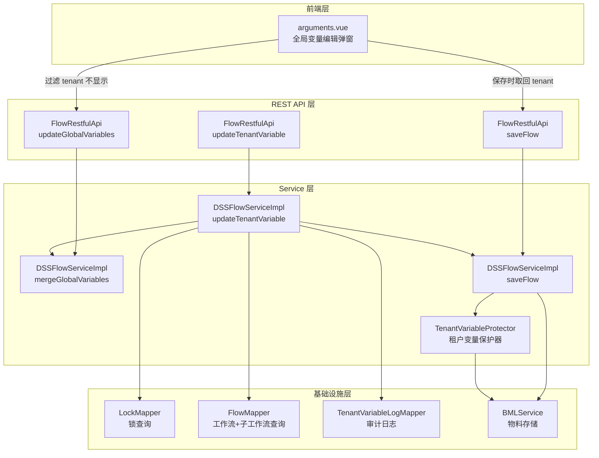
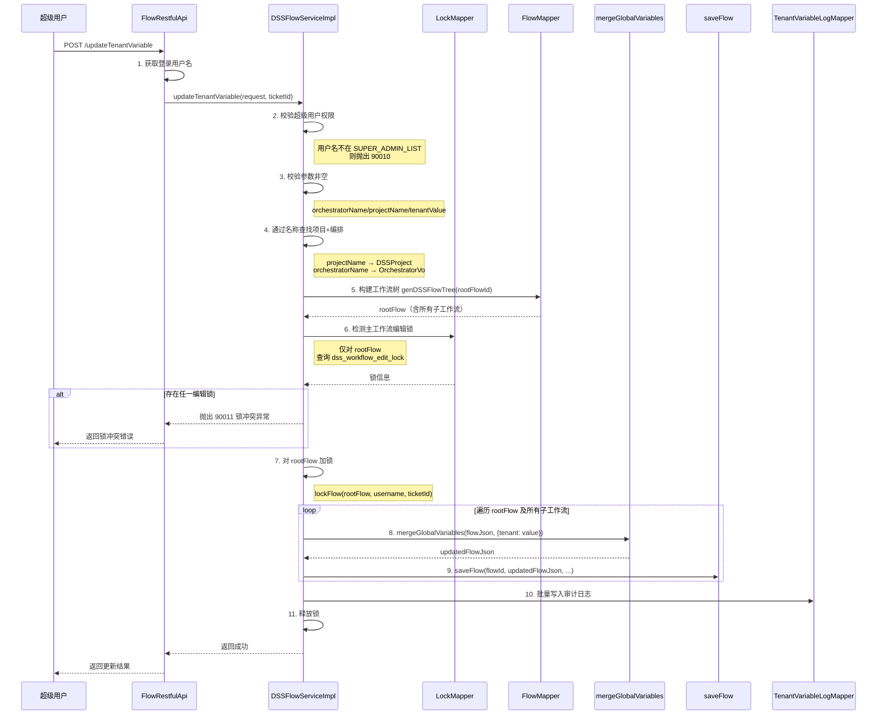
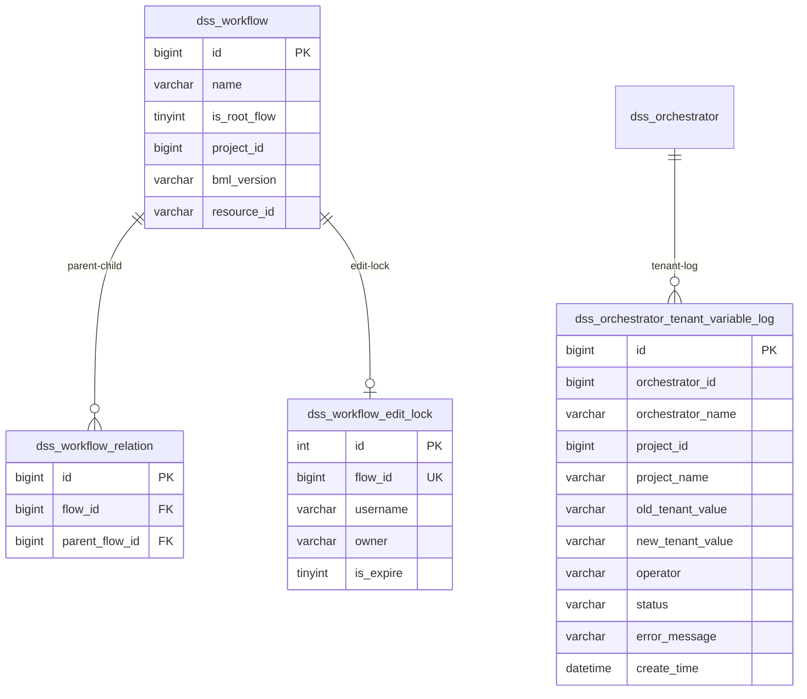

# 租户全局变量管理 设计文档

## 1. 设计概述

### 1.1 背景

DSS 工作流支持全局变量机制，用户通过前端页面可自由添加、编辑、删除全局变量。在多租户场景下，需要一种受控的全局变量 `tenant`，该变量由超级管理员通过后台接口写入，普通用户不可查看、编辑或删除，且保存工作流时需自动保护已有 `tenant` 变量不被覆盖或篡改。

### 1.2 设计目标

| 目标 | 说明 |
|-----|------|
| 受控写入 | 仅超级用户 hadoop 可通过专用接口写入 tenant 变量 |
| 级联修改 | 修改父工作流时，自动级联修改所有子工作流 |
| 锁冲突检测 | 父工作流或任一子工作流存在编辑锁时，拒绝修改 |
| 前端隐藏 | tenant 变量不在前端全局变量列表中展示 |
| 保存保护 | 普通用户保存工作流时，自动保护已有 tenant 不被覆盖、删除或篡改 |
| 操作审计 | 所有 tenant 变量修改操作落表记录 |
| 逻辑复用 | 复用现有 updateGlobalVariables 的合并变量和 saveFlow 保存链路 |

### 1.3 设计原则

1. **最小侵入**：在现有代码基础上扩展，不改变已有接口行为
2. **白名单机制**：仅允许 key 为 `tenant` 的变量通过专用接口写入
3. **防御深度**：写入端校验 + 保存端保护，双重保障 tenant 变量安全
4. **复用优先**：复用 `mergeGlobalVariables` 和 `saveFlow`，保证 BML、版本、上下文、元数据等逻辑一致

---

## 2. 整体架构

### 2.1 模块交互图



### 2.2 核心流程概览

本设计涉及两个核心流程：

1. **租户变量写入流程**：超级用户调用专用接口，经权限校验、名称查找、锁检测、级联修改变量、保存工作流、落审计日志
2. **前端展示隐藏流程**：前端 arguments.vue 组件在渲染全局变量弹窗时过滤 tenant 变量，保存时从原始 props 中取回 tenant 确保不丢失

---

## 3. 接口设计

### 3.1 新增接口：POST `/dss/workflow/updateTenantVariable`

**请求参数**：

| 字段 | 类型 | 必填 | 说明 |
|-----|------|:----:|------|
| orchestratorName | String | 是 | 编排名称，用于定位工作流树 |
| projectName | String | 是 | 项目名称，用于项目校验 |
| tenantValue | String | 是 | tenant 变量的值，不允许为空字符串 |

**响应格式**：

```json
// 成功
{
  "method": "/dss/workflow/updateTenantVariable",
  "status": 0,
  "message": "租户变量更新成功",
  "data": {
    "updatedFlowCount": 3,
    "flowIds": [100, 101, 102]
  }
}

// 失败
{
  "method": "/dss/workflow/updateTenantVariable",
  "status": 1,
  "message": "错误描述",
  "data": null
}
```

**错误码定义**：

| 错误码 | 场景 | 错误信息 |
|-------|------|---------|
| 90010 | 非超级用户调用 | 仅超级用户可调用此接口 |
| 90011 | 工作流或子工作流存在编辑锁 | 工作流 {flowName} 被用户 {username} 锁定编辑，无法修改租户变量 |
| 90012 | 编排不存在 | 编排不存在，orchestratorName: {orchestratorName} |
| 90013 | tenantValue 为空 | tenant 变量值不能为空 |
| 90014 | 项目不存在或编排校验失败 | 项目不存在，projectName: {projectName} / 编排信息无效 |
| 80001 | 保存失败 | 租户变量保存失败，原因为：{detail} |

### 3.2 与现有 updateGlobalVariables 的关系

| 维度 | updateGlobalVariables | updateTenantVariable |
|-----|----------------------|---------------------|
| 调用权限 | 项目编辑权限用户 | 仅超级用户 hadoop |
| 定位方式 | orchestratorId + flowName | orchestratorName + projectName |
| 变量 key | 任意（除 user.to.proxy） | 仅 tenant |
| 作用范围 | 单个工作流（通过 flowName 定位） | 父工作流 + 所有可能的子工作流 |
| 锁策略 | 支持强制解锁（unlock=true） | 仅检测主工作流锁，检测到锁直接拒绝，不支持强制解锁 |
| 审计 | 无落表 | 修改记录落表 |
| 核心逻辑 | mergeGlobalVariables + saveFlow | 复用 mergeGlobalVariables + saveFlow |

**复用策略**：新接口复用 `mergeGlobalVariables` 方法完成变量合并，复用 `saveFlow` 方法完成保存。在 `mergeGlobalVariables` 中，tenant 与其他变量走同一条合并路径，无需修改合并逻辑本身。保护逻辑在 `mergeGlobalVariables` 入口处注入。

---

## 4. 核心流程设计

### 4.1 租户变量写入流程



#### 关键节点说明表

| 节点 | 处理逻辑 | 输入/输出 | 异常处理 |
|-----|---------|----------|---------|
| 1. 请求 | 获取登录用户，构造请求 | 输入: HTTP Request<br>输出: username + request | 无 |
| 2. 权限校验 | 检查 username 是否在 SUPER_ADMIN_LIST | 输入: username<br>输出: 校验通过/异常 | 抛出 90010 |
| 3. 参数校验 | 检查必填参数非空 | 输入: orchestratorName, projectName, tenantValue<br>输出: 校验通过/异常 | 抛出 90013 |
| 4. 名称查找 | 通过 projectName 查 DSSProject，通过 orchestratorName 查 OrchestratorVo | 输入: projectName, orchestratorName<br>输出: dssProject, orchestratorVo | 抛出 90012/90014 |
| 5. 构建工作流树 | genDSSFlowTree 递归加载所有子工作流 | 输入: rootFlowId<br>输出: 完整工作流树 | 抛出 90012 |
| 6. 锁检测 | 仅检查 rootFlow 是否存在编辑锁 | 输入: rootFlowId<br>输出: 锁冲突信息 | 抛出 90011 |
| 7. 加锁 | 对 rootFlow 加编辑锁 | 输入: rootFlow, username, ticketId<br>输出: lockContent | 锁获取失败则抛异常 |
| 8. 合并变量 | mergeGlobalVariables 合并 tenant | 输入: flowJson, {tenant: value}<br>输出: updatedFlowJson | 异常向上抛出 |
| 9. 保存工作流 | saveFlow 完整保存链路 | 输入: flowId, jsonFlow<br>输出: bmlVersion | 异常向上抛出，finally 释放锁 |
| 10. 审计日志 | 批量写入修改记录 | 输入: 操作详情列表<br>输出: 无 | 日志写入失败不阻塞主流程 |

#### 技术难点说明表

| 难点 | 问题描述 | 解决方案 | 决策理由 |
|-----|---------|---------|---------|
| 级联子工作流遍历 | 工作流可多层嵌套，需递归获取所有子工作流 | 复用 genDSSFlowTree，该方法已实现递归构建完整工作流树 | 已有方法成熟稳定，避免重复实现 |
| 通过名称查找编排 | 接口入参为编排名称，需转换为编排ID | 通过 OrchestratorMetaRequest + RPC 查询编排服务获取 orchestratorId | 复用现有编排查询链路 |
| 通过名称查找项目 | 接口入参为项目名称，需转换为项目ID | 通过 ProjectInfoRequest + RPC 查询项目服务，再按名称过滤匹配 | 复用现有项目查询链路 |
| 锁检测与写入一致性 | 检测无锁后、加锁前可能被其他用户抢占 | 检测通过后立即加锁，加锁失败则抛异常回退 | 与现有 updateGlobalVariables 策略一致 |
| 部分子工作流保存失败 | N 个子工作流中第 M 个保存失败 | 整体事务回退：try-catch 包裹，异常时释放锁并抛出 | 保证数据一致性，部分成功不可接受 |
| 审计日志与主流程耦合 | 审计日志写入失败不应阻塞主流程 | 审计日志写入用 try-catch 隔离，失败仅记 warn 日志 | 审计为辅助功能，不应影响核心业务 |

#### 边界与约束说明

- **前置条件**：调用者必须为超级用户；项目名称和编排名称必须有效（能查到对应的项目和编排）
- **后置保证**：父工作流及所有子工作流的 props 中均包含 `tenant` 变量且值为指定值；修改记录已落表
- **并发约束**：同一工作流树同一时间仅允许一个 tenant 变量修改操作（通过 rootFlow 编辑锁保证）
- **性能约束**：子工作流数量较多时（>20），整体耗时受 BML 写入次数影响，预计单个子工作流保存耗时约 200-500ms

### 4.2 前端展示隐藏机制

**方案**：在全局变量编辑弹窗中过滤 `tenant` 变量，使其不在列表中显示。后端数据保持完整，仅前端渲染时过滤。

**实现位置**：`web/packages/workflows/module/process/component/arguments.vue`

**现有逻辑分析**：

该组件的 `setData()` 方法已对 `user.to.proxy` 做过滤：
```javascript
// 现有代码（第153行）
const list = this.props.filter((item) => keys(item)[0] !== 'user.to.proxy');
```

`emitChange()` 方法在提交时会把 `user.to.proxy` 拼回 props：
```javascript
// 现有代码（第177-180行）
const variable = util.convertArrayToMap(value);
const props = [{
  'user.to.proxy': that.scheduleParams.proxyuser,
}].concat(variable);
```

**修改方案**：

1. **`setData()` 方法**：在 filter 中同时排除 `tenant`

```javascript
// 修改后
const list = this.props.filter((item) => {
  const key = keys(item)[0];
  return key !== 'user.to.proxy' && key !== 'tenant';
});
```

2. **`emitChange()` 方法**：提交时将 `tenant` 从原始 props 中取出并拼回，确保保存时不丢失

```javascript
// 修改后
emitChange: debounce(function(that, value, proxyUserChange) {
  const variable = util.convertArrayToMap(value);
  // 从原始 props 中提取 tenant 值，保证保存时不丢失
  const tenantProp = that.props.find((item) => keys(item)[0] === 'tenant');
  const props = [{
    'user.to.proxy': that.scheduleParams.proxyuser,
  }];
  if (tenantProp) {
    props.push(tenantProp);
  }
  props.push(...variable);
  that.$emit('change-props', props, that.scheduleParams.proxyuser, proxyUserChange);
}, 300),
```

**修改要点**：
- `setData()` 过滤时排除 `tenant`，弹窗不显示
- `emitChange()` 提交时从 `that.props`（原始完整数据）中取回 `tenant` 拼入，确保保存不丢失
- 后端接口无需改动

---

## 5. 数据模型设计

### 5.1 新增表：dss_orchestrator_tenant_variable_log

记录 tenant 变量的所有修改操作，以编排和项目为维度，每次调用生成一条记录。

| 字段 | 类型 | 说明 | 约束 |
|-----|------|------|------|
| id | bigint(20) | 主键，自增 | PRIMARY KEY |
| orchestrator_id | bigint(20) | 编排 ID | NOT NULL |
| orchestrator_name | varchar(128) | 编排名称 | NOT NULL |
| project_id | bigint(20) | 项目 ID | NOT NULL |
| project_name | varchar(128) | 项目名称 | NOT NULL |
| old_tenant_value | varchar(512) | 修改前 tenant 值 | NULL 表示之前不存在 |
| new_tenant_value | varchar(512) | 修改后 tenant 值 | NOT NULL |
| operator | varchar(64) | 操作人 | NOT NULL |
| status | varchar(16) | 操作结果 | NOT NULL, 值为 SUCCESS/FAILED |
| error_message | varchar(1024) | 失败原因 | NULL 表示成功 |
| create_time | datetime | 操作时间 | NOT NULL, DEFAULT CURRENT_TIMESTAMP |

**索引设计**：

| 索引名 | 字段 | 类型 | 说明 |
|-------|------|------|------|
| idx_tenant_log_orchestrator_id | orchestrator_id | NORMAL | 按编排查询修改记录 |
| idx_tenant_log_project_id | project_id | NORMAL | 按项目查询修改记录 |
| idx_tenant_log_operator | operator | NORMAL | 按操作人查询 |
| idx_tenant_log_create_time | create_time | NORMAL | 按时间范围查询 |

### 5.2 ER 图



---

## 6. 关键代码变更清单

### 6.1 需要新增的类/方法

| 类/方法 | 包路径 | 说明 |
|--------|-------|------|
| UpdateTenantVariableRequest | com.webank.wedatasphere.dss.workflow.entity.request | 租户变量更新请求体 |
| TenantVariableProtector | com.webank.wedatasphere.dss.workflow.service | 租户变量保护器，封装前端隐藏过滤逻辑 |
| TenantVariableLogMapper | com.webank.wedatasphere.dss.workflow.dao | 审计日志 Mapper 接口 |
| TenantVariableLogMapper.xml | resources/mapper/ | 审计日志 Mapper XML |
| dss_orchestrator_tenant_variable_log DDL | db/version-update/ | 建表脚本 |

### 6.2 需要修改的类/方法

| 类 | 方法 | 修改要点 |
|---|------|---------|
| FlowRestfulApi | 新增 updateTenantVariable() | 新增 REST 端点，校验超级用户权限，调用 service |
| DSSFlowServiceImpl | 新增 updateTenantVariable() | 核心流程：锁检测、级联修改、保存、落日志 |
| DSSFlowServiceImpl | mergeGlobalVariables() | 增加 allowTenantOverride 参数，保护 tenant 不被 updateGlobalVariables 路径修改 |
| DSSFlowService | 接口新增方法声明 | 新增 updateTenantVariable 方法签名 |
| arguments.vue | setData() / emitChange() | 前端全局变量编辑弹窗过滤 tenant 变量，保存时从原始 props 取回 tenant 确保不丢失 |

### 6.3 UpdateTenantVariableRequest 定义

```java
/**
 * 租户变量更新请求
 */
public class UpdateTenantVariableRequest {
    private String orchestratorName;  // 编排名称
    private String projectName;       // 项目名称
    private String tenantValue;       // tenant 变量值
}
```

### 6.4 TenantVariableProtector 核心接口

```java
/**
 * 租户变量保护器
 *
 * 核心职责：
 * 从 flowJson 中提取 tenant 值（供审计日志使用）
 */
public class TenantVariableProtector {

    /**
     * 从 flowJson 的 props 中提取 tenant 值
     *
     * @param flowJson 工作流 JSON
     * @return tenant 值，不存在则返回 null
     */
    public static String extractTenantValue(String flowJson);
}
```

---

## 7. 安全性设计

### 7.1 权限校验

| 校验点 | 校验逻辑 | 失败处理 |
|-------|---------|---------|
| 接口调用权限 | `DSSCommonConf.SUPER_ADMIN_LIST` 包含当前用户名 | 抛出 90010 |
| 项目名称有效性 | 通过 projectName 查找项目，确认存在 | 抛出 90014 |
| 编排名称有效性 | 通过 orchestratorName + projectId 查找编排，确认存在 | 抛出 90012 |

### 7.2 变量 key 白名单

- 专用接口 `updateTenantVariable` 仅接受 `tenant` 这一个 key
- 请求体中不暴露 `variables` Map，直接传入 `tenantValue` 字符串
- 内部构造 `Map<String, Object> variables = new HashMap<>(1); variables.put("tenant", tenantValue);`
- 现有 `updateGlobalVariables` 接口中，tenant 不在禁止列表中（现有仅禁止 `user.to.proxy`），但通过 `mergeGlobalVariables` 的保护逻辑阻止普通用户篡改 tenant

### 7.3 防篡改机制

**两层防御**：

1. **接口层**：专用接口仅超级用户可调用，从入口限制
2. **合并层**：`mergeGlobalVariables` 中增加 tenant 保护分支（`allowTenantOverride=false` 时），普通用户通过 `updateGlobalVariables` 接口不可覆盖已有 tenant

> **注意**：当前版本暂不在 `saveFlow` 中添加 tenant 变量保护。saveFlow 链路保持不变，后续如有需要可在此基础上增加保存层保护。

---

## 8. 兼容性设计

### 8.1 现有接口不受影响

| 接口 | 影响 | 说明 |
|-----|------|------|
| POST /saveFlow | 无变更 | 当前版本不修改 saveFlow，tenant 变量保护暂不在此层实现 |
| POST /updateGlobalVariables | mergeGlobalVariables 增加保护 | 普通用户的 tenant 操作被静默忽略，超级用户正常 |
| GET /get | 无变更 | 当前版本不做 tenant 过滤，后续按需增加 |

### 8.2 已有工作流无 tenant 变量时的兼容处理

- **updateTenantVariable**：如果编排的工作流 props 中不存在 tenant，视为新增操作，old_tenant_value 记录为 null
- **mergeGlobalVariables 保护分支**：仅当旧 flowJson 中存在 tenant 且 `allowTenantOverride=false` 时才触发保护
- **saveFlow**：当前版本不做修改，不增加 tenant 保护逻辑

### 8.3 数据库升级脚本

提供独立的 DDL 升级脚本，位于 `db/version-update/dss_1.23.0_update.sql`，仅包含新建 `dss_orchestrator_tenant_variable_log` 表的语句，不修改现有表结构。

---

## 9. 异常处理

### 9.1 异常场景与处理策略

| 异常场景 | 检测方式 | 处理策略 | 用户感知 |
|---------|---------|---------|---------|
| 非超级用户调用 | SUPER_ADMIN_LIST 校验 | 抛出 90010 | 返回明确错误信息 |
| 项目名称不存在 | 通过 RPC 查找项目为空 | 抛出 90014 | 返回项目不存在提示 |
| 编排名称不存在 | 通过 RPC 查找编排为空 | 抛出 90012 | 返回编排不存在提示 |
| 主工作流存在编辑锁 | LockMapper 查询 rootFlow | 抛出 90011，返回锁持有者信息 | 返回锁冲突提示 |
| 部分子工作流保存失败 | saveFlow 抛异常 | 释放锁，整体失败 | 返回保存失败原因 |
| BML 写入失败 | saveFlow 内部异常 | 释放锁，整体失败 | 返回保存失败原因 |
| 审计日志写入失败 | try-catch 隔离 | 仅记录 warn 日志，不阻塞主流程 | 用户无感知 |

### 9.2 锁冲突详细处理

锁检测逻辑：仅检查主工作流（rootFlow）是否存在编辑锁，不对子工作流进行锁检测。对 rootFlowId 查询 `dss_workflow_edit_lock` 表，如果存在未过期的锁记录（`is_expire = 0`），则拒绝修改。

```
锁冲突信息示例：
- flowId=100, flowName=主工作流, lockedBy=userA
```

返回给前端的信息中包含锁持有者信息，帮助超级用户确认需要协调的对象。

---

## 10. 测试要点

### 10.1 功能测试

| 测试场景 | 前置条件 | 操作 | 预期结果 |
|---------|---------|------|---------|
| 超级用户设置 tenant | 工作流无 tenant | hadoop 调用 updateTenantVariable | props 中出现 tenant 变量，所有子工作流同步更新 |
| 超级用户更新 tenant | 工作流已有 tenant=old | hadoop 调用 updateTenantVariable(tenantValue=new) | tenant 值更新为 new |
| 非超级用户调用 | 普通用户登录 | 普通用户调用 updateTenantVariable | 返回 90010 错误 |
| 主工作流被锁定 | 其他用户正在编辑主工作流 | hadoop 调用 updateTenantVariable | 返回 90011 锁冲突错误 |
| 级联修改 | 父工作流有 3 个子工作流 | hadoop 调用 updateTenantVariable | 4 个工作流（1父+3子）均更新 |
| 多层嵌套 | 子工作流下还有子工作流 | hadoop 调用 updateTenantVariable | 所有层级工作流均更新 |

### 10.2 保存保护测试

| 测试场景 | 前置条件 | 操作 | 预期结果 |
|---------|---------|------|---------|
| updateGlobalVariables 篡改 | 工作流已有 tenant=A | 普通用户通过 updateGlobalVariables 修改 tenant=B | tenant 不被修改，保持 A |
| 无 tenant 工作流保存 | 工作流无 tenant | 普通用户正常保存 | 保存正常，不注入 tenant |
| 超级用户正常修改 | 工作流已有 tenant=A | hadoop 通过 updateTenantVariable 修改 tenant=B | tenant 正常更新为 B |

### 10.3 前端隐藏测试

| 测试场景 | 操作 | 预期结果 |
|---------|------|---------|
| 前端查看工作流 | 打开含 tenant 的工作流，打开全局变量编辑弹窗 | 变量列表中不显示 tenant |
| 前端编辑全局变量 | 在弹窗中编辑其他变量并保存 | tenant 不受影响，保存后 tenant 值不变 |
| 前端新增变量 | 在弹窗中新增一个普通变量并保存 | tenant 不受影响，新增变量正常保存 |
| 弹窗渲染兼容 | 工作流 props 中存在 tenant 变量 | 弹窗正常渲染，无报错 |

### 10.4 审计日志测试

| 测试场景 | 操作 | 预期结果 |
|---------|---------|---------|
| 新增 tenant | 首次设置 tenant | 日志记录 old_tenant_value=null, new_tenant_value=新值, status=SUCCESS |
| 更新 tenant | 修改已有 tenant | 日志记录 old_tenant_value=旧值, new_tenant_value=新值, status=SUCCESS |
| 级联修改 | 父+3子同时修改 | 生成 1 条日志记录（编排维度），status=SUCCESS |
| 保存失败 | BML 写入异常 | 日志记录 status=FAILED, error_message 包含异常信息 |

### 10.5 异常与边界测试

| 测试场景 | 操作 | 预期结果 |
|---------|------|---------|
| tenantValue 为空字符串 | 传入 tenantValue="" | 返回 90013 参数错误 |
| 项目名称不存在 | 传入不存在的 projectName | 返回 90014 |
| 编排名称不存在 | 传入不存在的 orchestratorName | 返回 90012 |
| 并发修改 | 两个超级用户同时修改同一工作流 | 编辑锁保证串行，第二个获锁失败 |
| 大量子工作流 | 父工作流有 30+ 个子工作流 | 全部成功修改，耗时在可接受范围 |

---

## L3 参考资料

<details>
<summary>完整 DDL：dss_orchestrator_tenant_variable_log</summary>

```sql
CREATE TABLE `dss_orchestrator_tenant_variable_log` (
  `id` bigint(20) NOT NULL AUTO_INCREMENT COMMENT '主键',
  `orchestrator_id` bigint(20) NOT NULL COMMENT '编排ID',
  `orchestrator_name` varchar(128) NOT NULL COMMENT '编排名称',
  `project_id` bigint(20) NOT NULL COMMENT '项目ID',
  `project_name` varchar(128) NOT NULL COMMENT '项目名称',
  `old_tenant_value` varchar(512) DEFAULT NULL COMMENT '修改前tenant值，NULL表示之前不存在',
  `new_tenant_value` varchar(512) NOT NULL COMMENT '修改后tenant值',
  `operator` varchar(64) NOT NULL COMMENT '操作人',
  `status` varchar(16) NOT NULL COMMENT '操作结果：SUCCESS/FAILED',
  `error_message` varchar(1024) DEFAULT NULL COMMENT '失败原因，成功时为NULL',
  `create_time` datetime NOT NULL DEFAULT CURRENT_TIMESTAMP COMMENT '操作时间',
  PRIMARY KEY (`id`),
  KEY `idx_tenant_log_orchestrator_id` (`orchestrator_id`),
  KEY `idx_tenant_log_project_id` (`project_id`),
  KEY `idx_tenant_log_operator` (`operator`),
  KEY `idx_tenant_log_create_time` (`create_time`)
) ENGINE=InnoDB DEFAULT CHARSET=utf8mb4 COLLATE=utf8mb4_bin COMMENT='编排租户变量修改日志';
```

</details>

<details>
<summary>完整代码示例：FlowRestfulApi.updateTenantVariable</summary>

```java
@RequestMapping(value = "/updateTenantVariable", method = RequestMethod.POST)
public Message updateTenantVariable(@RequestBody UpdateTenantVariableRequest request) {
    String userName = SecurityFilter.getLoginUsername(httpServletRequest);

    // 校验超级用户权限
    boolean isSuperAdmin = false;
    for (String admin : DSSCommonConf.SUPER_ADMIN_LIST) {
        if (admin.equals(userName)) {
            isSuperAdmin = true;
            break;
        }
    }
    if (!isSuperAdmin) {
        return Message.error("仅超级用户可调用此接口").data("errCode", 90010);
    }

    request.setOperator(userName);

    try {
        Cookie[] cookies = httpServletRequest.getCookies();
        String ticketId = Arrays.stream(cookies)
                .filter(cookie -> DSSWorkFlowConstant.BDP_USER_TICKET_ID.equals(cookie.getName()))
                .findFirst().map(Cookie::getValue).get();
        dssFlowService.updateTenantVariable(request, ticketId);
    } catch (Exception e) {
        LOGGER.error("租户变量更新失败, orchestratorName={}, projectName={}",
                request.getOrchestratorName(), request.getProjectName(), e);
        return Message.error("租户变量更新失败，原因为：" + e.getMessage());
    }
    return Message.ok("租户变量更新成功");
}
```

</details>

<details>
<summary>完整代码示例：TenantVariableProtector</summary>

```java
package com.webank.wedatasphere.dss.workflow.service;

import com.google.gson.JsonObject;
import com.google.gson.JsonParser;
import com.webank.wedatasphere.dss.common.utils.DSSCommonUtils;
import org.slf4j.Logger;
import org.slf4j.LoggerFactory;

import java.util.*;

/**
 * 租户变量保护器
 */
public class TenantVariableProtector {

    private static final Logger LOGGER = LoggerFactory.getLogger(TenantVariableProtector.class);
    private static final String TENANT_KEY = "tenant";
    private static final String PROPS_KEY = "props";

    /**
     * 从 flowJson 的 props 中提取 tenant 值
     */
    public static String extractTenantValue(String flowJson) {
        if (flowJson == null || flowJson.isEmpty()) {
            return null;
        }
        List<Map<String, Object>> props = DSSCommonUtils.getFlowAttribute(flowJson, PROPS_KEY);
        if (props == null) {
            return null;
        }
        for (Map<String, Object> prop : props) {
            if (prop.containsKey(TENANT_KEY)) {
                Object value = prop.get(TENANT_KEY);
                return value != null ? value.toString() : null;
            }
        }
        return null;
    }
}
```

</details>

<details>
<summary>完整代码示例：DSSFlowServiceImpl.updateTenantVariable</summary>

```java
@Override
public void updateTenantVariable(UpdateTenantVariableRequest request, String ticketId) throws Exception {
    String username = request.getOperator();
    String orchestratorName = request.getOrchestratorName();
    String projectName = request.getProjectName();
    String tenantValue = request.getTenantValue();

    // 1. 参数校验
    if (StringUtils.isEmpty(orchestratorName)) {
        DSSExceptionUtils.dealErrorException(90013, "orchestratorName 不能为空", DSSErrorException.class);
    }
    if (StringUtils.isEmpty(projectName)) {
        DSSExceptionUtils.dealErrorException(90013, "projectName 不能为空", DSSErrorException.class);
    }
    if (StringUtils.isEmpty(tenantValue)) {
        DSSExceptionUtils.dealErrorException(90013, "tenant 变量值不能为空", DSSErrorException.class);
    }

    // 2. 通过项目名称查找项目
    DSSProject dssProject = getProjectByName(projectName);
    if (dssProject == null) {
        DSSExceptionUtils.dealErrorException(90014, "项目不存在，projectName: " + projectName, DSSErrorException.class);
    }
    Long projectId = dssProject.getId();
    Long workspaceId = Long.valueOf(dssProject.getWorkspaceId());

    // 3. 通过编排名称查找编排
    OrchestratorVo orchestratorVo = getOrchestratorByName(orchestratorName, projectId);
    if (orchestratorVo == null || orchestratorVo.getDssOrchestratorInfo() == null
            || orchestratorVo.getDssOrchestratorVersion() == null) {
        DSSExceptionUtils.dealErrorException(90012, "编排不存在，orchestratorName: " + orchestratorName, DSSErrorException.class);
    }
    DSSOrchestratorVersion dssOrchestratorVersion = orchestratorVo.getDssOrchestratorVersion();
    DSSOrchestratorInfo dssOrchestratorInfo = orchestratorVo.getDssOrchestratorInfo();
    Long orchestratorId = dssOrchestratorInfo.getId();

    // 4. 构建工作流树
    Long rootFlowId = dssOrchestratorVersion.getAppId();
    DSSFlow rootFlow = genDSSFlowTree(rootFlowId);

    // 5. 锁检测：仅检查主工作流
    DSSFlowEditLock editLock = lockMapper.getFlowEditLockByID(rootFlow.getId());
    if (editLock != null && !editLock.getExpire()) {
        throw new DSSErrorException(90011, String.format("主工作流[%s]正在被用户%s编辑，无法修改租户变量",
                rootFlow.getName(), editLock.getUsername()));
    }

    // 6. 对 rootFlow 加锁
    Workspace workspace = new Workspace();
    workspace.setWorkspaceId(workspaceId);
    lockFlow(rootFlow, username, ticketId);

    try {
        // 7. 遍历工作流树，修改 tenant 变量
        List<Long> updatedFlowIds = new ArrayList<>();
        String oldTenantValue = TenantVariableProtector.extractTenantValue(rootFlow.getFlowJson());

        updateTenantVariableForFlowTree(rootFlow, tenantValue, username, updatedFlowIds);

        // 8. 写入审计日志 - 成功
        saveLog(orchestratorId, orchestratorName, projectId, projectName,
                oldTenantValue, tenantValue, username, "SUCCESS", null);

        logger.info("租户变量更新成功, orchestratorName={}, 更新工作流数={}", orchestratorName, updatedFlowIds.size());
    } catch (Exception e) {
        // 写入审计日志 - 失败
        String oldTenantValue = null;
        try {
            oldTenantValue = TenantVariableProtector.extractTenantValue(rootFlow.getFlowJson());
        } catch (Exception ignored) {}
        saveLog(orchestratorId, orchestratorName, projectId, projectName,
                oldTenantValue, tenantValue, username, "FAILED", e.getMessage());
        throw e;
    } finally {
        // 9. 释放锁
        workFlowManager.unlockWorkflow(username, dssOrchestratorVersion.getAppId(), true, workspace);
    }
}

/**
 * 保存审计日志（成功和失败均记录）
 */
private void saveLog(Long orchestratorId, String orchestratorName, Long projectId, String projectName,
        String oldTenantValue, String newTenantValue, String operator, String status, String errorMessage) {
    try {
        TenantVariableLogEntry logEntry = new TenantVariableLogEntry();
        logEntry.setOrchestratorId(orchestratorId);
        logEntry.setOrchestratorName(orchestratorName);
        logEntry.setProjectId(projectId);
        logEntry.setProjectName(projectName);
        logEntry.setOldTenantValue(oldTenantValue);
        logEntry.setNewTenantValue(newTenantValue);
        logEntry.setOperator(operator);
        logEntry.setStatus(status);
        logEntry.setErrorMessage(errorMessage);
        tenantVariableLogMapper.insert(logEntry);
    } catch (Exception e) {
        logger.warn("租户变量审计日志写入失败", e);
    }
}

/**
 * 通过项目名称查找项目
 */
private DSSProject getProjectByName(String projectName) {
    // 通过 RPC 查询项目服务，按名称过滤
    RequestQueryProject request = new RequestQueryProject();
    // ... 通过 RPC 获取项目列表，按 projectName 匹配
    // 复用 DSSSenderServiceFactory.getOrCreateServiceInstance().getProjectServerSender()
    return dssProject;
}

/**
 * 通过编排名称+项目ID查找编排
 */
private OrchestratorVo getOrchestratorByName(String orchestratorName, Long projectId) {
    // 通过 OrchestratorMetaRequest 查询编排服务
    OrchestratorMetaRequest metaRequest = new OrchestratorMetaRequest();
    metaRequest.setOrchestratorName(orchestratorName);
    metaRequest.setProjectList(Collections.singletonList(projectId.toString()));
    // ... 通过 RPC 查询编排，按 orchestratorName 匹配
    return orchestratorVo;
}

/**
 * 递归遍历工作流树，对每个工作流设置 tenant 变量
 */
private void updateTenantVariableForFlowTree(DSSFlow flow, String tenantValue, String username,
        List<Long> updatedFlowIds) throws Exception {

    String flowJson = flow.getFlowJson();

    // 构造 tenant 变量 Map
    Map<String, Object> variables = new HashMap<>(1);
    variables.put("tenant", tenantValue);

    // 复用 mergeGlobalVariables 合并变量，allowTenantOverride=true 允许覆盖已有 tenant
    String updatedFlowJson = mergeGlobalVariables(flowJson, variables, flow.getName(), true);
    flow.setFlowJson(updatedFlowJson);

    // 复用 saveFlow 保存
    saveFlow(flow.getId(), updatedFlowJson, flow.getDescription(),
            flow.getCreator(), null, null, null);

    updatedFlowIds.add(flow.getId());

    // 递归处理子工作流
    if (!CollectionUtils.isEmpty(flow.getChildren())) {
        for (DSSFlow child : flow.getChildren()) {
            updateTenantVariableForFlowTree(child, tenantValue, username, updatedFlowIds);
        }
    }
}

}
```

</details>

<details>
<summary>完整代码示例：mergeGlobalVariables 中 tenant 保护分支</summary>

```java
private String mergeGlobalVariables(String flowJson, Map<String, Object> newVariables, String flowName, boolean allowTenantOverride) {
    List<Map<String, Object>> existingProps = DSSCommonUtils.getFlowAttribute(flowJson, "props");
    String proxyUser = null;
    Map<String, Object> mergedVars = new LinkedHashMap<>();

    for (Map<String, Object> prop : existingProps) {
        if (prop.containsKey("user.to.proxy")) {
            proxyUser = prop.get("user.to.proxy") != null ? prop.get("user.to.proxy").toString() : null;
        } else {
            mergedVars.putAll(prop);
        }
    }

    logger.info("updateGlobalVariables flowName={}, existingVariables={}, newVariables={}", flowName, mergedVars, newVariables);

    // 禁止通过此接口覆盖 user.to.proxy
    if (newVariables.containsKey("user.to.proxy")) {
        throw new DSSRuntimeException(90003, "不允许通过全局变量接口修改 user.to.proxy");
    }

    // 新增：保护 tenant 变量不被 updateGlobalVariables 接口修改
    // 仅 updateTenantVariable 专用接口（allowTenantOverride=true）才允许覆盖 tenant
    if (newVariables.containsKey("tenant") && !allowTenantOverride) {
        // 非专用接口路径试图新增或修改 tenant，直接忽略
        logger.warn("Attempt to add or modify tenant variable via updateGlobalVariables is blocked for flow: {}", flowName);
        newVariables.remove("tenant");
    }

    // 增量合并
    mergedVars.putAll(newVariables);

    // 重建 props 数组
    List<Map<String, Object>> newProps = new ArrayList<>();
    if (proxyUser != null) {
        Map<String, Object> proxyMap = new HashMap<>();
        proxyMap.put("user.to.proxy", proxyUser);
        newProps.add(proxyMap);
    }
    for (Map.Entry<String, Object> entry : mergedVars.entrySet()) {
        Map<String, Object> varMap = new HashMap<>();
        varMap.put(entry.getKey(), entry.getValue());
        newProps.add(varMap);
    }

    JsonObject flowJsonObj = new JsonParser().parse(flowJson).getAsJsonObject();
    flowJsonObj.add("props", DSSCommonUtils.COMMON_GSON.toJsonTree(newProps));
    return DSSCommonUtils.COMMON_GSON.toJson(flowJsonObj);
}

// 兼容现有调用：updateGlobalVariables 路径默认不允许覆盖 tenant
private String mergeGlobalVariables(String flowJson, Map<String, Object> newVariables, String flowName) {
    return mergeGlobalVariables(flowJson, newVariables, flowName, false);
}
```

**tenant 重复修改说明**：超级用户可通过 `updateTenantVariable` 接口重复修改 tenant 值，每次修改直接覆盖原值。原值在覆盖前记录到审计日志 `old_tenant_value` 字段，保证可追溯。

</details>
