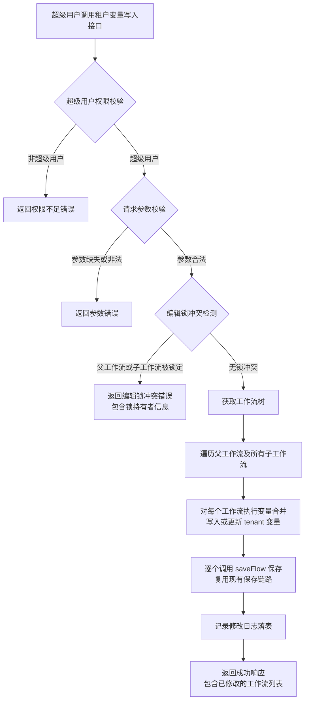

# 租户全局变量管理 需求文档

**需求类型**: NEW（新增功能）
**文档版本**: v1.0
**创建日期**: 2025-06-05

---

## 需求速览

| 维度 | 内容 |
|-----|------|
| **一句话描述** | 新增后台接口，向指定工作流及其所有子工作流写入或更新 `tenant` 全局变量，并对普通用户隐藏和保护该变量 |
| **目标用户** | 超级管理员（hadoop），普通用户间接受保护 |
| **核心价值** | 实现租户标识与工作流的绑定，防止普通用户篡改租户信息，保障多租户隔离安全性 |
| **功能范围** | P0: 7个 |
| **关键约束** | 仅超级用户可调用；仅允许操作 `tenant` 变量；编辑锁冲突时拒绝修改 |
| **涉及模块** | dss-workflow-server（REST API / Service / Lock / Mapper） |

> 阅读指引：速览全貌看本卡片 -> 功能详情看第三章 -> 接口与数据模型看第四/五章

---

## 一、需求概述 【核心】

### 1.1 业务背景

DSS 工作流支持全局变量机制，用户可通过 `updateGlobalVariables` 接口管理工作流级别的变量。当前全局变量接口面向所有用户开放，缺乏对特定敏感变量（如租户标识 `tenant`）的管控能力。业务上需要一种受控机制，将租户标识绑定到工作流，同时确保普通用户无法查看、修改或删除该变量。

### 1.2 核心目标

1. 提供一个受权限管控的后台接口，仅超级用户 `hadoop` 可调用，用于向工作流及其子工作流写入或更新 `tenant` 全局变量
2. 在前端页面隐藏 `tenant` 变量，普通用户无法感知其存在
3. 在普通用户保存工作流时，保护已有的 `tenant` 变量不被覆盖、删除或篡改
4. 修改操作须记录落表，满足审计追踪需求

### 1.3 边界定义

| 包含（In Scope） | 不包含（Out of Scope） |
|------------------|----------------------|
| 新增 `tenant` 变量写入/更新后台接口 | 不支持删除 `tenant` 变量 |
| 父子工作流级联修改 `tenant` 变量 | 不支持操作 `tenant` 以外的全局变量 |
| 超级用户权限校验 | 不改造现有 `updateGlobalVariables` 接口的权限模型 |
| 前端隐藏 `tenant` 变量 | 不涉及前端代码修改（前端通过后端返回的数据渲染，后端过滤即可） |
| 保存时变量保护 | 不改变现有保存链路的主流程 |
| 修改记录落表 | 不涉及历史数据回填 |

### 1.4 项目上下文

**项目类型**: 现有项目（棕地）
**相似功能检查**: 现有 `updateGlobalVariables` 接口可更新全局变量，但不支持权限管控、变量隐藏、级联修改
**依赖的现有模块**:
- `DSSFlowServiceImpl` -- 工作流服务实现（saveFlow / mergeGlobalVariables）
- `DSSFlowEditLockManager` -- 编辑锁管理
- `FlowMapper` -- 工作流数据访问
- `LockMapper` -- 锁数据访问
- `DSSCommonConf.SUPER_ADMIN_LIST` -- 超级管理员配置
- `BMLService` -- BML 持久化
- `AuditLogUtils` -- 审计日志

---

## 二、核心流程 【核心】

### 2.1 异常处理

当出现异常情况时，用户体验如下：

| 异常场景 | 用户提示 | 处理方式 |
|---------|---------|---------|
| 非超级用户调用接口 | "仅超级管理员可执行此操作" | 直接返回权限错误，不执行任何修改 |
| 父工作流存在编辑锁 | "工作流 {name} 正在被用户 {username} 编辑，请稍后重试" | 返回锁冲突信息，不执行任何修改 |
| 子工作流存在编辑锁 | "子工作流 {name} 正在被用户 {username} 编辑，请稍后重试" | 返回锁冲突信息，不执行任何修改 |
| 工作流不存在 | "工作流不存在，flowId: {id}" | 返回参数错误 |
| orchestratorId 无效 | "编排不存在" | 返回参数错误 |
| 保存失败 | "工作流 {name} 租户变量写入失败，原因: {detail}" | 返回保存错误，已成功的工作流不回滚 |

---

## 三、功能需求 【核心】

### 3.1 功能总览

| ID | 功能点 | 优先级 | 状态 | 一句话描述 |
|----|-------|:------:|:----:|----------|
| F1 | 租户变量写入接口 | P0 | 已确认 | 新增后台接口，向工作流写入或更新 tenant 变量 |
| F2 | 超级用户权限校验 | P0 | 已确认 | 仅 hadoop 用户可调用，其他用户直接拒绝 |
| F3 | 编辑锁冲突检测 | P0 | 已确认 | 主工作流存在编辑锁时拒绝修改 |
| F4 | 父子工作流级联修改 | P0 | 已确认 | 修改父工作流时一并修改其所有子工作流 |
| F5 | 前端展示隐藏 | P0 | 已确认 | 全局变量编辑弹窗中不显示 tenant 变量（前端过滤实现） |
| F6 | 保存时变量保护 | 延后 | 待定 | 普通用户保存工作流时保护已有 tenant 不被覆盖或删除（当前版本暂不实现） |
| F7 | 修改记录落表 | P0 | 已确认 | 记录每次租户变量修改的操作日志 |

---

### 3.2 F1: 租户变量写入接口 `P0` `已确认`

**功能描述**

新增一个后台 REST 接口，允许超级用户向指定工作流及其所有子工作流添加或更新全局变量 `tenant`。该接口独立于现有的 `updateGlobalVariables` 接口，不共享其权限模型和参数结构。

**输入**

| 参数名 | 类型 | 必填 | 说明 |
|-------|------|:----:|------|
| orchestratorName | String | 是 | 编排名称，用于定位工作流树 |
| projectName | String | 是 | 项目名称，用于项目校验 |
| tenant | String | 是 | 租户标识值，不能为空 |

**输出**

成功时返回已修改的工作流列表：

| 字段名 | 类型 | 说明 |
|-------|------|------|
| message | String | 操作结果描述 |
| modifiedFlows | List | 已修改的工作流信息列表 |

每个 modifiedFlow 包含：

| 字段名 | 类型 | 说明 |
|-------|------|------|
| flowId | Long | 工作流 ID |
| flowName | String | 工作流名称 |
| tenant | String | 写入的租户值 |
| version | String | 保存后的 BML 版本号 |

**业务规则**

| 规则ID | 规则描述 |
|--------|---------|
| R1.1 | 仅允许写入 key 为 `tenant` 的变量，请求中传入其他变量 key 应被拒绝 |
| R1.2 | 如果工作流中已存在 `tenant` 变量，则更新其值（覆盖原值）；如不存在，则新增。tenant 可通过接口重复修改，每次修改直接覆盖原值 |
| R1.3 | 保存时必须复用现有的 `saveFlow` 链路，确保 BML 持久化、版本管理、上下文保存、元数据更新等逻辑一致 |
| R1.4 | `tenant` 变量的合并逻辑应复用现有的 `mergeGlobalVariables` 方法，但需排除对 `user.to.proxy` 的影响 |
| R1.5 | 接口路径为 POST `/dss/workflow/updateTenantVariable`，位于 `FlowRestfulApi` 控制器中 |
| R1.6 | 接口通过编排名称（orchestratorName）和项目名称（projectName）定位目标工作流，内部转换为 orchestratorId 和 projectId 后执行操作 |

**验收标准（三段式）**

| 验证阶段 | 验收条件 |
|:--------:|---------|
| 【输入验证】 | AC1.1: orchestratorName 为空时返回参数错误 |
| 【输入验证】 | AC1.2: projectName 为空时返回参数错误 |
| 【输入验证】 | AC1.3: tenant 值为空时返回参数错误 |
| 【处理验证】 | AC1.4: 调用接口后，目标工作流的 flowJson 中 props 数组包含 `tenant` 变量且值正确 |
| 【处理验证】 | AC1.5: 保存后 BML 版本号更新，资源 ID 保持不变 |
| 【输出验证】 | AC1.6: 成功响应中包含所有已修改工作流的 flowId、flowName、tenant 值和 version |

---

### 3.3 F2: 超级用户权限校验 `P0` `已确认`

**功能描述**

在租户变量写入接口的入口处，校验当前调用者是否为超级用户。仅 `DSSCommonConf.SUPER_ADMIN_LIST` 中配置的用户（默认为 `hadoop`）允许调用，其他用户一律拒绝。

**输入**

| 参数名 | 类型 | 说明 |
|-------|------|------|
| 当前登录用户 | String | 从 HTTP 请求中通过 `SecurityFilter.getLoginUsername()` 获取 |

**输出**

| 场景 | 响应 |
|------|------|
| 超级用户 | 继续执行后续逻辑 |
| 非超级用户 | 返回错误码 `90005`，消息 "仅超级管理员可执行此操作" |

**业务规则**

| 规则ID | 规则描述 |
|--------|---------|
| R2.1 | 从 `DSSCommonConf.SUPER_ADMIN_LIST` 读取超级管理员列表，该列表可通过配置项 `wds.dss.super.admin` 修改 |
| R2.2 | 校验时机：在接口入口处最先执行，先于参数校验和锁检测 |
| R2.3 | 不再执行现有的 `validateOperation` 项目编辑权限校验（超级用户可能不在项目成员中），仅校验项目名称和编排名称的有效性 |

**验收标准（三段式）**

| 验证阶段 | 验收条件 |
|:--------:|---------|
| 【输入验证】 | AC2.1: 未登录用户调用接口时，返回认证错误 |
| 【处理验证】 | AC2.2: 用户名为 `hadoop` 时，接口正常执行后续逻辑 |
| 【输出验证】 | AC2.3: 用户名不在超级管理员列表时，返回错误码 90005，消息为 "仅超级管理员可执行此操作" |

---

### 3.4 F3: 编辑锁冲突检测 `P0` `已确认`

**功能描述**

在执行 `tenant` 变量写入前，检测父工作流及其所有子工作流是否存在编辑锁。如果任一工作流存在编辑锁，则拒绝执行修改操作，直接返回失败并告知锁持有者信息。

**输入**

| 参数名 | 类型 | 说明 |
|-------|------|------|
| 工作流树 | DSSFlow | 通过 `genDSSFlowTree` 构建的完整工作流树 |

**输出**

| 场景 | 响应 |
|------|------|
| 无编辑锁 | 继续执行 |
| 主工作流有锁 | 返回错误码 `60056`，消息 "主工作流 {name} 正在被用户 {username} 编辑，请稍后重试" |

**业务规则**

| 规则ID | 规则描述 |
|--------|---------|
| R3.1 | 检测范围仅为主工作流（rootFlow），不检查子工作流的编辑锁 |
| R3.2 | 通过 `LockMapper.getFlowEditLockByID(rootFlowId)` 查询主工作流的编辑锁状态 |
| R3.3 | 锁即使已过期也视为冲突（保守策略），因为过期的锁可能正处于清理过程中 |
| R3.4 | 检测到冲突时，不执行任何修改操作（原子性：要么全部修改，要么全部不修改） |
| R3.5 | 与现有 `updateGlobalVariables` 不同，本接口不支持 `unlock` 参数强制解锁，避免干扰用户正在进行的编辑 |

**验收标准（三段式）**

| 验证阶段 | 验收条件 |
|:--------:|---------|
| 【输入验证】 | AC3.1: 工作流树为空或不存在时，返回工作流不存在的错误 |
| 【处理验证】 | AC3.2: 主工作流存在有效编辑锁时，接口返回错误，不修改任何工作流 |
| 【输出验证】 | AC3.3: 锁冲突错误信息中包含被锁主工作流名称和锁持有者用户名 |

---

### 3.5 F4: 父子工作流级联修改 `P0` `已确认`

**功能描述**

当超级用户向指定工作流写入 `tenant` 变量时，需同时将该变量写入其所有子工作流。通过 `flow_relation` 表的递归查询获取完整的子工作流列表，逐个执行变量合并和保存。

**输入**

| 参数名 | 类型 | 说明 |
|-------|------|------|
| rootFlow | DSSFlow | 工作流树根节点，包含所有子工作流 |
| tenant | String | 要写入的租户值 |

**输出**

| 字段 | 说明 |
|------|------|
| modifiedFlows | 所有已成功修改的工作流列表（包含父工作流和子工作流） |

**业务规则**

| 规则ID | 规则描述 |
|--------|---------|
| R4.1 | 通过 `genDSSFlowTree` 构建完整的工作流树，获取所有层级的子工作流 |
| R4.2 | 对每个工作流（父 + 所有子工作流），分别执行变量合并和 `saveFlow` 操作 |
| R4.3 | 如果目标工作流是父工作流（通过 flowName 定位），则级联到其所有子工作流 |
| R4.4 | 如果目标工作流是子工作流，也需级联到该子工作流的更深层子工作流，同时修改父工作流 |
| R4.5 | 某个子工作流保存失败时，不影响其他工作流的保存，但需在返回结果中标记失败项 |
| R4.6 | 对每个工作流执行 `saveFlow` 时，传入的 username 使用该工作流的 `creator` 字段，确保 BML 权限一致 |

**验收标准（三段式）**

| 验证阶段 | 验收条件 |
|:--------:|---------|
| 【输入验证】 | AC4.1: orchestratorName 对应的编排不存在时返回参数错误 |
| 【处理验证】 | AC4.2: 父工作流有 3 个子工作流时，4 个工作流（1 父 + 3 子）的 props 中均包含正确的 tenant 值 |
| 【处理验证】 | AC4.3: 子工作流还有更深层子工作流时，所有层级的工作流均被修改 |
| 【输出验证】 | AC4.4: 响应中 modifiedFlows 列表包含所有已修改工作流的信息 |
| 【输出验证】 | AC4.5: 某个子工作流保存失败时，响应中标记该工作流为失败，其他成功项正常返回 |

---

### 3.6 F5: 前端展示隐藏 `P0` `已确认`

**功能描述**

`tenant` 变量不在全局变量编辑弹窗中展示，普通用户无法查看、编辑或删除该变量。此功能通过前端在渲染变量列表时过滤 `tenant` 实现，后端数据保持完整。

**输入**

| 参数名 | 类型 | 说明 |
|-------|------|------|
| props | Array | 工作流 props 数组，可能包含 tenant 变量 |

**输出**

| 场景 | 行为 |
|------|------|
| 全局变量编辑弹窗 | 变量列表中不显示 tenant |
| 保存工作流 | tenant 从原始 props 中取回并拼入提交数据，不丢失 |

**业务规则**

| 规则ID | 规则描述 |
|--------|---------|
| R5.1 | 前端 `arguments.vue` 组件的 `setData()` 方法中，过滤 props 时同时排除 `user.to.proxy` 和 `tenant` |
| R5.2 | 前端 `emitChange()` 方法提交时，从原始 props 中取回 `tenant` 拼入，确保保存不丢失 |
| R5.3 | 后端接口无需改动，flowJson 中始终保留 `tenant` 变量 |
| R5.4 | 与 `user.to.proxy` 的处理模式一致：`user.to.proxy` 在弹窗中单独显示为代理用户输入框，`tenant` 则完全不显示 |

**验收标准（三段式）**

| 验证阶段 | 验收条件 |
|:--------:|---------|
| 【输入验证】 | AC5.1: 工作流中存在 tenant 变量时，弹窗正常渲染不报错 |
| 【处理验证】 | AC5.2: 全局变量编辑弹窗中不显示 tenant 变量 |
| 【处理验证】 | AC5.3: 普通用户在弹窗中编辑其他变量并保存后，tenant 变量仍然存在且值不变 |

---

### 3.7 F6: 保存时变量保护 `P0` `已确认`

**功能描述**

当普通用户通过前端保存工作流时，后端需要保护已有的 `tenant` 变量不被覆盖、删除或篡改。即使前端提交的 flowJson 中不包含 `tenant` 变量，后端也应从数据库中读取并保留该变量。

**输入**

| 参数名 | 类型 | 说明 |
|-------|------|------|
| flowJson（前端提交） | String | 可能不包含 tenant 变量的工作流 JSON |
| flowJson（数据库中） | String | 包含 tenant 变量的原始工作流 JSON |

**输出**

| 场景 | 行为 |
|------|------|
| 普通用户保存，前端提交的 flowJson 不含 tenant | 合并时保留数据库中的 tenant 变量 |
| 普通用户保存，前端提交的 flowJson 包含 tenant（篡改值） | 忽略前端提交的 tenant 值，保留数据库中的原值 |
| 超级用户通过新接口保存 | 按新接口逻辑处理 |

**业务规则**

| 规则ID | 规则描述 |
|--------|---------|
| R6.1 | 在现有 `saveFlow` 方法中，保存 flowJson 之前，检测数据库中是否存在 `tenant` 变量 |
| R6.2 | 如果数据库中存在 `tenant`，且当前操作者不是超级用户（或不是通过租户变量接口调用），则强制保留数据库中的 `tenant` 值，忽略前端提交的 `tenant` |
| R6.3 | 如果数据库中存在 `tenant`，前端提交的 flowJson 中没有 `tenant`，则在合并时将数据库中的 `tenant` 追加回去 |
| R6.4 | 如果数据库中不存在 `tenant`，前端提交的 flowJson 中包含 `tenant`（非超级用户），则忽略前端提交的 `tenant`（普通用户不能自行添加） |
| R6.5 | 保护逻辑应在 `saveFlow` 或 `mergeGlobalVariables` 的调用链中实现，确保通过所有现有保存路径（普通保存、批量编辑等）均受保护 |
| R6.6 | `user.to.proxy` 已有类似的保护机制（在 `mergeGlobalVariables` 中禁止覆盖），`tenant` 应采用相同的模式 |

**验收标准（三段式）**

| 验证阶段 | 验收条件 |
|:--------:|---------|
| 【输入验证】 | AC6.1: 数据库中有 tenant 变量的工作流，普通用户正常保存时接口不报错 |
| 【处理验证】 | AC6.2: 普通用户保存工作流后，数据库中的 tenant 值不变 |
| 【处理验证】 | AC6.3: 普通用户在前端修改全局变量（不含 tenant）并保存后，tenant 变量仍然存在且值正确 |
| 【输出验证】 | AC6.4: 普通用户试图通过构造包含 tenant 的请求保存工作流时，tenant 值不被写入或篡改 |
| 【输出验证】 | AC6.5: 普通用户保存后重新读取工作流，tenant 值与保存前一致 |

---

### 3.8 F7: 修改记录落表 `P0` `已确认`

**功能描述**

每次通过租户变量写入接口成功修改编排的 `tenant` 变量后，需将修改记录写入数据库表，满足审计追踪需求。每次调用生成一条记录，记录编排和项目维度信息。

**输入**

| 参数名 | 类型 | 说明 |
|-------|------|------|
| operator | String | 操作者用户名 |
| orchestratorName | String | 编排名称 |
| orchestratorId | Long | 编排 ID |
| projectName | String | 项目名称 |
| projectId | Long | 项目 ID |
| oldTenantValue | String | 修改前的 tenant 值（可能为空，表示新增） |
| newTenantValue | String | 修改后的 tenant 值 |
| operateTime | Date | 操作时间 |

**输出**

成功写入数据库记录，无额外返回。

**业务规则**

| 规则ID | 规则描述 |
|--------|---------|
| R7.1 | 新增数据库表 `dss_orchestrator_tenant_variable_log` 用于存储修改记录，不记录操作类型 |
| R7.2 | 每次调用接口生成一条记录，记录编排和项目维度信息，不记录单个工作流信息 |
| R7.3 | 记录包含：操作者、编排名称、编排ID、项目名称、项目ID、修改前值、修改后值、操作结果（成功/失败）、失败原因、操作时间 |
| R7.4 | 如果编排之前不存在 tenant 变量，`oldTenantValue` 记录为空 |
| R7.5 | 编辑锁冲突时不记录日志（操作未实际执行）；其他场景（成功或失败）均需写入日志记录 |
| R7.6 | 操作成功时 `status` 为 SUCCESS，`error_message` 为空；操作失败时 `status` 为 FAILED，`error_message` 记录失败原因 |
| R7.7 | 失败场景包括但不限于：保存异常、BML写入失败等（编辑锁冲突除外） |
| R7.8 | 同时通过 `AuditLogUtils.printLog` 输出审计日志，操作类型使用 `UPDATE` |

**验收标准（三段式）**

| 验证阶段 | 验收条件 |
|:--------:|---------|
| 【输入验证】 | AC7.1: 接口成功执行后，日志表中新增一条记录 |
| 【输入验证】 | AC7.2: 编辑锁冲突时，日志表中不新增记录 |
| 【处理验证】 | AC7.3: 新增 tenant 变量时，oldTenantValue 字段为空 |
| 【处理验证】 | AC7.4: 更新 tenant 变量时，oldTenantValue 为修改前的值，newTenantValue 为修改后的值 |
| 【处理验证】 | AC7.5: 操作成功时，status 为 SUCCESS，error_message 为空 |
| 【处理验证】 | AC7.6: 操作失败时（如保存异常），status 为 FAILED，error_message 记录具体失败原因 |
| 【输出验证】 | AC7.7: 日志记录的 operator 为实际调用接口的超级用户用户名 |
| 【输出验证】 | AC7.8: 日志记录包含编排名称、编排ID、项目名称、项目ID等关键信息 |

---

## 四、接口设计（需求层面） 【重要】

### 4.1 新增接口：租户变量写入

| 属性 | 值 |
|------|------|
| 路径 | POST `/dss/workflow/updateTenantVariable` |
| 认证 | 需要登录，通过 Cookie 中的 ticketId 认证 |
| 权限 | 仅超级用户（`SUPER_ADMIN_LIST`） |

**请求体**

| 字段 | 类型 | 必填 | 说明 |
|------|------|:----:|------|
| orchestratorName | String | 是 | 编排名称 |
| projectName | String | 是 | 项目名称 |
| tenant | String | 是 | 租户标识值，不能为空字符串 |

**成功响应**

| 字段 | 类型 | 说明 |
|------|------|------|
| method | String | 接口方法名 |
| status | Integer | 0 表示成功 |
| message | String | "租户变量写入成功" |
| data.modifiedFlows | Array | 已修改的工作流列表 |
| data.modifiedFlows[].flowId | Long | 工作流 ID |
| data.modifiedFlows[].flowName | String | 工作流名称 |
| data.modifiedFlows[].tenant | String | 写入的租户值 |
| data.modifiedFlows[].version | String | BML 版本号 |
| data.modifiedFlows[].success | Boolean | 该工作流是否修改成功 |

**错误码定义**

| 错误码 | HTTP 状态 | 说明 | 消息模板 |
|-------|:---------:|------|---------|
| 90005 | 200 | 非超级用户 | 仅超级管理员可执行此操作 |
| 90003 | 200 | 参数缺失 | {fieldName}不能为空 |
| 90003 | 200 | 项目不存在 | 项目不存在，projectName: {name} |
| 90003 | 200 | 编排不存在 | 编排不存在，orchestratorName: {name} |
| 60056 | 200 | 编辑锁冲突 | 工作流 {name} 正在被用户 {username} 编辑，请稍后重试 |
| 80001 | 200 | 保存失败 | 工作流 {name} 租户变量写入失败，原因: {detail} |

### 4.2 现有接口变更

**4.2.1 工作流读取接口 (`GET /dss/workflow/get`)**

当前版本不变更。tenant 变量的隐藏通过前端 arguments.vue 组件在渲染时过滤实现，后端返回完整数据。

**4.2.2 工作流保存接口 (`POST /dss/workflow/saveFlow`)**

当前版本不变更。后续按需增加 tenant 变量保护逻辑。

**4.2.3 全局变量更新接口 (`POST /dss/workflow/updateGlobalVariables`)**

变更：在 `mergeGlobalVariables` 中增加对 `tenant` 变量的保护，禁止通过此接口修改或删除 `tenant` 变量，与 `user.to.proxy` 的保护机制一致。

---

## 五、数据模型（需求层面） 【重要】

### 5.1 新增表：dss_orchestrator_tenant_variable_log

用于记录租户变量的修改历史，以编排和项目为维度。

| 字段 | 业务说明 | 约束 |
|------|---------|------|
| id | 主键，自增 | 非空，主键 |
| operator | 操作者用户名 | 非空 |
| orchestrator_id | 编排 ID | 非空 |
| orchestrator_name | 编排名称 | 非空 |
| project_id | 项目 ID | 非空 |
| project_name | 项目名称 | 非空 |
| old_tenant_value | 修改前的 tenant 值 | 可为空（新增时无旧值） |
| new_tenant_value | 修改后的 tenant 值 | 非空 |
| status | 操作结果 | 非空，值为 SUCCESS 或 FAILED |
| error_message | 失败原因 | 可为空（成功时为空） |
| create_time | 操作时间 | 非空，默认当前时间 |

**索引**：
- `idx_orchestrator_id`：orchestrator_id 字段索引，支持按编排查询修改历史
- `idx_project_id`：project_id 字段索引，支持按项目查询修改历史
- `idx_operator`：operator 字段索引，支持按操作者查询
- `idx_create_time`：create_time 字段索引，支持按时间范围查询

### 5.2 现有表变更

无需修改现有表结构。`tenant` 变量存储在 `dss_flow` 表对应的 BML 资源的 flowJson 的 props 数组中，与现有全局变量存储方式一致。

---

## 六、非功能需求 【重要】

### 6.1 安全需求

| 需求项 | 说明 |
|-------|------|
| 权限隔离 | 租户变量写入接口仅超级用户可调用，普通用户无法绕过 |
| 变量隐藏 | 前端全局变量编辑弹窗中过滤 tenant 变量，使其不在列表中显示；后端数据保持完整，保存时从原始 props 中取回 tenant 确保不丢失 |
| 变量保护 | 当前版本暂不实现 saveFlow 层保护，仅通过 mergeGlobalVariables 层阻止 updateGlobalVariables 路径修改 tenant |
| 防篡改 | 普通用户无法通过 updateGlobalVariables 接口修改 tenant 变量 |
| 审计追踪 | 所有 `tenant` 变量修改操作可追溯 |

### 6.2 性能需求

| 指标 | 预估值 |
|-----|:------:|
| 单个工作流变量合并耗时 | <= **500ms** |
| 含 **10** 个子工作流的级联修改总耗时 | <= **10s** |
| 工作流读取时变量过滤耗时 | <= **10ms**（内存操作） |
| 保存时变量保护检测耗时 | <= **100ms**（数据库读取原有 flowJson） |

### 6.3 可用性需求

| 需求项 | 说明 |
|-------|------|
| 原子性 | 编辑锁检测通过后，如果部分子工作流保存失败，应标记失败项但不回滚已成功的工作流 |
| 幂等性 | 多次调用接口写入相同的 tenant 值，结果一致；写入不同值则覆盖原值 |
| 兼容性 | 不影响现有 `updateGlobalVariables`、`saveFlow`、`get` 等接口的功能 |

---

## 七、约束与限制 【参考】

| 约束项 | 说明 |
|-------|------|
| 仅允许操作 `tenant` 变量 | 新接口不支持操作其他全局变量 key |
| 不支持删除 `tenant` 变量 | 当前需求仅为写入/更新，删除功能不在范围内；重复调用会覆盖原值 |
| 编辑锁冲突不强制解锁 | 与 `updateGlobalVariables` 不同，新接口不提供 `unlock` 参数，避免干扰用户编辑 |
| 超级用户列表配置 | 通过 `wds.dss.super.admin` 配置项管理，默认为 `hadoop`，多个用户以逗号分隔 |
| 保存链路复用 | 必须复用 `saveFlow` 链路，确保 BML、版本、上下文、元数据、审计等逻辑一致 |
| 并发安全 | 同一工作流同时被超级用户和普通用户操作时，通过编辑锁机制保证数据一致性 |

---

## 八、风险识别 【参考】

### 8.1 技术风险

| 风险 | 影响 | 应对措施 |
|------|------|---------|
| 保存链路变更影响现有功能 | 高 | 变量保护逻辑应仅在检测到 `tenant` 变量时触发，不影响无 `tenant` 的工作流保存 |
| 大量子工作流时级联修改耗时过长 | 中 | 设置合理的子工作流数量上限，或在接口中增加超时提示 |
| BML 资源版本号快速增长 | 低 | `tenant` 变量修改频率低，版本号增长在可接受范围内 |

### 8.2 业务风险

| 风险 | 影响 | 应对措施 |
|------|------|---------|
| 普通用户感知到全局变量数量不一致 | 低 | 前端展示的变量数量不含 `tenant`，但用户可能注意到变量计数差异；可考虑在前端变量计数中也排除 `tenant` |
| 超级用户误操作覆盖 tenant 值 | 中 | 修改记录落表，支持审计追踪；修改前记录旧值 |

### 8.3 依赖风险

| 风险 | 影响 | 应对措施 |
|------|------|---------|
| `saveFlow` 链路未来变更 | 中 | 变量保护逻辑应与 `saveFlow` 解耦，通过独立的拦截机制实现，而非在 `saveFlow` 内部硬编码 |
| 编辑锁机制变更 | 低 | 新接口仅读取锁状态，不创建或修改锁，受锁机制变更影响小 |

---

## 九、验收标准汇总 【核心】

### F1: 租户变量写入接口

- [ ] AC1.1: orchestratorName 为空时返回参数错误
- [ ] AC1.2: projectName 为空时返回参数错误
- [ ] AC1.3: tenant 值为空时返回参数错误
- [ ] AC1.4: 调用接口后，目标工作流的 flowJson 中 props 数组包含 `tenant` 变量且值正确
- [ ] AC1.5: 保存后 BML 版本号更新，资源 ID 保持不变
- [ ] AC1.6: 成功响应中包含所有已修改工作流的 flowId、flowName、tenant 值和 version

### F2: 超级用户权限校验

- [ ] AC2.1: 未登录用户调用接口时，返回认证错误
- [ ] AC2.2: 用户名为 `hadoop` 时，接口正常执行后续逻辑
- [ ] AC2.3: 用户名不在超级管理员列表时，返回错误码 90005

### F3: 编辑锁冲突检测

- [ ] AC3.1: 工作流树为空或不存在时，返回工作流不存在的错误
- [ ] AC3.2: 主工作流存在有效编辑锁时，接口返回错误，不修改任何工作流
- [ ] AC3.3: 锁冲突错误信息中包含被锁主工作流名称和锁持有者用户名

### F4: 父子工作流级联修改

- [ ] AC4.1: orchestratorName 对应的编排不存在时返回参数错误
- [ ] AC4.2: 父工作流有 3 个子工作流时，4 个工作流的 props 中均包含正确的 tenant 值
- [ ] AC4.3: 子工作流还有更深层子工作流时，所有层级的工作流均被修改
- [ ] AC4.4: 响应中 modifiedFlows 列表包含所有已修改工作流的信息
- [ ] AC4.5: 某个子工作流保存失败时，响应中标记该工作流为失败，其他成功项正常返回

### F5: 前端展示隐藏

- [ ] AC5.1: 工作流中存在 tenant 变量时，弹窗正常渲染不报错
- [ ] AC5.2: 全局变量编辑弹窗中不显示 tenant 变量
- [ ] AC5.3: 普通用户在弹窗中编辑其他变量并保存后，tenant 变量仍然存在且值不变

### F6: 保存时变量保护

- [ ] AC6.1: 数据库中有 tenant 变量的工作流，普通用户正常保存时接口不报错
- [ ] AC6.2: 普通用户保存工作流后，数据库中的 tenant 值不变
- [ ] AC6.3: 普通用户在前端修改全局变量（不含 tenant）并保存后，tenant 变量仍然存在且值正确
- [ ] AC6.4: 普通用户试图通过构造包含 tenant 的请求保存工作流时，tenant 值不被写入或篡改
- [ ] AC6.5: 普通用户保存后重新读取工作流，tenant 值与保存前一致

### F7: 修改记录落表

- [ ] AC7.1: 接口成功执行后，日志表中新增一条记录
- [ ] AC7.2: 编辑锁冲突时，日志表中不新增记录
- [ ] AC7.3: 新增 tenant 变量时，oldTenantValue 字段为空
- [ ] AC7.4: 更新 tenant 变量时，oldTenantValue 为修改前的值，newTenantValue 为修改后的值
- [ ] AC7.5: 操作成功时，status 为 SUCCESS，error_message 为空
- [ ] AC7.6: 操作失败时（如保存异常），status 为 FAILED，error_message 记录具体失败原因
- [ ] AC7.7: 日志记录的 operator 为实际调用接口的超级用户用户名
- [ ] AC7.8: 日志记录包含编排名称、编排ID、项目名称、项目ID等关键信息
